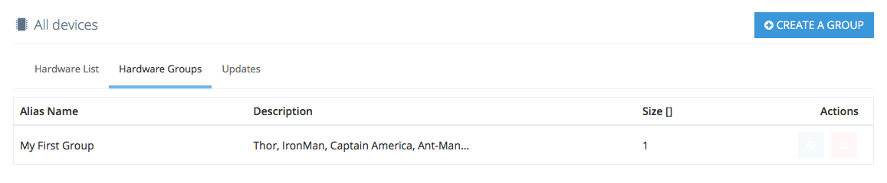
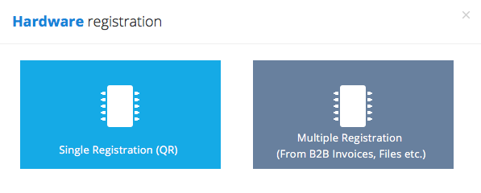
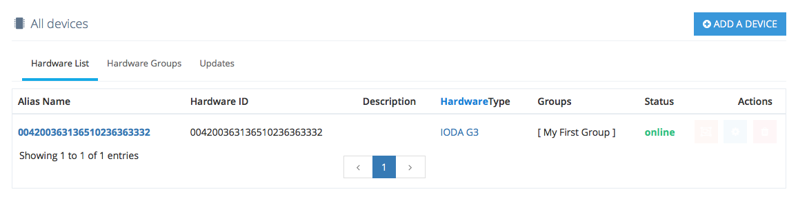
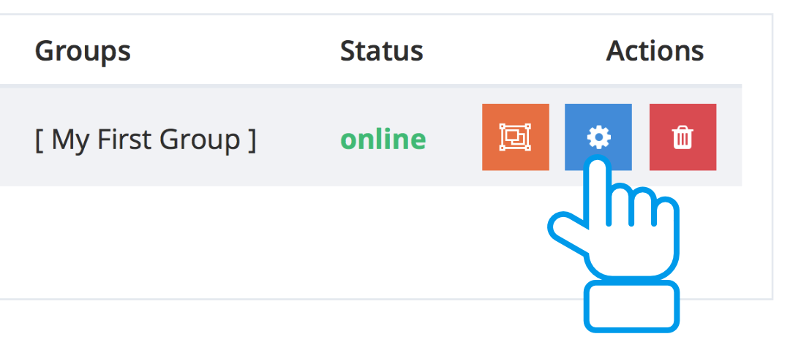
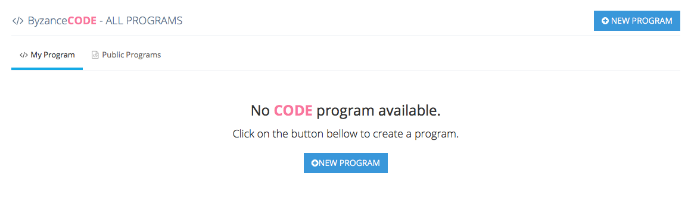
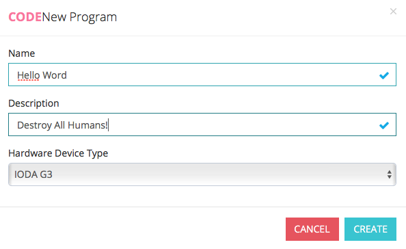
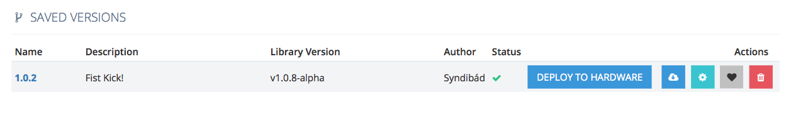
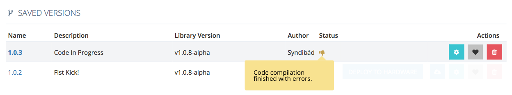
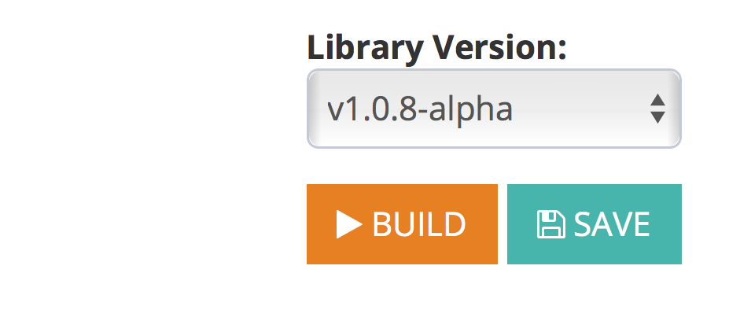

# 2. Intrudoction \(Beginner's Guide\)

Vítej ještě jednou v Byzance. Zde je seznam, co vše během úvodního tutoriálu probereme. Pokusíme se ti i vysvětlit návaznosti a komponenty vývojového Flow Byzance. Aby jsi věděl nejen jak, ale také proč.

## List of Steps

1. [Vlastní účet](2.-intrudoction-beginners-guide.md#own-account)
2. [Vlastní Tariff](2.-intrudoction-beginners-guide.md#own-tariff)
3. [První Projekt](2.-intrudoction-beginners-guide.md#first-project)
   1. Základní přehled
   2. Vysvětlení Menu
4. [Registrace Hardwaru](2.-intrudoction-beginners-guide.md#registrace-hardwaru)
5. První program pro Hardware
6. Nahrátí programu na Hardware
7. První Blocko
8. První Vlastní Bloček
9. Integrace Blocko s Hardwarem
10. První vlastní Instance
11. První Aplikace v Gridu 
12. První vlastní Widget
13. Integrace s Blocko

### Vlastní účet {#own-account}

První věc, kterou musíš udělat je vytvořit si účet účet na Portálu Byzance \([portal.byzance.cz](https://github.com/byzance/public-documentation/tree/38b460c46404c197299c0f0a84e3402a9b74c8d7/portal.byzance.cz)\)

V přihlašovacím okně se lze přilásit s využitím účtu Facebook či Github nebo se registrovat vytvořením nového Byzance účtu kliknutím na tlačítko **Create an account**. Při registraci nového byzance účtu je nutné vyplnit požadované údaje a vyčkat na potvrzovací email, který bude zaslán na zadanou adresu.

Po úspěšném přihlášení se zobrazí Dashboard portálu Byzance.

#### **Co je Portál**

Portál je internetová aplikace vytvořená Byzance, která slouží jako brána pro všechna Byzance IoT zařízení ke komunikaci s okolním světem. Portál zároveň uživateli slouží jako prostředí, ve kterém vytváří funkční kód, uploaduje tento kód do síťě svých zařízení a dochází k aktualizaci zařízení. Dokumentace, krok po kroku vysvětluje, jak provést základní konfiguraci.

### Vlastní Tariff {#own-tariff}

V levém Menu Najdi odkaz Financial \([portal.byzance.cz/financial](https://github.com/byzance/public-documentation/tree/38b460c46404c197299c0f0a84e3402a9b74c8d7/portal.byzance.cz/financial/README.md)\)  
Vytvoř si nový účet a vyber si - který typ účtu ti nejvíce vyhovuje. **I do it for my self** or **I will be integrator**. Na stránce máš více rozepsané, co k čemu slouží.

#### **Co jsou to Tarify** 

Jelikož jsou některé naše služby placené a protože chceme umožnit i velkým firmám pracovat a spravovat své produkty ve složité hierarchii, jsou všechny aktivity vázané na Tariffs. Tarify jsou Účetní entity, která má vlasntíka \(neboli správce\) v podobě fyzické osoby \(zakladatel účtu\) nebo firmy \(lze nastavit\) a také fakturované jednotky buď jde o stejnou osobu / firmu - nebo externí firmu. Lze tedy Vytvořit i Tarrif, kterého jsem vlastník - ale fakturuje se to třetí osobě. Tento model je vhodný pro Freelancery nebo Integrátory. Integrátor tak může vytvářet zakázkové projekty pro desítky svých klientů a mít tak dokonalý přehled o celkových nákladech každého klienta. Tariff lze migrovat i na jiné účty a firmy. Takto lze vytvářet různé kombinace desítek finančních entit.

####  **Jaký je rozdíl v tariffech?** 

Rozdíl není žádný - jde jen o počáteční stav. To s čím na začátku začínáš. Každý Tariff se skládá z Extensions \(Extensions pro vyšší počet HW, Extensions Pro vyšší objem přenesených dat atd.\). Takže na začátku máš některé Tariffy, které už mají předplacený vyšší objem dat, nebo vyšší počet uživatelů, kteří se mohou spravovat projekty. Naše zkušenosti nám říkají, že někteří zákazníci mají rádi už od začátku vše aktivní a tak jsme jim připravili již předkonfigurované Tariffy obsahující důležité funkce. Pokud si nevíš rady, prostě začni s tím základním a postupně si přidávej jednotlivé funkce. Některé tariffy už od začátku vyžadují plnohodnotnou registraci včetně emergency kontaktů a dalších. Tyto kontakty NIKDY NESLOUŽÍ K MARKETINGU! Ale jsou použity výlučně pro technickou a bezpečností podporu. \(Naše servisní středisko vás může v některých případech kontaktovat pokud dojde k vážným incidentům\)

####  **Co jsou Extensions?** 

Extensions jsou balíčky, jež lze kdykoliv nebo i na začátku přikupovat do svého Tariffu. Na začátku každý tariff obsahuje základní sadu balíčků. Díky nim se nám snadno zpřístupňují jendnotlivé funkce pro naše zákazníky. Některé jsou zdarma, jiné ve zpoplatněných tariffech už měsíčně něco stojí. Většina Extensions je založena na poplatcích na měsíční bázy. Některé poskytuje přímo Byzance, jiné jsou třetích stran. Balíčky mají vlastní konfiguraci - založené na tom, co který balíček umožnuje. Například potřebuješ-li databázi k uskladnění svých dat, lze aktivovat balíček "Databáze" s různou velikostí podle potřeb s různou cenou. U některých je aktivní sleva z rozsahu.

### První Projekt {#first-project}

Teď tě čeká vytvoření tvého prvního projektu. Každý projekt je vázaný na některý z tvých finančních produktů \(Tariffech\). Pokud ho nemáš - vrať se k bodu číslo 2. **Tadááá - Máš svůj první projekt. Gratulujeme! &lt;3** 

#### **Overview Menu:**

* **DashBoard**: je výchozí obrazovka projektu, kde máš základní přehled všeho.
* **Members**: Je správce účtů, které mohou s projektem manipulovat. Lze nastavit práva tak jak jednotlivým uživatelům důvěřuješ. Můžeš pozvat své kolegy, kteří už účet mají, nebo si ho díky pozvánce teprve vytvoří. Pozvaní nemusejí již vytvářet vlastní finanční produkty a ani do nich nemají přístup. \(Jen pokud by si je jmenoval i správcem Financial Tariff.\)
* **HARDWARE**: Je Stránka, která ti zobrazuje tvůj zaregistrovaný Hardware a jeho manažerské nástroje. Na každé stránce, která obsahuje seznam v tabulce \(všude v portálu\) lze vykreslit maximálně 25 prvků. Pro zobrazení dalších prvků, používej šipky nebo parametry filtru.
  * **Hardware list**: Seznam tvého Hardwaru. Jako ho zaregistrovat se dozvíš níže.
  * **Hardware Groups**: Ti umožní vytvářet skupiny Hardwaru, které jsou si něčím podobné nebo ti umožní speciální dělení. Například "German Market", "Generation v1.3", "Office Flor 3". Díky skupinám můžeš využívat nástroje hromadného updatu.
  * **Updates**: Je seznam všech tvých updatů, jednotlivých individuálních i těch hromadných. Na této stránce díky tlačítku "Release Firmware" můžeš aktualizovat skupinu, kde lze vybrat Program a jeho verzi, nebo Bootloader. Aktualizační proceduru lze i naplánovat na čas, který ti vyhovuje.
* **CODE**: Je první Cloud Tool v našem Portálu, který ti umožnuje jednoduše programovat Hardware.
  * **Code Programs**:: Obsahuje dvě sekce. Tvé vlastní programy a programy vytvořené Byzance, komunitou nebo jednotlivými dodavately Hardwaru. Veřejné programy si můžeš zkopírovat a dále upravovat. Nezapomeň, že i ty můžeš jednotlivé programy v platformě sdílet s ostatními. Sdílení je jen kontrolováno administrátory.
  * **Code Libraries**:: Knihovny jsou předpřipravené balíčky kodu, jež ti umožní velmi snadno integrovat speciální funkce nebo obsluhu Shieldu pro tvůj Hardware.
* **GRID**: Je nástroj pro tvorbu jednoduchých ovládacích aplikací přímo na míru k jendomu HW nebo celé skupině. Grid nemá za cíl udělat dokonalé sexy vypadající aplikace pro vaše zákazníky - doporučujeme dělat nativní s podporou Rest-Api, ale umožnit ti tvořit jednoduché řídící aplikace pro průmysl a průmyslové řízení s prezentací dat.

  * **Grid Apps**::
  * **Grid Widgets**::

  Grid se skládá s kolekce aplikací - a z jednotlivých Widgetů

* BLOCKO: TODO
* CLOUD: TODO

### Registrace Hardwaru

Hardware se registruje na základě registračních klíčů \(Hash klíčů\). Tyto klíče jsou zvlášť generovány pro každý hardware - a to z důvodu toho, že jako identifikátor Hardwaru považujeme jeho 24 místné číslo procesoru. Veškerý HW, vyrobený Byzance je již v platformě zaregistrovaný a defaultně nakonfigurovaný. V případě registrace tvého vlastního HW, nevyrobeného Byzance, ale splňujícího základní požadavky kompatibility, prosím kontaktuj technickou podporu.

**Nákup na Eshopu:** Pokud jsi si kompatibilní Hardware zakoupil na našem Eshopu a systém automaticky našel tvojí objednávku automaticky ti zaregistroval veškerý HW do účtu. Jelikož tyto systémy nejsou přímo kvůli bezpečnosti propojené - Hledání probíhá pomocí shodného emailu registrace v našem portálu s registračním emailem na Eshopu. Automatická registrace Hardwaru se provede jen v případě že máš vytvořený pouze jeden! Finanční Tarif, v případě více tarifů, systém neví do kterého by měl HW zaregistrovat a proceduru pro jistotu neprovede. Pokud HW nevidíš a máš číslo objednávky můžeš si ho registrovat tlačítkem přidat hardware a vybrat třetí možnost registrace pomocí "ID Faktury". Pokud máš jakékoliv potíže, neboj se kontaktovat technickou podporu.

#### Vytvoř Hardware Group

V horním menu klikni na Hardware Group a vytvoř si svojí první skupinu - v dalších krocích si totiž ukážeme jak si vyzkoušet nanečisto naprogramovat a updatovat milion zařízení během 10 sekund.

#### Manuální registrace \(Jeden HW\)

Klikni na tlačítko registrovat, kde je Label pro vyplnění registračního Hashe. Vyplň Hash kde validační formulář rovnou zkontroluje klíč a nezapomeň zakliknout svojí první vytvořenou skupinu.

#### Registrace desítek až tisíců HW

Vytvořili jsme speciální rozhraní pro množstevní registraci. Jedná se o pokročilou funkci a více se o ní dozvíš na [Hardware Registration.](https://github.com/byzance/public-documentation/tree/38b460c46404c197299c0f0a84e3402a9b74c8d7/programovani/hardware-registration.md)

#### Registrace pomocí QR kódu \(Alfa\)

Pokud se přihlásíš do portálu na mobilním zařízení, jednoduchý průvodce pro výběr projektu a skupiny. Skenování je velmi příjemné, ale jelikož nemáme upravenou Light verzi portálu, je nutné s tím počítat.

**Výsledek registrace by měl vypadat takto:**

#### Alias Hardwaru

Svůj Hardware si pro snazší identifikaci můžeš libovolně přejmenovat. Tento název se také automaticky vždy při změně automaticky propíše do Hardwaru kde si pomocí příkazu můžeš jméno načíst. Nadále jako unikátní identifikátor je použito číslo procesoru, ale vždy pro tvůj přehled je přiložen Alias zařízení. Alias je editovatelný i pomocí [Rest-Api. ](https://github.com/byzance/public-documentation/tree/38b460c46404c197299c0f0a84e3402a9b74c8d7/Rest/README.md)Více informací o Aliasu najdeš na [Identifikace zařízení. ](../hardware-a-programovani/funkcionality/identifikace-zarizeni.md)

* Nápověda - Pokud přejedeš myší přes tlačítko - po chvíli se ti zobrazí nápověda k čemu tlačítko slouží. 

### První program pro Hardware

Nejdříve si naprogramujeme Hardware. To lze jednoduše Online IDE jménem [Code.](https://github.com/byzance/public-documentation/tree/38b460c46404c197299c0f0a84e3402a9b74c8d7/byzance_documentation/code_intro.md) Ten byl navržen pro jednodušší programy, jež nepotřebují složité funkce profesionálních IDE. Pokud už na začátku víš, že chceš používat své lokální desktop IDE, připravili jsme pro tento případ samostatný toturial. \[TODO Doplnit link\]

Sekce **My Program**, je seznam tvých programů a **Public Program** je seznam komunitou vytvořených programů k přímému nahráti do Hardwaru. Aby si mohl požívat veřejné programy, je nutné z nich vytvořit vlastní kopii. Místo klasické reference jsme k tomuto přistoupili zejména z důvodů velmi komplexní historie a tvorbě statistik, takže pokud by byl veřejný program upraven nebo smazán, došlo by ke komplikacím co kde a jak zobrazovat.

....

Vytvoření Programu předchází výběr správné desky. Jelikož ti chceme zjednodušit život, výběrem desky ti selektujeme přesně ty funkce, které podporují periferie Hardwaru. Umožňujeme však psát kód nezávisle na hardwaru zejména díky využití Embed OS, kompilace více typů hardwaru je vysvětlena v samostatné kapitole.

Po vytvoření programu, klikni na název programu v seznamu, kde se ti následně zobrazí Code editor. Jeho všechny Funkcionality jsou popsány v samostatné kapitole. Nám teď stačí využít předvyplněný první program, který v editoru vidíš. Naším úkolem bude tento program jednoduše upravit, vytvořit Build a uložit.

#### Nejdříve připíšeme funkci pro blikání ledkou

#### Klikneme na Tlačíko Build

Tlačítkem Build se tvůj kód zabezpečenou formou pošle na jeden z několika kompilačních serverů spravovaných Byzance, které obsahují veškeré knihovny. Server po 5-20 sekundách \(podle vytížení\) vytvoří soubor, které lze nahrát na hardware. Jedná se o balíček kodu, který ti umožňuje velmi jednoduše desku řídit, vzdáleně programovat a spravovat. Tak aby jsi se mohl soustředit jen na kód který ti přináší užitek. To ostatní má na starosti Byzance.

Po úspěšném Buildu se zobrazí Notifikace. To je indikace, že vše proběhlo v pořádku. V opačném případě ti pod editorem zobrazíme seznam chyb i řádku, na kterém došlo k problému.

#### Program uložíme

Uložení programu následuje jeho automatické znovu zkompilování. A ověření.

Výsledek uložení bude vypadat nějak takto:

Pokud program uložíš s chybou - například proto, že na něm pracuješ, server ho vždy zkusí zkompilovat ale ikonou ti zobrazí jeho stav.

#### Dodatek: Verze Core Knihovny

Jak sis asi všiml, kód lze zkompilovat několika verzemi Core Knihovny. Jedná se o naší připravenou sadu jednotlivých knihoven připojených k Embed OS. Tak jako Embed OS vydává nové verze, my je integrujeme a přidáváme další rozšíření usnadňující ti programovat. Každý nový update obsahuje kritické záplaty, nové funkcionality a další. Běžně ve výchozím stavu vidíš programy verze v1.0.2 nebo v1.30.31.. V případě zájmu můžeš volitelně vybrat i knihovny s příponou "-beta". v1.0.3-beta, v1.0.4-beta.2 \(Vše podle standardu[ https://semver.org](https://semver.org)\). Knihovny Alpha jsou určeny pouze pro vybrané vývojáře a aktivní členy komunity. U verzí Alpha se doporučuje mít Hardware připájený na Dev-Kitu pro jeho opravu v případě kritického selhání.

### Nahrátí programu na Hardware

Pokud vidíš nepřehlédnutelné tlačítko DEPLOY TO HARDWARE, můžeme rovnou program nahrát na tvůj Hardware. Každý Update, který provedeš má neomezenou platnost. Čeká, dokud se Hardware nepřihlásí k serveru a nestáhne si nový Firmware.

Žádná funkcionalita ti nikdy nezabrání nahrát na Hardware co chceš a to přesto, že by to bylo v konfliktu s jinou částí systému - například byl Hardware integrován do vzájemně komunikující sítě. Na tyto konflikty jsi pouze pokud se Back-End serveru podaří kolizi najít upozorněn. Zároveň nám takto upravené opatření přišlo správné. To aby si mohl pohotově nasazovat kritické patche, a nemusel řešit desítky možných konfliktů.

Vyzkoušíme si dva typy updatu a to rychlou volbou **DEPLOY TO HARDWARE** přímo z Code Editoru a pomocí **Release Manageru**.

#### DEPLOY TO HARDWARE

#### Release Manageru

### První Blocko Program

První Vlastní Bloček

Integrace Blocko s Hardwarem

První vlastní Instance

První Aplikace v Gridu

První vlastní Widget

Integrace s Blocko

#### Konfigurace hardware

Následující dokumentace pomáhá uživateli při prvním spuštění a základní konfiguraci nově zakoupených zařízení. Bližší informace a specifikace jednotlivých zařízení lze nalézt v [Hardwarové dokumentaci](https://github.com/byzance/public-documentation/tree/38b460c46404c197299c0f0a84e3402a9b74c8d7/articles/first-steps/Odkaz%20na%20Hardwarovou%20docu/README.md). Během konigurace lze indentifikovat chování zařízení pomocí LED signalizace, kterou zařízení provádí. Význam těchto LED signálů, lze vyhledat v Hardvarové dokumentaci jednotlivých typů zařízení v sekci [LED signalizace](https://github.com/byzance/public-documentation/tree/38b460c46404c197299c0f0a84e3402a9b74c8d7/byzance_documentation/hardware_intro/hardware/iodag3e/led-signalizace.md)

