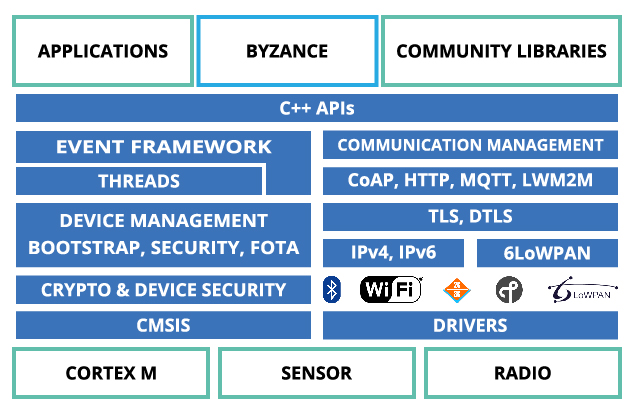

# Architektura FW

Firmware vyvíjený v prostředí Byzance Code je založen na otevřeném operačním systému [Mbed OS](https://github.com/ARMmbed/mbed-os). Vývojáři je při programování k dispozici kompletní [MBED API](https://os.mbed.com/docs/latest/reference/apis.html), rozšířené o další možnosti v podobě zálohy a obnovení firmware \(funkce [autobackup](autobackup.md)\), vzdálenou aktualizaci a další užitečné funkce. Tyto další funkce jsou dostupné v rámci [Byzance API](../programovani-hw/byzance-hardware-api.md) a [uživatelských maker](../programovani-hw/uzivatelska-makra.md).

Součástí MBED API jsou ARM low level ovladače CMSIS a ovladače HAL výrobce mikrokontroléru. K tomu MBED přidává množství užitečných knihoven na šifrování, konektivitu k internetu a operační systém RTOS

