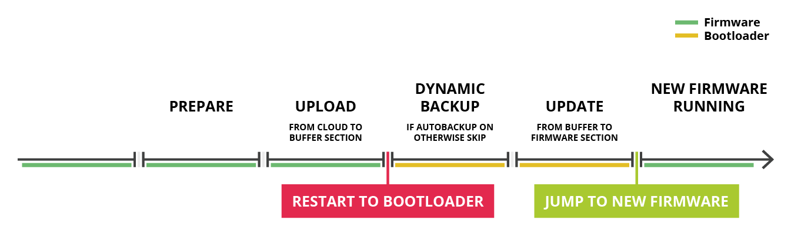

# Autobackup

Autobackup je funkce, která se stará o automatickou zálohu aktuálního funkčního kódu na mikrokontroléru pro případ selhání.

## Vlastnosti autobackup

Pokud je funkce autobackup **zapnutá**, při nahrávání nového firmware se původně běžící firmware zazálohuje a při chybě nové binárky se dokáže tato konfigurace obnovit. Tomuto typu zálohy se říká **dynamická záloha**. V případě, že je automatická záloha posledního funkčního firmware nežádoucí a je třeba jeden záložní firmware pro všechny situace, funkce autobackup je **vypnutá** a tomuto typu se říká **statická záloha**.

## Dynamická záloha

Zapnutý autobackup, tedy dynamická záloha přináší určité výhody i nevýhody.

* Výhodou této varianty je, že pokud aktualizace zařízení selže, vždy se obnoví poslední funkční konfigurace.
* Nevýhodou je, že při každé aktualizaci na novou verzi firmware musí proběhnout ještě záloha původního firmware. Toto může trvat nějaký čas. Řádově se jedná zhruba o 20 sekund navíc při každé aktualizaci.

## Statická záloha

V případě, že je autobackup **vypnutý**, zařízení spoléhá na to, že v záložním sektoru existuje platná **statická záloha,** která byla do zařízení při vypnutí autobackupu doručena. Pokud update binárky neproběhne v pořádku, statická záloha se automaticky obnoví.

* Výhodou je, že stačí zálohu nahrát jednou a zařízení si ji "navždy" pamatuje \(případně do doby než je autobackup zapnutý, čímž se záloha se automaticky přepíše na dynamickou\).
* Nevýhoda je to, že pokud update selže, může se obnovit velmi stará fukční konfigurace, která v aktuálním kontextu nemusí být dávno platná.

## Nastavování a zjišťování hodnot

Pokud je nutné režim autobackup změnit, existuje několik možností, jak toho docílit.

* Pomocí Portálu Byzance online
* V Command režimu Bootloaderu

