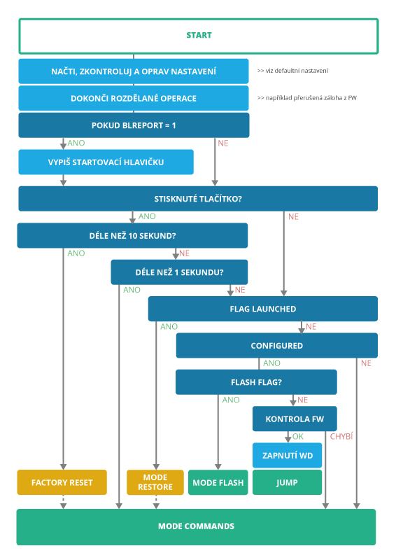

# Bootloader

Bootloader je firmwarová komponenta nahraná v každém zařízení Byzance. Automaticky se spouští ihned po zapnutí napájení. Nejčastější úkol bootloaderu je pouze zajištění skoku do hlavního programu, v ostatních případech obstarává aktualizaci hlavního programu zařízení, obnovení v případě nefunkčního hlavního firmware a nastavení některých konfiguračních dat. Bootloader může vykonávat různé funkce na základě módu, ve kterém se nachází.

Jednotlivé režimy jsou popsány v kapitolách [režimy bootloaderu](rezimy-bootloaderu.md), přičemž nejrozsáhlejší část - [command mode - má vyhrazenou vlastní kapitolu](command-mod.md).

