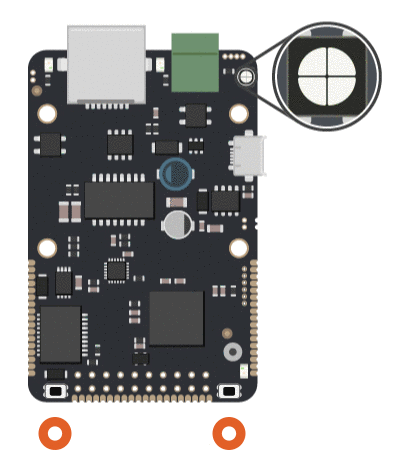

# Command mód

Command mód je jeden z režimů [bootloaderu](./), kde je možné pomocí příkazů posílaných po [sériové lince](../../tutorialy/komunikace-po-seriove-lince-uart/) ověřovat a [nastavovat konfigurační parametry](../../uvod/konfigurace-zarizeni.md). Ostatní režimy jsou popsány v [příslušné kapitole](rezimy-bootloaderu.md).

Do command režimu bootloaderu je možno vstopit následujícím způsobem

1. podržet RESET a USER tlačítko dohromady
2. pustit RESET tlačítko
3. počkat několik sekund, než zhasne žlutá LED
4. pustit USER tlačítko

Při prvním spuštění nebo při položce configured=0 bootloader skáče do command režimu automaticky.

## Příkazy bez parametru

* **ping** - ping, pro testovací účely
* **help** - vypíše nápovědu do konzole
* **overview** - vypíše aktuální hodnotu všech parametrů, které jsou v bootloaderu nastaveny
* **restart** - restartuje zařízení.
* **target** -Typ desky. 
* **fullid** - vypíše FULL ID zařízení.  
* **launch\_reset** - Pokud bylo předchozí spuštění firmware neúspěšné a není žádná validní binárka k obnovení, je třeba nahrát validní binárku a poté napsat příkaz ''launch\_reset''.
* **defaults** - Veškeré nastavení se obnoví do [výchozích hodnot](vychozi-hodnoty.md).

## Příkazy s parametrem i bez

Více informací k MQTT připojení je možno nalézt v sekci [Komunikace se servery](../../konektivita/komunikace-s-portalem.md).

* **normal\_mqtt\_hostname** - Hostname, na kterém běží hlavní Homer.
* **normal\_mqtt\_port** -  Hlavní port, na kterém běží Homer.
* **backup\_mqtt\_hostname** - Záložní hostname, na kterém běží Homer.
* **backup\_mqtt\_port** - Záložní port, na kterém běží Homer. 
* **mqtt\_username** - Záložní jméno pro přihlášení k Homerovi.
* **backup\_mqtt\_password** - Záložní heslo pro přihlášení k Homerovi.
* **alias** - Alias zařízení, který si každý může nastavit pro lepší [identifikaci zařízení](../../funkcionality/identifikace-zarizeni.md).
* **mac** - Zjištění MAC adresy.
* **blreport** - Bootloader report. Zapnutí, nebo vypnutí výpisu hlavičky [bootloaderu](./) do konzole.
* **wdenable** - Zapnutí [watchdogu](../../funkcionality/watchdog.md).
* **wdtime** - Nastavení periody resetu [watchdogu](../../funkcionality/watchdog.md).
* **autobackup** - Funkce, která zajišťuje, zajišťuje zálohu starého firmware při doručení nového.
* **netsource** - Zdroj, odkud bere zařízení internet.
* **configured** - při prvním spuštění bootloader naběhne vždy do Command režimu a čeká na konfiguraci všech parametrů. Až jsou parametry nastaveny, ''configured'' se přepne na 1 a tím se dá zařízení najevo, že je již plně nakonfigurováno a příště bude už nabíhat do normálního programu.
* **webview** - Zapnutí nebo vypnutí funkcionality [webového rozhraní](../../funkcionality/webove-rozhrani/).
* **webport** - Port, na kterém bude přístupno [webové rozhraní](../../funkcionality/webove-rozhrani/).
* **timeoffset** - Slouží pro lokalizovanou [práci s časem](../../tutorialy/prace-s-datem-a-casem-rtc.md). Nastavení offsetu lokálního času RTC od UTC.
* **timesync** - Slouží pro zapnutí [synchronizace času](../../tutorialy/prace-s-datem-a-casem-rtc.md) mezi servery Byzance a RTC.
* **lowpanbr** - Zapnutí funkce [lowpan border router](../../konektivita/6lowpan.md).
* **restartbl** - Identifikátor pro [restart zařízení do bootloaderu](./).
* **revision** - Zjištění [revize zařízení](../../funkcionality/revize.md)

## Příkazy pouze s parametrem

* **info** - Informace k dané komponentě.

  Parametry mohou být "bootloader", "firmware", "buffer", "backup".

* **memsize** - Velikost oddílu, který je vyhrazen pro danou komponentu.

  Parametry mohou být "bootloader", "firmware", "buffer", "backup".

* **intmem** - Zformátuje paměť.

  Parametry mohou být "intmem" nebo "extmem".

* **firmware** - Práce si firmwarem.

  Parametry mohou být "backup" pro zálohu, nebo "restore" pro obnovu.

