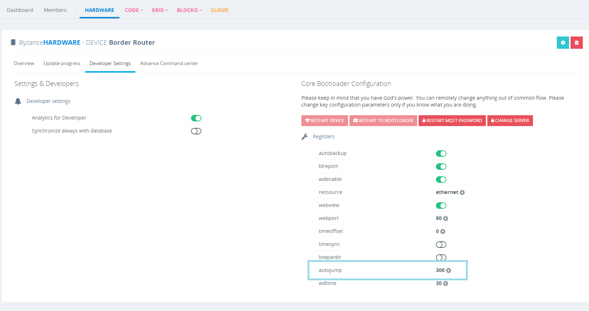
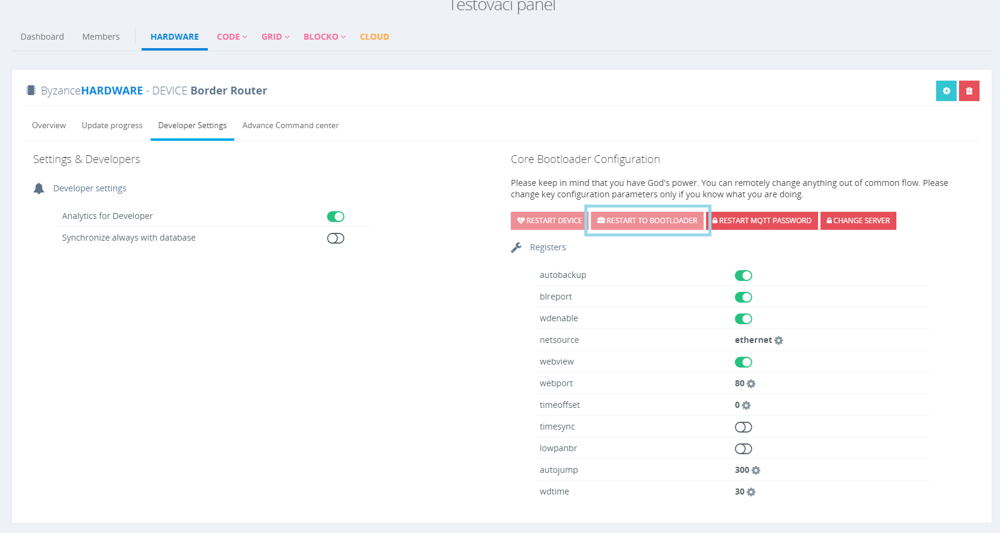

# Další vlastnosti bootloaderu

## Autojump

Autojump je funkce bootloaderu, která zajišťuje **skok do hlavního programu**, pokud uživatel neprovedl **žádnou interakci** se zařízením [po sériové lince](../../tutorialy/komunikace-po-seriove-lince-uart-s-pc/konfigurace-seriove-linky-v-pc.md) v průběhu nastavené doby. Vyjadřuje se ve **vteřinách** jako celé číslo.

Čas Autojump lze konfigurovat jedním ze způsobů popsaným v kapitole konfigurace zařízení.



## Restart to bootloader

V určitých případech \(kdy na zařízení běží uživatelský program\) může být pořeba vzdáleně přepnout zařízení do bootloaderu. Právě k tomu slouží funkce "restartbl". Ovládání funkce může probíhat dvěma způsoby. 

### **Automaticky online pomocí Portálu**

Toto je doporučovaná varianta. Stačí v Portálu kliknout na tlačítko "restart to bootloader" v záložce Developer Settings u daného zařízení.

Další možnost, jak docílit restartování zařízení do bootloaderu, je **offline postup** . Funkce je implementována jako signalizátor "restartbl", který je nutno ručně zapnout a potom libovolnou možností vyvolat restart zařízení \(restart po zapnutí "restartbl" není automatický\). Po restartu najde bootloader signalizátor "restartbl" zapnutý, přičemž jej automaticky vypne a zůstane v [command režimu](command-mod.md).

Ruční metody ovládání restartbl jsou popsány v kapitole konfigurace zařízení.



