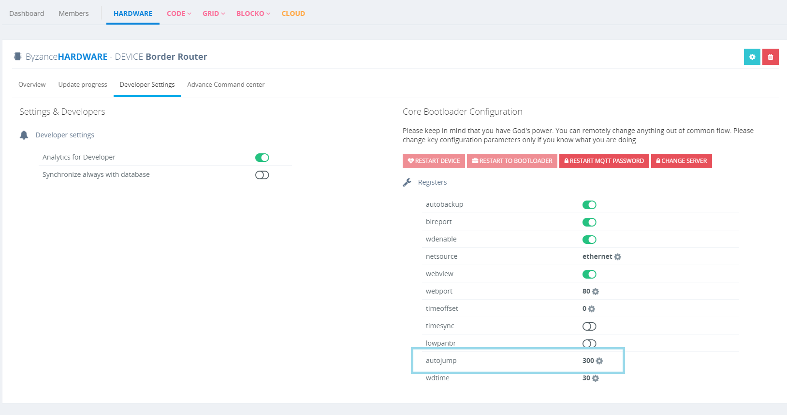

# Další vlastnosti

## Autojump

Autojump je funkce bootloaderu, která zajišťuje **skok do hlavního programu**, pokud uživatel neprovedl **žádnou interakci** se zařízením po nastavenou dobu.

Autojump lze nastavit přímo v Portálu v nastavení konkrétního hardware \(viz obrázek\), v [command režimu](https://github.com/byzance/public-documentation/tree/38b460c46404c197299c0f0a84e3402a9b74c8d7/articles/hardware/ioda/navody/bootloader.md) nebo přímo v uživatelském programu pomocí [Byzance Hardware API](../../programovani-hw/byzance-hardware-api.md)

## Restart to bootloader

V návaznosti na Autojump je možné zařízení přímo restartovat do bootloaderu, ve kterém setrvá bez ohledu na Autojump pomocí funkce **Restart to bootloader**

Restart do bootloaderu lze provést přímo v portálu \(viz obrázek\) v [command režimu](https://github.com/byzance/public-documentation/tree/38b460c46404c197299c0f0a84e3402a9b74c8d7/articles/hardware/ioda/navody/bootloader.md) a [Byzance Hardware API](../../programovani-hw/byzance-hardware-api.md)

