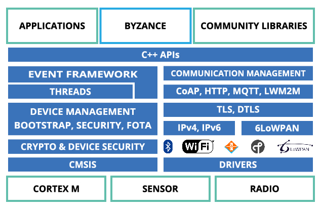
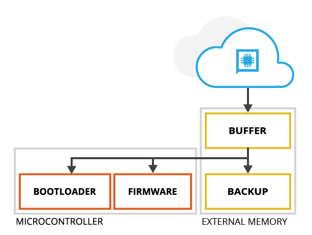

# Hierarchie FW

.

Každý takto vytvořený program, zkompilovaný do binárky je možno distribuovat z cloudového editoru Code jako jednotlivou komponentu ''bootloader'', ''firmware'' nebo ''backup''. Více informací je dostupných v sekci Aktualizace FW. S tímto procesem taktéž úzce souvisí funkce Autobackup pro automatickou zálohu aktuálního funkčního firmware.

