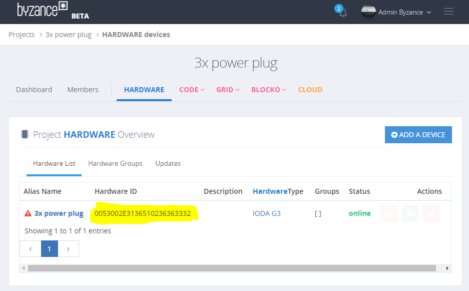
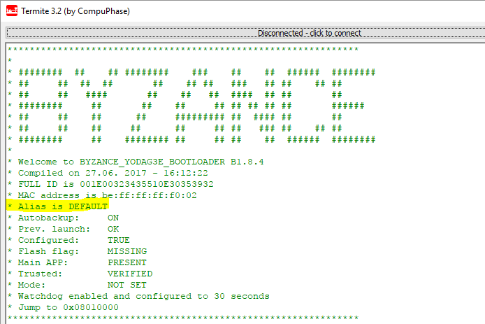
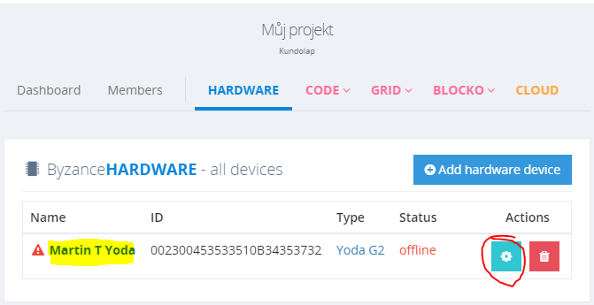

# Identifikace zařízení

## Identifikace zařízení

Všechny zařízení IODA mají ve FLASH paměti svého mikrokontroléru STM32 z výroby naprogramovaný **jedinečný identifikátor** , který se vyskytuje na specifické adrese v paměti \(liší se podle rodiny mikrokontroléru\) a lze ho pouze číst. Toto číslo je Byzance interně označováno jako **Full ID**. Full ID je pro člověka obtížně zapamatovatelné a slouží především k strojovému zpracovávání.

Každé zařízení dále umožňuje nastavit vlastní **Alias**, který slouží k jednodušší identifikaci člověkem. Název Alias může být například "kuchyn-svetlo".

### Full ID

Jedná se o 96 bitů dlouhé číslo reprezentované **24 hexadecimálními ASCII znaky**. Full ID se zapisuje **velkými písmeny a bez oddělujícíh znaků**. Např. ''0123456789AB0123456789AB''.

Lze to teoreticky přirovnat například k MAC adrese - ta je 48 bitů dlouhá a zapisuje se jako šestice dvojciferných hexadecimálních čísel oddělených pomlčkami nebo dvojtečkami \(např. ''01-23-45-67-89-AB'' nebo ''01:23:45:67:89:AB''\).

#### Jak zjistit Full ID

Existuje několik způsobů, jak zjistit Full ID. Pokud je zařízení nové a nikdy nebylo použito, Full ID lze zjistit společně s kódem pro přidání do uživatelského účtu z nálepky na zařízení, nebo na jeho obalu.


Pokud je zařízení připojeno k internetu a je přidáno v nějakém projektu, Full ID je možné zjistit online v sekci Projects -&gt; \(název projektu\) -&gt; Hardware



Bez využití internetu je Full ID možno zjistit z bootloaderu výpisem přes sériovou linku nebo USB.


Pomocí veřejné metody třídy Byzance ''Byzance::get\_full\_id\(\)'' výpisem přes sériovou linku nebo USB.

```cpp
#include "byzance.h"

Serial    pc(SERIAL_TX, SERIAL_RX); // tx, rx

void init(){
    pc.baud(115200);
}

void loop(){
    pc.printf("full_id=%s\n", Byzance::get_full_id());
    Thread::wait(500);
}
```

### Alias

Alias slouží společně s [Full ID](https://github.com/byzance/public-documentation/tree/38b460c46404c197299c0f0a84e3402a9b74c8d7/articles/hardware/ioda/navody/full-id.md) k identifikaci zařízení.

Narozdíl od Full ID, které je vždy unikátní z výroby a strojově dobře čitelné, Alias je nastavovaný uživatelsky pro lepší identifikaci člověkem. Při více zařízeních by měl být identifikátor Alias dostatečně popisný, nemusí však být nutně unikátní. Například při použití v osvětlení by měl Alias nést názvy typu "SVETLO-KUCHYN", "SVETLO-OBYVAK" a podobně. S identifikátorem Alias je možné pracovat několika způsoby.

**Omezení:**

* Alias může mít maximálně 63 znaků \(resp. 64 znaků včetně terminační nuly\)
* Může nabývat libovolné ASCII hodnoty včetně mezer
* Musí být [tisknutelný z pohledu C++](http://www.cplusplus.com/reference/cctype/isprint/)

## Jak s Alias pracovat?

Je možné jej zjistit při startu zařízení vyčtením při startu [bootloaderu](https://github.com/byzance/public-documentation/tree/38b460c46404c197299c0f0a84e3402a9b74c8d7/byzance_documentation/hardware_intro/features/bootloader.md).



Je možné jej zjistit či nastavit v [command režimu bootloaderu](https://github.com/byzance/public-documentation/tree/38b460c46404c197299c0f0a84e3402a9b74c8d7/byzance_documentation/hardware_intro/features/bootloader/command-rezim.md). V případě nastavení z bootloaderu není garantována funkčnost, protože zařízení při startu zařízení žádá o nastavení Aliasu a v případě, že je název s Tyrionem kolizní, za správnou variantu je považovana varianta Tyrionu.

Alias je možné také zjistit v rámci uživatelského kódu dotazem pomocí [Byzance API](https://github.com/byzance/public-documentation/tree/38b460c46404c197299c0f0a84e3402a9b74c8d7/byzance_documentation/hardware_intro/API/byzance-api.md) funkcí ''Byzance::get\_alias\(\);''.

Jednoduchý kód může vypadat například takto:

```cpp
#include "byzance.h"

Serial    pc(SERIAL_TX, SERIAL_RX); // tx, rx

void init(){
    pc.baud(115200);
}

void loop(){
    pc.printf("alias=%s\n", Byzance::get_alias());
    Thread::wait(500);
}
```

Jediná správná možnost editace aliasu je pomocí Byzance Code \(Becki\). V sekci hardware uživatele je možné Alias jak zjistit, tak změnit.



