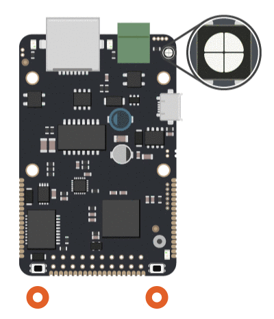

# LED modul

LED signalizace využívá interní LED modul, který je součástí všech Byzance zařízení. Ve výchozím nastavení bez zásahu uživatele **slouží k vizuální reprezentaci stavů zařízení**. Funkci LED modulu lze přeprogramovat vlastní funkcionalitou. Generace IODAG3E použivá k signalizaci stavu jednu RGB LED diodu. Stavy jsou proto dány jako kombinace blikání s určitou časovou sekvencí a barvou.

Pokud je vyžadováno, uživatelský kód může převzít kontrolu nad LED modulem. Více informací viz. \#TODO doplnit link na API a example s LED modulem.

## Stav CONNECTED

* Ioda úspěšně připojený do internetu
* rychlé blikání se střídou 50% - 200ms ON, 200ms OFF
* barva: LED\_COLOR\_GREEN

## Stav DISCONNECTED

*  Ioda není připojen/subscribovaný k Homerovi
* pomalé blikání s převahou rozsvícení - 1700ms ON, 600ms OFF
* barva: LED\_COLOR\_GREEN

## Stav BUSY

* Probíhá upload nové binárky, popř. záloha aktuální
* rychlé blikání se střídou 50% - 100ms ON, 100ms OFF
* barva: LED\_COLOR\_VIOLET

## Stav REFUSED

* Zařízení nemá validní přihlašovací údaje či certifikát k serveru a bylo odmítnuto
* Dvojité krátké bliknutí, které se opakuje stále dokola \(100ms ON, 100ms OFF, 100ms ON, 1600 ms OFF\)

## Stav ERROR/DEAD

* LED modul bliká červeně. Většinou SOS.
* Většinou fatalita, totální selhání nějaké komponenty, problém s pamětí, chyba která nikdy neměla nastat a podobně

## Signalizace Bootloaderu

* Při vstupu do bootloaderu se na RGB modulu rozsvítí **žlutá barva**.
* Po přepnutí do Command režimu se LED modul přepne do **modré barvy**, kde trvale svítí.
* Pokud se v bootloaderu začne vykonávat časově náročnější operace \(typicky flashování firmware, záloha atd.\), bootloader nepravidelně přeblikává **žlutě**.

