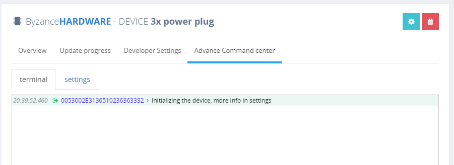

# Webová konzole

## Webová konzole

Průběh vykonávání uživatelského programu je možné logovat pomocí webové konzole.

Jejím smyslem je možnost nahrazení klasické sériové linky. Její výstup je možné najít v Portálu Byzance v záložce Hardware, vždy v konfiguraci konkrétního zařízení.



## Výhody a nevýhody

Výhodou webové konzole je, že je díky ní možno monitorovat libovolné zařízení na dálku, či si vypisovat průběhy kódu. Není nutná fyzická přítomnost zařízení a připojení k počítači USB kabelem, či použití FTDI převodníku. Odpadají problémy s instalací driveru sériové linky, nastavení baud rate, parity a dalších.

Nevýhodou je, že vyžaduje, aby bylo zařízení stále připojeno k internetu. Dalším problémem může být fakt, že příliš velké množství logů může velmi zpomalovat běh programu, zvláště při pomalém připojení.

## Použití

Konzole je implementována jako statická třída, funguje automaticky od začátku běhu programu \(není nutná její inicializace\) a obsahuje následující veřejné metody dostupné uživateli.

Jednoduchý příklad kódu, který využívá Konzoli může být například takovýto

```cpp
#include "byzance.h"

void loop(){

    if(Console::enabled()){
        printf("console is enabled\n");
        // Console::log("this is some log\n"); - No longer supported
        Console::error("this is some error\n");
        Console::warn("this is some warning\n");
        Console::info("this is some info\n");
        Console::debug("this is some debug\n");
        Console::trace("this is some trace\n");
    } else {
        to_computer("console is disabled\n");
    }

    Thread::wait(1000);

}
```

## Vlastnosti konzole

Fukce **error**, **warning**, **info,** **log, debug a trace** slouží k logování různých úrovní různých vlastních událostí, parametricky jsou shodné s C/C++ fukcí [printf](http://www.cplusplus.com/reference/cstdio/printf/). Logy konzole se automaticky přenášejí do webového rozhraní Becki pomocí protokolu [MQTT](../konektivita/komunikace-s-portalem.md), kde zařízení může uživatel sledovat. Návratovou hodnotou je možné detekovat, jestli informace dorazila do webového rozhraní.

Fukce **enabled** slouží k zjištění, jestli je logování do webové konzole zapnuto. Logování se automaticky vypíná, pokud logy nikdo neodebírá.

