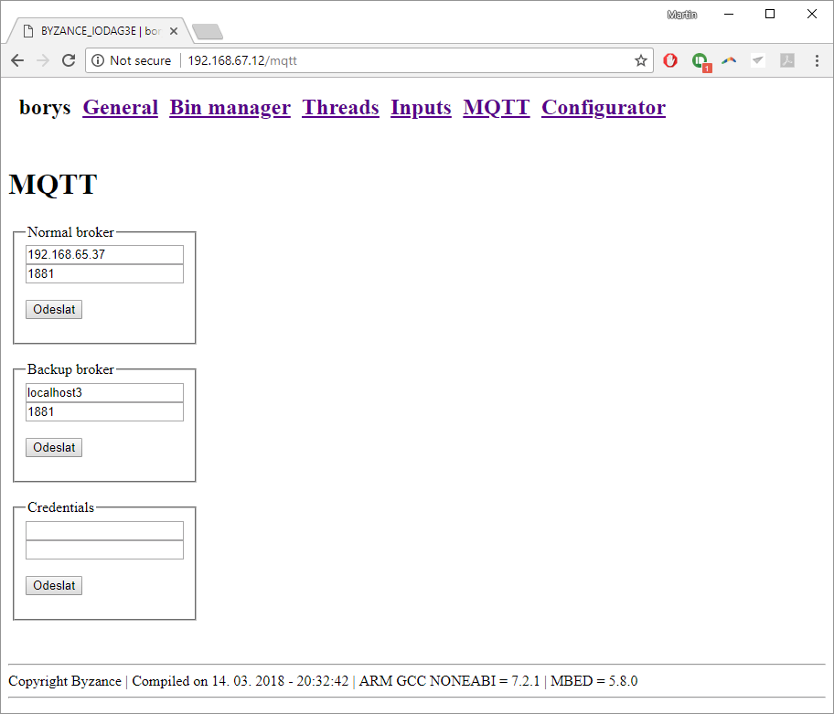

# Konfigurace MQTT

Pro komunikaci mezi zařízením a cloudem je na pozadí použit protokol MQTT. Podrobnostem o MQTT se věnuje příslušná kapitola, která zahrnuje i generování přihlašovacích údajů. Pro nastavení připojení k Brokeru je třeba dále znát jeho IP adresu a port.



Zařízení taktéž umožňuje nastavit hlavní a záložní Broker, mezi kterými je možné se přepínat.



