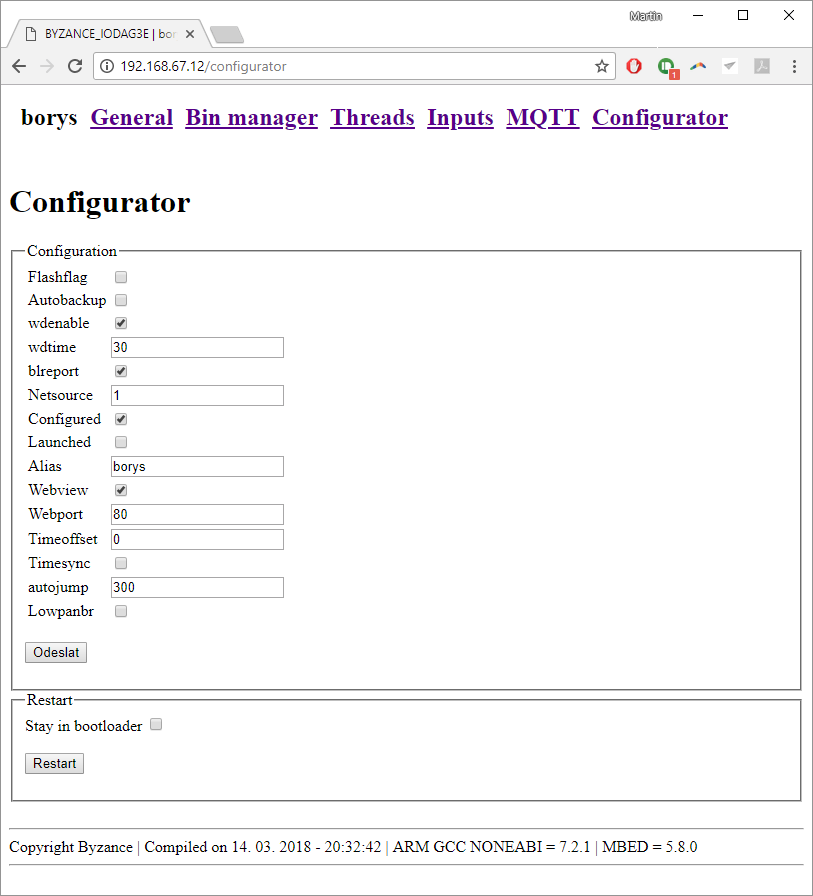

# Nastavení

Všechna zařízení IODAG3E jsou konfigurovatelná. Konfigurace může probíhat několika způsoby, pričemž doporučovaný způsob je pomocí Portálu. Všechny další možnosti jsou shrnuty v příslušném článku.



