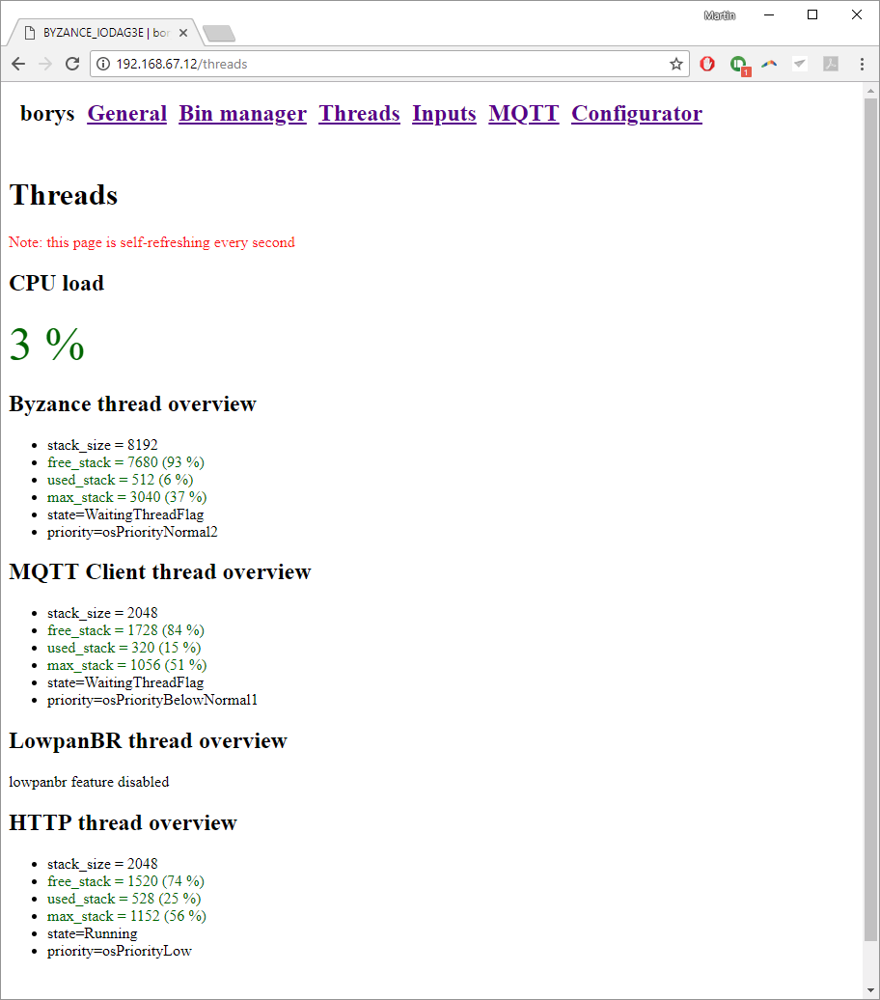

# Vlákna

Firmware každého Byzance zařízení je postaven nad [MBED-OS](../../programovani-hw/mbed-api/), podporující vlákna. Některá hlavní vlákna jsou dostupná ve webovém rozhraní. Na pozadí komunikují se servery, starají se o [aktualizaci zařízení](../../architektura-fw/aktualizace-fw.md), [webové rozhraní](./) a [další konektivitu](../../konektivita/specifikace-zdroje-internetu.md).

Jejich přehled je dostupný v záložce "threads".

