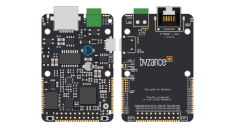
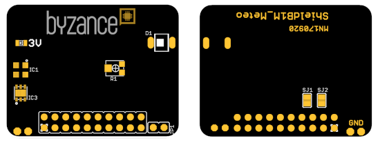
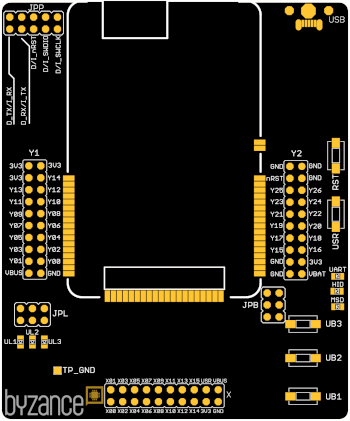

# Hardware

Stránka se zabývá popisem hardware vyvinutý pro testování Byzance platformy a realizaci zejména jednoduchých demo projektů bez zákaznických úprav hardware. Hardware rozdělujeme do tří skupin podle jeho účelu: základní jednotky, rozšiřující moduly a ostatní. Dílčí podkapitoly se věnují popisu podrobněji a přináší informace o účelu a funkcionalitě, napájení, vstupech a výstupech a případně ukazují konkrétní zapojené.

Mezi [základní jednotky ](zakladni-jednotky/)se řadí samostatně fungující plnohodnoté prvky schopné připojení do cloudu. Mají programovatelné vstupy a výstupy a po napojení jednotek na cloud slouží jednotky jako IoT prvky. Příkladem takové jednotky je [IODA](zakladni-jednotky/iodag3e/).

Na [základní jednotky](zakladni-jednotky/) se připojují [rozšiřující moduly](rozsirujici-moduly/). Smyslem rozšiřujících jednotek je přinést konkrétní funkcionalitu bez nutnosti vyvíjet vlastní hardware. Jedná se o předpřipravené desky, které se pouze připojí na základní jednotky a bez dodatečné kabeléže nebo drátování na nepájivém poli lze vyzkoušet intereakci s reálným světem. Těmto jednotklám se alternativně říká **shieldy**. Jmenovitě jde například o [Meteo shield ](rozsirujici-moduly/meteo-shield.md)se senzory teploty, tlaku, relativní vlhkosti nebo intenzity osvětlení nebo [Serial shield](rozsirujici-moduly/serial-shield.md) pro připojení dalších zařízení komunikujících přes RS232/RS485 sběrnici. 

[Třetí skupinu](ostatni/) tvoří hardware nepatřící ani do jedné z předchozích kategorií a jde aktuálně o hardware zjednodušující vývoj firmware a testování Byzance platformy. Především jde o vývojářský kit [DevKitG3](ostatni/devkitg3.md) s věstavěným programátorem/debugerem a převodníkem seriové linky na USB a s vyvedenými konektory pro pohodlnější práci. Dále je k dispozici sestava pro automatizované testování a konfigurování hardware a nebo pouze malá doplňková deska s programátorem a debugerem.

