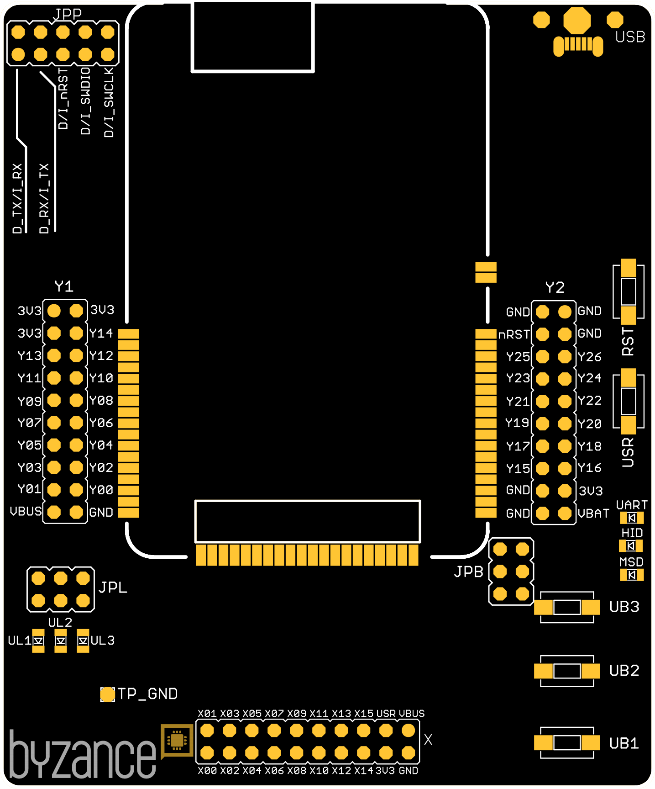

# DevKitG3

Jedná se o vývojovou desku s integrovaným zařízením IODAG3E. Deska umožňuje:

* přímý přístup k X i Y konektoru
* vestavěný offline programátor
* vestavěný USB-UART převodník pro komunikaci po sériové lince
* tři uživatelská tlačítka
* tři uživatelské LED

## Použití

Připojením DevKitu k PC je vytvořeno složené USB zařízení obsahující:

* flashdisk s názvem _BYZG3\_\*\*\*\*_
* virtuální sérový port

### Programování firmware

Přenos binárního souboru _\*.bin_ do interní flash paměti zařízení IODA na adresu příslušící komponentně firmware je prováděn překopírováním souboru na flash disk.

### Programování bootloader

Přenos binárního souboru _\*.bin_ do interní flash paměti zařízení IODA na adresu příslušící komponentně bootloader je prováděn následujícím způsobem:

* na flashdisk je nahrán prázdný soubor _BOOTLOAD.txt_, čímž dojde k dočasnému výběru cílové adresy pro bootloader
* na flashdisk je poté nahrán soubor _\*.bin_ s bootloaderem

## Konektory

### USB

Konektor má několik funkcí:

* napájení přes USB
* vytváří složené zařízení pro Drag'n'Drop programování a virtuální sériový port

### Konektor X, Y

Rozložení pinů je stejné, jako na základní desce IODAG3E. Popis jednotlivých pinů je dostupný [v dokumentaci](../../zakladni-jednotky/iodag3e/konektor-x-a-y.md).

## Konfigurace

Jumperová propojka _JPL_ slouží k připojení uživatelských LED následujícím způsobem:

* Y12 - UL1 \(zelená\)
* Y13 - UL2 \(modrá\)
* Y14 - UL3 \(červená\)

Jumperová propojka _JPB_ slouží k připojení uživatelských tlačítek následujícím způsobem:

* UB1 - Y04
* UB2 - Y05
* UB3 - Y06

Jumperová propojka _JPP_ slouží k připojení programovací rozhraní a UART k zařízení IODA:

* DevKit/IODA SWCLK
* DevKit/IODA SWDIO
* DevKit/IODA nRST
* DevKit RX - IODA TX
* Devkit TX - IODA RX

## MSD příkazy

Jedná se o příkazy, kterými lze ovládat programátor. Pro jejich vyvolání je nutné nahrát na disk soubor s příslušným názvem. Existují dva módy příkazů:

* automation-allowed on - v tomto módu programátor přijímá příkazy přímo - tj. pokud je příkaz nahrán
* automation-allowed off- pokud je programátor v tomto módu, příkazy přijímá pouze, pokud je při nahrávání příkazu stisknuto tlačítko RST \(výchozí mód\)

#### Action Commands

* _start\_bl.act_ - restartuje programátor do bootloader \(tj. jako CRP DISABLED flash disk\)
* _start\_if.act_ - flashdisk se odpojí a znovu připojí
* _erase.act_ - vymaže programovou paměť IODy \(bootloader i firmware\)

#### Configuration Commands

* _auto\_rst.cfg_ - zapne mód auto reset \(po dokončení programování cílového procesoru je procesor restartován; ve výchozím nastavení zapnut; ukládání do NVM\)
* _hard\_rst.cfg_ - vypne mód auto reset  \(ukládání do NVM\)
* _auto\_on.cfg_ - přepnutí do módu automation-allowed on \(ukládání do NVM\)
* _auto\_off.cfg_ - přepnutí do módu automation-allowed off \(ukládání do NVM\)

## Upload firmware programátoru 

Pokud je potřeba přehrát firmware programátoru, je zapotřebí:

1. odpojit DevKit z USB a veškerého napájení
2. stisknout tlačítko RST a současně připojit USB kabel
3. programátor se přihlásí jako flash disk _CRP DISABLED_
4. smazat soubor _firmware.bin_ z flashdisku
5. nahrát na flash disk soubor \#todo nahrát soubor

## 

  

