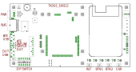

# TK3G

TK3G \(TestKit 3 generace\) je automatizované testovací zařízení vyvinuto speciálně pro testování a prvotní konfiguraci IODAG3. Aby nebylo nutné vytvářet celé, úplně nové specializované zařízení, jádrem TestKitu je řídicí testovací IODAG3, který je skrze zbytek TK3G propojen s testovaným IODAG3.

Z důvodů unifikace byla pro jednotlivé části převzata terminologie z průmyslu a vojenství.

* Automatic Test Equipment = [ATE - testovací zařízení](https://en.wikipedia.org/wiki/Automatic_test_equipment). Je to ten, kdo řídí a provádí testy.
* Device Under Test = [DUT - testované zařízení](https://en.wikipedia.org/wiki/Device_under_test). Je to ten, kdo je testován.

