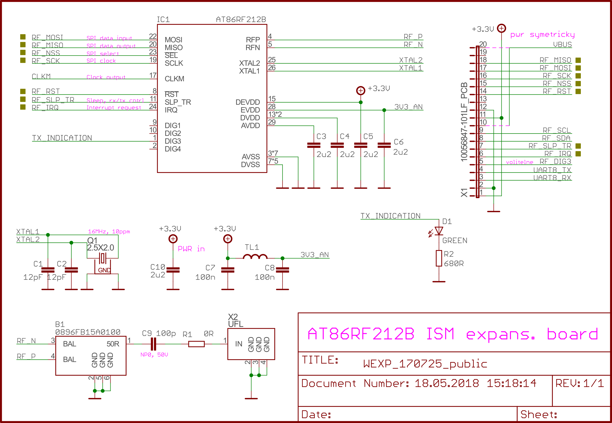

# WEXP

## Přehled

Modul WEXP je modul pro hardwarové rozšíření komunikačních schopností jednotky IODAG3E o technologii 6LoWPAN. Tento modul neobsahuje žádný mikrokontrolér, konvertory napájení atp., jde pouze o rádiové rozhraní připojované přes konektor na základní jednotku. Nejedná se tedy o samostatně funkční autonomní zařízení, ale pro své využití vyžaduje spojení s nadřazeným systémem \(mikrokontrolérem\).

