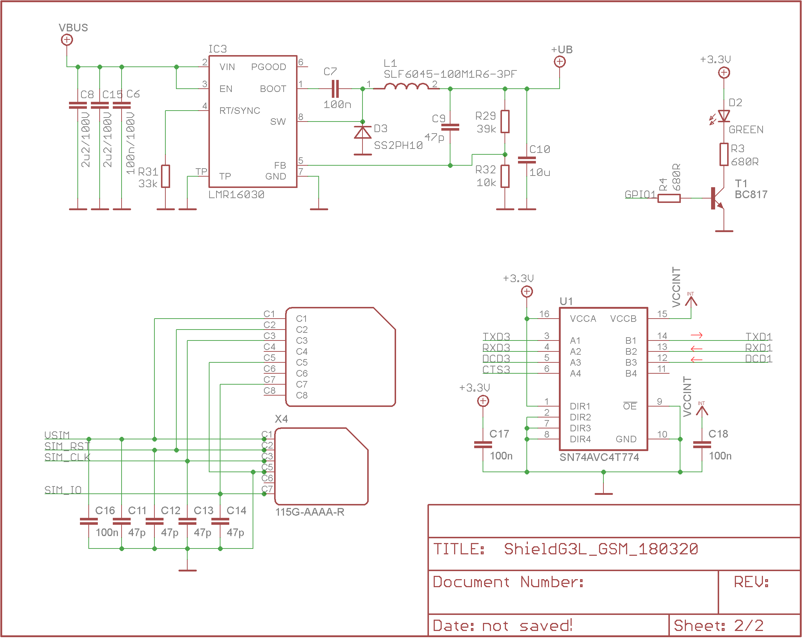

# WEXP

## Přehled

Modul WEXP je modul pro hardwarové rozšíření komunikačních schopností jednotky [IODAG3E ](../zakladni-jednotky/iodag3e/)o technologii [6LoWPAN](../../konektivita/6lowpan.md). Tento modul neobsahuje žádný mikrokontrolér, konvertory napájení atp., jde pouze o rádiové rozhraní připojované přes konektor na základní jednotku. Nejedná se tedy o samostatně funkční autonomní zařízení, ale pro své využití vyžaduje spojení s nadřazeným systémem \(mikrokontrolérem\).

Na jednotku [IODAG3E ](../zakladni-jednotky/iodag3e/)se vkládá do [patřičného konektoru](../zakladni-jednotky/iodag3e/rozhrani-a-periferie.md#prehled) \(č. 3\) a upevňuje šroubem M1.6.

## Technické specifikace

Modul je obecně použitelný pro ZigBee, IEEE802.15.4, 6LoWPAN a jiné aplikace. Pracuje v ISM pásmu, disponuje bohatými nastaveními parametrů přenosu a velmi nízkou spotřebou ve spánku. Je založen na obvodu AT86RF212B.

Modul podporuje modulace několik typů BPSK a QPSK modulací a rychlostmi přenosu dat od 20 kb/s po 1000 kb/s. Modul disponuje integrovanou hardwarovou šifrovací jednotkou AES 128 bit a hardwarový generátor náhodných čísel.

### Absolute maximum ratings

| **Parametr** | **Min** | **Typ** | **Max** |
| :--- | :--- | :--- | :--- |
| Napájecí napětí \[V\] | 1.8 |  | 3.6 |
| Napájecí proud \[mA\] |  |  | 30 |
| Provozní rozsah \[°C\] | -40 |  | -85 |
| Skladovací rozsah \[°C\] | -50 |  | 150 |
| ESD \(human body model\) \[V\] |  |  | 6000 |

### Charakteristiky a doporučené operační parametry

Hodnoty uvedeny při napájení 3.0 V a teplotě okolí 25°C.

| **Parametr** | **Min** | **Typ** | **Max** |
| :--- | :--- | :--- | :--- |
| Napájecí proud při vysílání \(+10 dB\) \[mA\] |  | 26.5 |  |
| Napájecí proud při vysílání \(+0 dB\) \[mA\] |  | 13.5 |  |
| Napájecí proud při vysílání \(-25 dB\) \[mA\] |  | 9.5 |  |
| Napájecí proud při příjmu \(high sensitivity\) \[mA\] |  | 9.2 |  |
| Napájecí proud při příjmu \(normal mode\) \[mA\] |  | 8.7 |  |
| Napájecí proud Rx/Tx část vypnutá \[uA\] |  | 450 |  |
| Napájecí proud ve spánku \[uA\] |  | 0.2 |  |
| Frekvence SPI \[MHZ\] |  |  | 8 |

## Schéma

