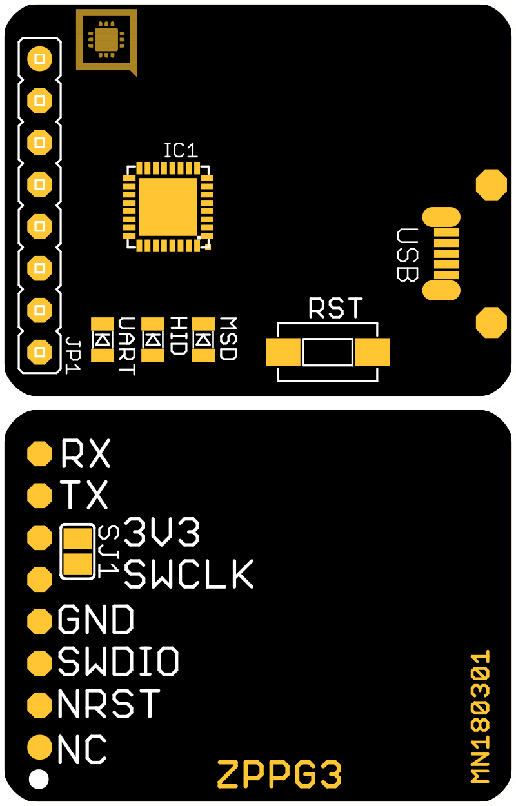

# ZPPG3

## Konfigurace a zapojení 

* _SJ1_ - napájecí propojka; pokud je spojena, je cílový procesor napájen z programátoru \(ve výchozím nastavení rozpojeno\)

## Použití 

\#TODO \(GIF pripojení ZPP do počítače a IODY - ticket [HW-1054](https://youtrack.byzance.cz/youtrack/issue/HW-1054)\)

Připojením DevKitu k PC je vytvořeno složené USB zařízení obsahující:

* mass storage zařízení \(flashdisk\) s názvem _BYZG3\_\*\*\*\*\_
* virtuální sériový port

Aktualizace [firmware](https://docu.byzance.cz/~/edit/primary/hardware-a-programovani/programovani-hw/struktura-programu) či [bootloaderu](https://docu.byzance.cz/~/edit/primary/hardware-a-programovani/architektura-fw/bootloader) IODA binárním souborem _\*.bin_ je možno provádět pomocí drag&drop z počítače na virtuální mass storage zařízení.



