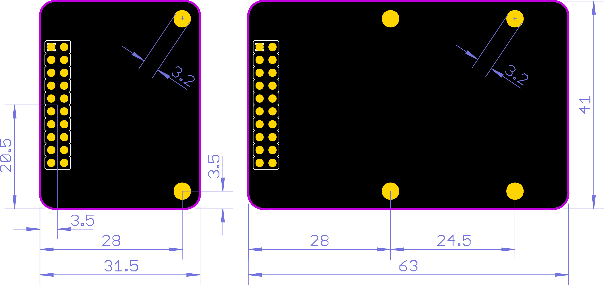
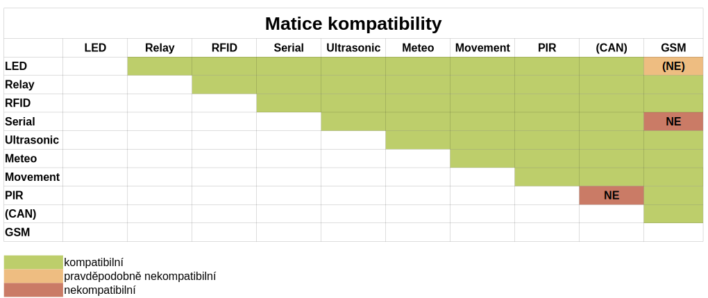

# Rozšiřující moduly

## Přehled

Na [základní jednotky](../zakladni-jednotky/) se připojují v této kapitole rozebrané rozšiřující moduly \(shieldy\). Smyslem rozšiřujících jednotek je přinést konkrétní funkcionalitu bez nutnosti vyvíjet vlastní hardware. Jedná se o předpřipravené desky, které se pouze připojí na základní jednotky a bez dodatečné kabeléže nebo drátování na nepájivém poli lze vyzkoušet interakci s reálným světem. Dobře slouží pro rychlé vytvoření ukázek na nejčastěji řešené aplikace jako je měření teploty a nebo spínání relé. Lze s nimi rychle bez větší námahy postavit funkční prototyp. Těmto jednotkám se alternativně říká **shieldy**.

[Základní jednotky](../zakladni-jednotky/) podporující připojení shieldů musí mít integrovaný tzv. [X konektor](./#x-konektor-a-y-konektor) \(např. [IODAG3E](../zakladni-jednotky/iodag3e/)\). 

## X konektor a Y konektor

Fyzicky jsou vstupy a výstupy základních jednotek rozděleny do dvou skupin, tzn. na **X konektor** a **Y konektor**. Tyto konektory obsahují vybrané na základní jednotce dostupné periferie \(UART, I2C, PWM, ...\), napájecí signály a nebo signály pro [SWD ](../../programovani-hw/offline-programovani/)či reset. 

Kromě vstupně výstupních pinů jsou na konektorech dostupné i napájecí vývody a signály _user_ tlačítka a tlačítka _reset_. Jmenovitě jde o signály 3V3, USR, GND, VBUS, VBAT a RST \(obrázek níže\).

* 3V3 - výstupní napájecí pin s napětím 3.3 V pro napájení externích periferií
* USR - signál _user_ tlačítka \(emulace _user_ tlačítka z externího zařízení\)
* GND - nulový potenciál jednotky, referenční nulový potenciál pro všechny ostatní signály
* VBUS - napájecí výstup určený pro výstup napájecího napětí ze základní jednotky, více v sekci s napájením pro danou[ základní jednotku](../zakladni-jednotky/#prehled) \(konkrétně pro IODAG3E v [této části](../zakladni-jednotky/iodag3e/#moznosti-napajeni)\)
* VBAT - vstupní napájení do [RTC obvodu](../../funkcionality/pripojeni-zdroje-k-vbat.md) základní jednotky 
* RST - resetovací vstup mikrokontroléru jednotky

### X konektor

Základní jednotky podporující připojení [shieldů ](./)musí mít integrovaný tzv. **X konektor** \(např. [IODAG3E](../zakladni-jednotky/iodag3e/)\). Jde o standardní 20 pinový header s roztečí 2.54mm a rozložením 2x10 pinů \(samice\). Do tohoto headeru se shora připojují všechny shieldy. Kromě toho jsou vývody dostupné na hranách základních jednotek ve frézovaných prokovech. Rozteč prokovů je standardních 1.27mm. Rozšiřující moduly mají stejný typ konektoru včetně rozložení vývodů \(samec\).

Popis jednotlivých vstupů a výstupů je závislý na typu základní jednotky - různé základní jednotky se mohou mírně odlišovat v dostupných pinech/funkcích \(tzn. pin X05 může být hardwarově připojen na různý pin mikrokontroléru na různých základních jednotkách\). Přesto X konektor definuje např. dostupný UART vždy na pinech X09 a X11 a I2C sběrnici vždy dostupnou na vývodech X06 a X07. 

V tabulce níže je uveden seznam dostupných periferií na každé [základní jednotce ](../zakladni-jednotky/)bez ohledu na její typ. Ukázka konkrétního zapojení vývodů na mikrokontrolér pro jednotku IODAG3E [zde](../zakladni-jednotky/iodag3e/konektor-x-a-y.md). 

| **Pin** | **Funkce** |  | **Pin** | **Funkce** |
| --- | --- | --- | --- | --- | --- | --- | --- | --- | --- | --- |
| X00 |  |               | X10 | SPI SCK |
| X01 |  |  | X11 | USART TX |
| X02 |  |  | X12 | SPI MISO |
| X03 |  |  | X13 | CAN TX |
| X04 |  |  | X14 | SPI MOSI |
| X05 |  |  | X15 | CAN RX |
| X06 | I2C SCL |  | 3V3 |  |
| X07 | I2C SDA |  | USR |  |
| X08 | SPI NSS |  | GND |  |
| X09 | USART RX |  | VBUS |  |

### **Y konektor**

Oproti tomu **Y konektor** není fyzicky vyveden na žádný konektor, ale vývody jsou dostupné pouze na hranách základních jednotek ve frézovaných prokovech. Vývody slouží pro další rozšíření vstupů a výstupů. Rozteč a velikosti prokovů jsou shodné s X konektorem.

\#TODO Pro Y konektor platí podobné věci jako výše popsané pro X.

## Rozměry

Shieldy existují ve dvou velikostech: plná a poloviční. Shield plné velikost má rozměry totožné jako základní jednotka [IODAG3E](../zakladni-jednotky/iodag3e/). Poloviční shield je zcela shodný s plným shieldem pouze s tím rozdílem, že má poloviční délku. Rozměrový nákres je níže \(v milimetrech\).

Vlevo je na nákresu vidět umístění X konektoru a dále jsou na shieldech dva resp. čtyři otvory pro M3 šrouby v závislosti na velikosti shieldu.

## Kompatibilita shieldů

Každý z shieldů využivá určité datové piny z [X konektoru](../zakladni-jednotky/iodag3e/rozhrani-a-periferie.md#pinout) a zároveň žádný shield nevyužívá všechny najednou. Je tedy možné použít více shieldů najednou. V tétou sovislosti lze mluvit o kompatibilitě shiledů elektrické a mechanické.

### Mechanická kompatibilita

Obecně lze shieldy na sebe skládat jako stavebnici a zapojovat jeden do druhého. Může se však stát, že např. [Ultrazvukový shield ](ultrasonic-shield.md)a [PIR shield ](pir-shield.md)na sebe dát nejdou. Nejdou na sebe dát z důvodu, že oba shieldy pro svou činnost potřebují volný prostor nad shieldem. Obdobně jiné shieldy mohou mít vysoké svorkovnice, které zabrání dalšímu skládání shieldů na sebe. 

### Elektrická kompatibilita 

Elektrická kompatibilita se odvíjí od sdílení pinů X konektoru mezi jednotlivými shieldy. Jinými slovy jde o to, že jeden pin [X konektoru](../zakladni-jednotky/iodag3e/rozhrani-a-periferie.md#pinout) mohou využívat dva důzné shieldy a takové shieldy nebude možné použít najednou. Teoreticky to možné být může, ale přinese to komplikace ve firmware. Pro jednoduchost však mluvíme o tom, že **shieldy není možné použít najednou**, tzn. **shieldy nejsou spolu** kompatibilní.

V případě elektrické kompatibility shieldů je níže dostupná tabulka kompatibility, kde je kompatibilita patrná. 

## Firmware

Zpravidla na všechny shieldy jsou vytvořené example projekty pro jednoduché vyzkoušení funkcionality hardware. Projekty stačí pouze zkompilovat, nahrát do zařízení a vyzkoušet. Všechny projekty jsou dostupné v k tomu určeném repozitáři. \#TODO zajistit dostupnost projektů

