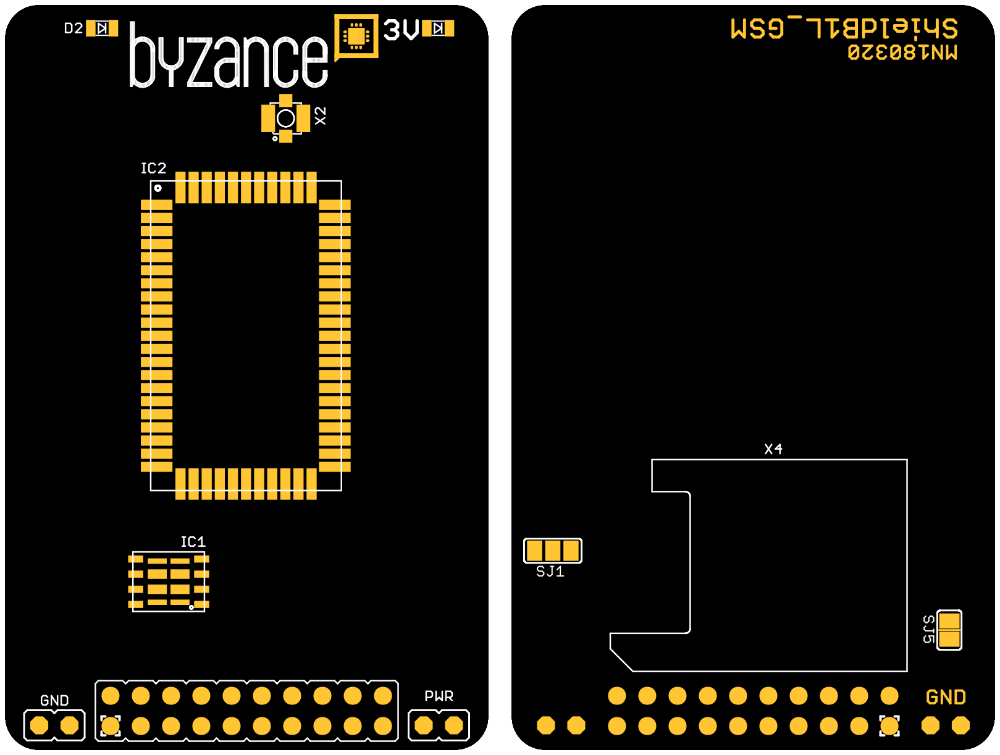

# GSM shield

GSM shield si klade za cíl připojit základní jednotku k Internetu pomocí buňkové sítě GSM. Jádro shieldu tvoří modul ublox SRA-U201, což jej činí globálně použitelným. Je možné využít jak klasickou mini SIM, tak zabudovanou eSIM. Shield pracuje ve 3G HSPA/GSM síti.

## Hardware

### Zapojení X konektoru

| **X01** | **X03** | **X05** | **X07** | **X09** | **X11** | **X13** | **X15** | **USR** | **VBUS** |
| --- | --- | --- | --- |
| ​RESET | ​ | ​ | ​ | RX | TX | ​ | ​ | ​ | ​&gt;= 5 V |
| **X00** | **X02** | **X04** | **X06** | **X08** | **X10** | **X12** | **X14** | **3V3** | **GND** |
| ​ | ​ | ​ | ​ | \(​DCD\) | ​ |  | ​ | ​ | ​ |

* _RESET _- pin resetu modul; musí být ve stavu open-drain
* _DCD _- Data Carrier Detection indikace dostupných dat ve směru shield &gt; základní jednotka
* _RX _a _TX _- vysílání a příjem dat po sériové lince

### Konfigrace a zapojení

* propojka _SJ1 _- volba napájení 3,3 V ze základní jednotky \(spojení vlevo\); vlastní měnič \(spojení vpravo\)
* propojka _SJ5 _- spojeno: pin DCD je připojen na X08 \(výchozí stav\)
* _X4 _- koniktor mini SIM karty; může být vložena pouze, pokud není osazena eSIM
* _IC1 _- zabudovaná SIM \(eSIM\); může být osazena pouze, pokud není vložena mini SIM
* _X2 _- u.fl konektor pro připojení GSM antény \(50 ohm\)
* _3V _- indikace napájení GSM modulu
* _D2 _- indikace stavu sítě

## Schéma

\#TODO doplnit schéma

## Software

Pro použití je nutné GSM shield připojit k základní jednotce, v případě použití mini SIM vložit SIM \(nezabezpečenou kódem PIN\). Dále je nutné nakonfigurovat základní jednotku tak, aby používala GSM jako zdroj Internetu \(viz. [Specifikace zdroje internetu](https://docu.byzance.cz/~/edit/primary/hardware-a-programovani/konektivita/specifikace-zdroje-internetu)\).

