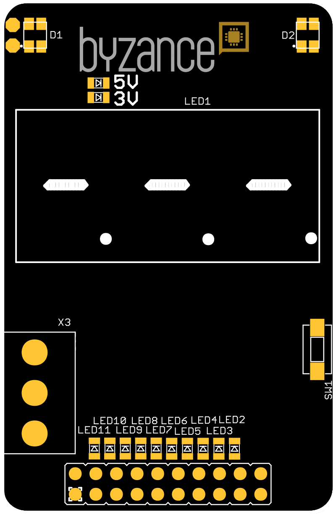
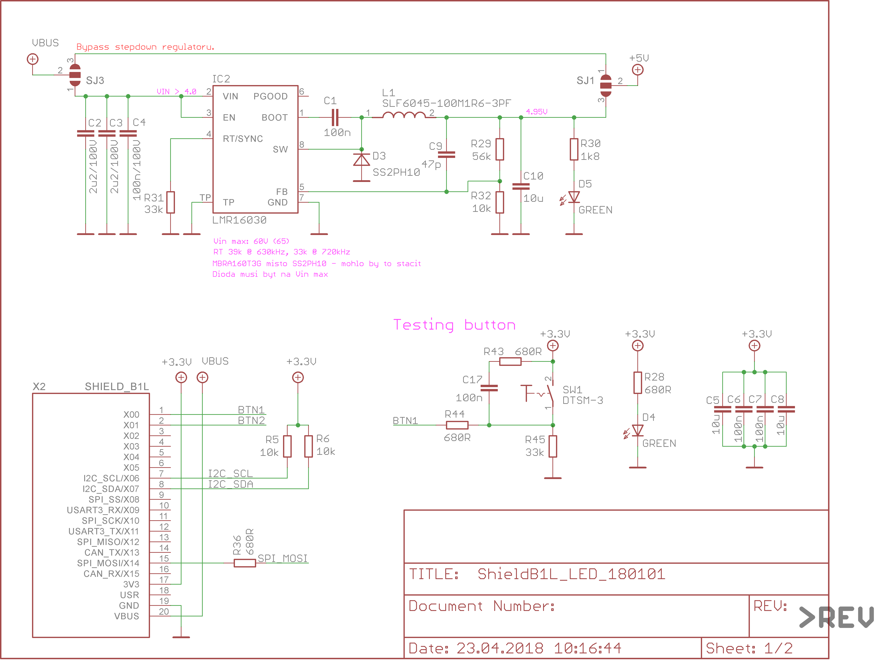
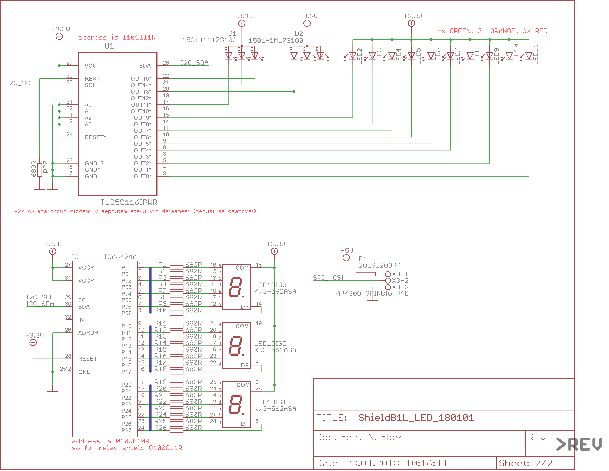

# LED shield

Shield slouží k zobrazení dat pomocí trojmístného sedmisegmentového displeje, LED diod či bargrafu, RGB diod nebo pomocí volitelně připojitelného digitálně řízeného LED pásku s čipy WS2812. 



## Hardware

### Zapojení X konektoru

| **X01** | **X03** | **X05** | **X07** | **X09** | **X11** | **X13** | **X15** | **USR** | **VBUS** |
| :---: | :---: | :---: | :---: | :---: | :---: | :---: | :---: | :---: | :--- |
|  |  |  | SDA |  |  |  |  |  | &gt; 6V |
| **X00** | **X02** | **X04** | **X06** | **X08** | **X10** | **X12** | **X14** | **3V3** | **GND** |
| BTN |  |  | SCL |  |  |  | DAT | 3.3 V | GND |

* _SCL_ a _SDA_ - komunikace po I2C sběrnici s expandery pro řízení LED diod, displeje a RGB displeje
* _DAT_ - datový vodič pro LED pásky
* _BTN_ - tlačítko

### Konfigurace a zapojení

* _X3_ - svorkovnice pro připojení LED pásku \(5 V, GND a datový vodič\) s řadičem WS2812; datový vodič chráněn rezistorem, proudová pojistka pro 5 V \(1 A\)
* _LED2 - LED11_ - LED diody pro zobrazení bargrafu 
* _LED1_ - trojmístný sedmisegmentový displej
* _D1, D2_ - RGB LED diody
* _3V_ - detekce napětí 3,3 V
* _5V_ - detekce 5 V napájení
* SJ1, SJ2 - volba napájení pro LED pásek

## Schema





## Software

```cpp
#include "byzance.h"
#include "TripleSevenSeg.h"
#include "TLC59116.h"

#define BYZANCE_OVER_USB 0

#if BYZANCE_OVER_USB
    USBSerial    usb(0x1f00, 0x2012, 0x0001, false);
#else
    Serial        pc(SERIAL_TX, SERIAL_RX); // tx, rx
#endif

// Common variables
uint32_t tmp32 = 0;
InterruptIn btnUsr(USER_BUTTON);
volatile bool button_usr_clicked= 0;
uint32_t i = 0;

// Object for LED segment display and LED bargraph
TripleSevenSeg * seven_segment;
TLC59116 * pwm_driver;


/*
 * Prototyp, který bude vybírat, kam se konzole vypisuje
 */
void to_computer(const char* format, ...);

void button_usr_fall_callback(){
    button_usr_clicked = 1;
}

void init(){

#if BYZANCE_OVER_USB
    ByzanceLogger::init(&usb);
#else
    ByzanceLogger::init(&pc);
    pc.baud(115200);
#endif

    // Attach callback for user button
    btnUsr.fall(&button_usr_fall_callback);

    // sSven_segment
    seven_segment = new TripleSevenSeg();
    seven_segment->is_initialized();
    Thread::wait(100);

    // PWM driver init
    pwm_driver = new TLC59116();
    pwm_driver->initialize(X07, X06);     // I2C SDA, I2C SCL
}

void loop(){

    // Change global PWM dimming
    if(button_usr_clicked){
        button_usr_clicked=0;
        to_computer("Button pressed.\n");
        pwm_driver->set_global_pwm(((i % 2) == 0) ? 2 : 0xFF);    // Choose 2 or 255 global PWM value.

    }

    // Display generated numbers from negativ to positive values with maximally two decimal digits.
    seven_segment->display_number(-120 + ((float)i++)/1 + 0.12, 2);

    // PWM dimming of the LED bargraph
    uint8_t pole[16];
    for (uint8_t j = 0; j < 16; j++) {
        pole[j] = i*5;
    }
    pwm_driver->set_all_channels(pole);

    // Wait some time
    Thread::wait(50);
}


void to_computer(const char* format, ...){
    char buffer[256];

    va_list arg;
    va_start (arg, format);
    vsnprintf(buffer, 256, format, arg);
    va_end (arg);

    #if BYZANCE_OVER_USB
        usb.printf(buffer);
    #else
        pc.printf(buffer);
    #endif
}
```

