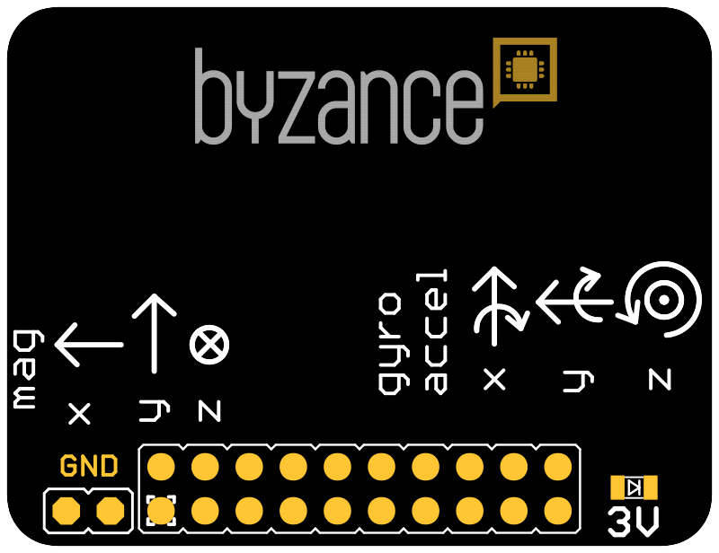
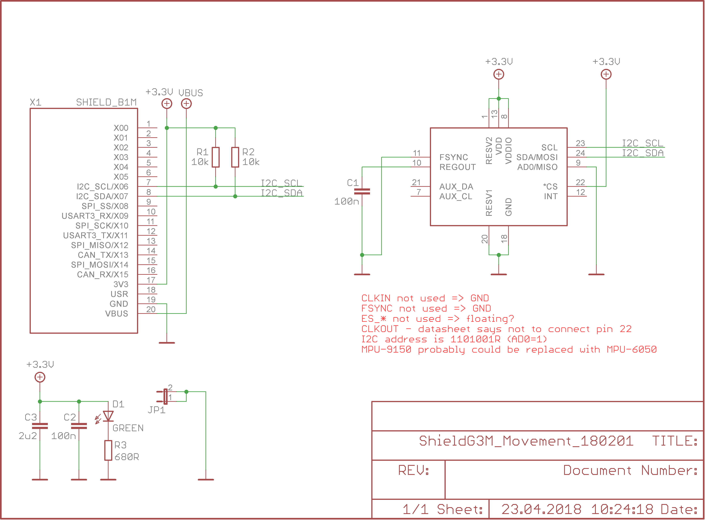

# Movement shield

Shield je určen pro sledování veličin zrychlení \(akcelerometr\), rotace \(gyroskop\) a magnetické indukce \(magnetometr\). Ze získaných dat je tedy možné získat celou řadu informací - například informaci o náklonu, vibracích, pohybu. Základní detekčním obvodem je MPU-9250.



## Hardware

### Zapojení X konektoru 

| **X01** | **X03** | **X05** | **X07** | **X09** | **X11** | **X13** | **X15** | **USR** | **VBUS** |
| --- | --- | --- | --- |
| ​ | ​ | ​ | SDA | ​ | ​ | ​ | ​ | ​ |  |
| **X00** | **X02** | **X04** | **X06** | **X08** | **X10** | **X12** | **X14** | **3V3** | **GND** |
|  | ​ | ​ | SCL | ​ | ​ | ​ |  | 3.3 V | GND |

* _SCL_ a _SDA_ - komnikace po sběrnice I2C s MPU-9250
* _3V_ - detekce napětí 3,3 V

### Konfigurace a zapojení

Není potřeba žádná dodatečná konfigurace. 

## Schéma



## Software

```cpp
#include "byzance.h"
#include "MPU9150.h"

#define BYZANCE_OVER_USB 0

#if BYZANCE_OVER_USB
	USBSerial	usb(0x1f00, 0x2012, 0x0001, false);
#else
	Serial		pc(SERIAL_TX, SERIAL_RX); // tx, rx
#endif

uint32_t tmp32 = 0;

/*
 * Prototyp, který bude vybírat, kam se konzole vypisuje
 */
void to_computer(const char* format, ...);


// speciální funkce, do které program skočí dřív než do initu
// slouží hlavně k zapnutí ByzanceLoggeru, aby se mohly logovat i hlášky z Byzance::init a connect
void pre_init(){

	#if BYZANCE_OVER_USB
		ByzanceLogger::init(&usb);
	#else
		ByzanceLogger::init(&pc);
		pc.baud(115200);
	#endif

	ByzanceLogger::set_level(DEBUG_LEVEL_TRACE);
	ByzanceLogger::enable_prefix(false);
}

void init(){

	to_computer("Compiled on %02d. %02d. %04d - %02d:%02d:%02d\n", __BUILD_DAY__, __BUILD_MONTH__, __BUILD_YEAR_LEN4__, __BUILD_HOUR__, __BUILD_MINUTE__, __BUILD_SECOND__);
	to_computer("Waiting for init...\n");
	to_computer("ARM GCC NONEABI = %s.%s.%s\n", TOSTRING(__GNUC__), TOSTRING(__GNUC_MINOR__), TOSTRING(__GNUC_PATCHLEVEL__));


}

void loop(){
	MPU9150 mpu9150(X07,X06);
	mpu9150.set_Ascale(AFS_2G);
	mpu9150.set_Gscale(GFS_250DPS);
	while(1){
		mpu9150.update_motion();  // Read the x/y/z adc values
		to_computer("mpu9150: ax = %f ay = %f az = %f gx = %f gy = %f gz = %f\n",mpu9150.ax,mpu9150.ay,mpu9150.az,mpu9150.gx,mpu9150.gy,mpu9150.gz);
		Thread::wait(1000);
	}
}

void to_computer(const char* format, ...){

	char buffer[256];

	va_list arg;
	va_start (arg, format);
	vsnprintf(buffer, 256, format, arg);
	va_end (arg);

	#if BYZANCE_OVER_USB
		usb.printf(buffer);
	#else
		printf(buffer);
	#endif

}
```

