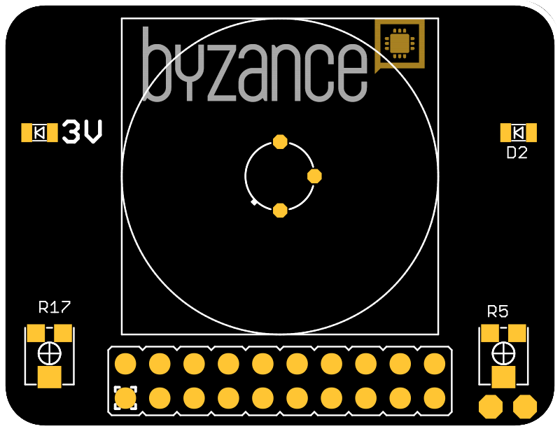
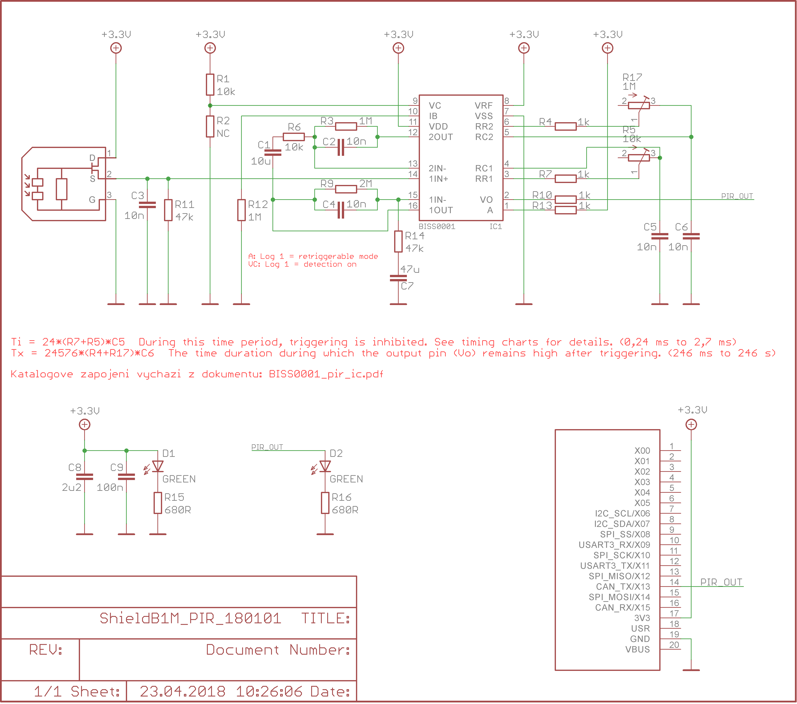

# PIR shield

Shield slouží k detekci pohybu. Detekce funguje tak, že hlídaná oblast je rozdělena na několik zón a v každé zóně je měřena teplota. Pokud dojde ke změně teploty mezi zónami, což je způsobeno přechodem z jedné zóny do druhé, je detekován pohyb. Z tohoto důvodu nejsou detekovány osoby pouze stojící.



## Hardware

### Zapojení X konektoru

| **X01** | **X03** | **X05** | **X07** | **X09** | **X11** | **X13** | **X15** | **USR** | **VBUS** |
| :---: | :---: | :---: | :---: | :---: | :---: | :---: | :---: | :---: | :--- |
|  |  |  |  |  |  | PIR\_OUT |  |  |  |
| **X00** | **X02** | **X04** | **X06** | **X08** | **X10** | **X12** | **X14** | **3V3** | **GND** |
|  |  |  |  |  |  |  |  | 3.3 V | GND |

* PIR\_OUT - detekční pin pohybového senzoru

### Konfigurace a zapojení

* R5  - Tx - Nastavení, jak dlouho bude trvat puls, pokud senzor detekuje pohyb.
* R17 - Ti - Nastavení potlačení spouštění \(citlivost\).

### Provozní vlastnosti

Detekční úhel - pohybuje se mezi 100 - 140°. Velmi záleží na světelných podmínkách - detekce ve tmě nebo v protisvětle je horší.

Detekční vzdálenost - pohybuje se v rozmezí 3-7 metrů. Opět záleží na světelných podmínkách a na velikosti pohybujícího-se předmětu. Jemnější pohyby těla čidlo poměrně bezpečně detekuje do 3-4 metrů, na větší vzdálenost je třeba větší pohyb celým tělem.

## Schema



## Software

```cpp
#include "byzance.h"

Serial pc(SERIAL_TX, SERIAL_RX); // tx, rx

DigitalIn pir_out(X13);

void init(){   

    pc.baud(115200);
    pc.printf("Sensor initialised\n");

}

bool state_current = false;
bool state_previous = false;

void loop(){

    state_current = pir_out.read();

    if(state_current!=state_previous){

        if(state_current){
            pc.printf("motion detected\n");
        } else {
            pc.printf("motion ended\n");
        }

        state_previous = state_current;
    }

    Thread::wait(10);

}
```

