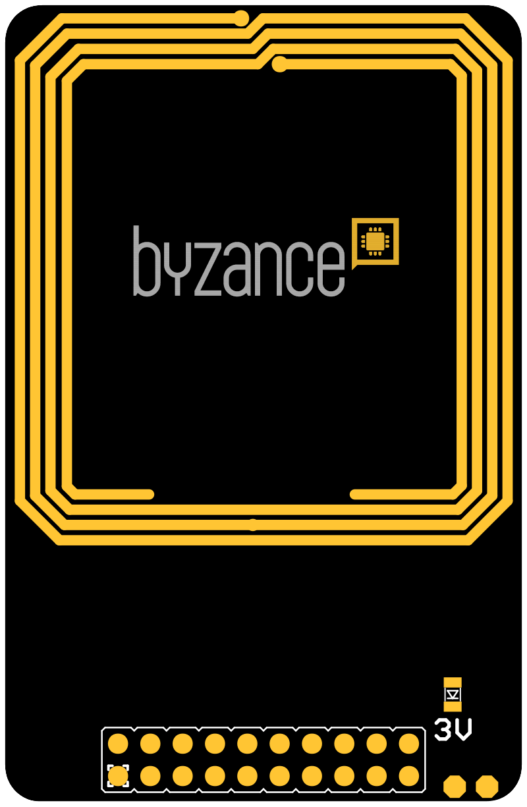
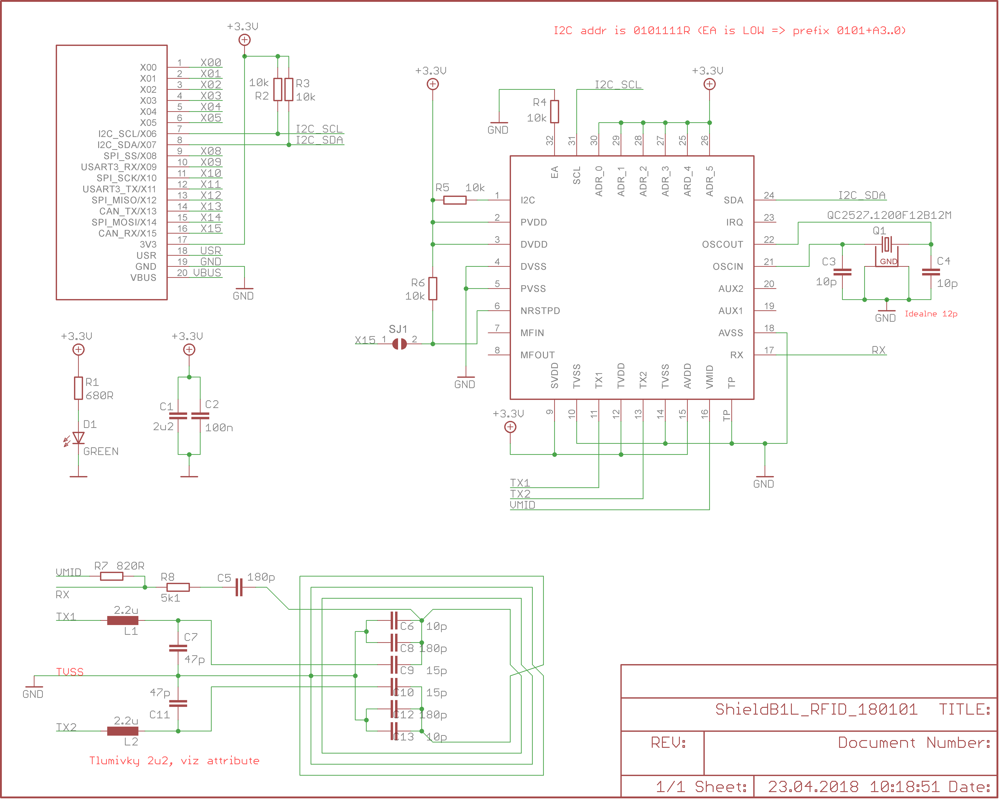

# RFID shield

RFID shield slouží k obousměrné komunikaci s NFC zařízení \(RFID nálepky, karty, ..\). Shield má integrovanou anténu a využívá obvod **NXP MFRC522**. Tento čip podporuje práci se zařízeními fungujících na identifikačních protokolech

* MIFARE Mini
* MIFARE 1K
* MIFARE 4K
* MIFARE Ultralight
*  MIFARE DESFire EV1
* MIFARE Plus




## Hardware

### Zapojení X konektoru

| **X01** | **X03** | **X05** | **X07** | **X09** | **X11** | **X13** | **X15** | **USR** | **VBUS** |
| --- | --- | --- | --- |
| ​ | ​ | ​ | ​SDA | ​ | ​ | ​ | ​ | ​ | ​ |
| **X00** | **X02** | **X04** | **X06** | **X08** | **X10** | **X12** | **X14** | **3V3** | **GND** |
|  | ​ | ​ | SCL | ​ | ​ | ​ | ​ | 3.3 V | GND |

* _SDA_ a _SCL_ - I2C komunikace s MFRC522
* _3V_ - detekce napětí 3,3 V

### Konfigurace a zapojení

Shield nevyžaduje žádnou další komunikaci.

## Schéma



## Software

```cpp
#include "byzance.h"
#include "MFRC522.h"

// third arument is optional
MFRC522    RfChip(X07, X06, X15);

#define BYZANCE_OVER_USB 0

#if BYZANCE_OVER_USB
	USBSerial	usb(0x1f00, 0x2012, 0x0001, false);
#else
	Serial		pc(SERIAL_TX, SERIAL_RX); // tx, rx
#endif

void to_computer(const char* format, ...);

int rc = 0;

void init(){

#if !BYZANCE_OVER_USB
	pc.baud(115200);
#endif

	to_computer("Compiled on %02d. %02d. %04d - %02d:%02d:%02d\n", __BUILD_DAY__, __BUILD_MONTH__, __BUILD_YEAR_LEN4__, __BUILD_HOUR__, __BUILD_MINUTE__, __BUILD_SECOND__);
	to_computer("Waiting for init...\n");
	to_computer("ARM GCC NONEABI = %s.%s.%s\n", TOSTRING(__GNUC__), TOSTRING(__GNUC_MINOR__), TOSTRING(__GNUC_PATCHLEVEL__));

	rc = RfChip.PCD_Init();
	if(rc){
		to_computer("*******************\n");
		to_computer("*  RFchip init failed\n");
		to_computer("*******************\n");
	} else {
		to_computer("RFchip init done\n");
		// Get the MFRC522 software version
		uint8_t v = RfChip.PCD_ReadRegister(RfChip.VersionReg);
		to_computer("MFRC522 Software Version: 0x%02X", v);
		if (v == 0x91){
			to_computer(" = v1.0");
		} else if (v == 0x92){
			to_computer(" = v2.0");
		} else {
			to_computer(" (unknown)");
		}
		to_computer("\n");
		// When 0x00 or 0xFF is returned, communication probably failed
		if ((v == 0x00) || (v == 0xFF)) {
			to_computer("WARNING: Communication failure, is the MFRC522 properly connected?");
		}
	}

}

void loop(){

	// Look for new cards
	if (RfChip.PICC_IsNewCardPresent()){
		to_computer("card is present\n");

		// Select one of the cards
		if (RfChip.PICC_ReadCardSerial()){

			// Print Card UID
			to_computer("Card UID: ");
			for (uint8_t i = 0; i < RfChip.uid.size; i++){
				to_computer("%02X", RfChip.uid.uidByte[i]);
			}
			to_computer("\n");
		}

		// Print Card type
		uint8_t piccType = RfChip.PICC_GetType(RfChip.uid.sak);
		to_computer("PICC Type: %s \n\r", RfChip.PICC_GetTypeName(piccType));


	} else {
		to_computer("card isn't present\n");
	}

	Thread::wait(1000);
}

void to_computer(const char* format, ...){

	char buffer[256];

	va_list arg;
	va_start (arg, format);
	vsnprintf(buffer, 256, format, arg);
	va_end (arg);

	#if BYZANCE_OVER_USB
		usb.printf(buffer);
	#else
		pc.printf(buffer);
	#endif

}
```


