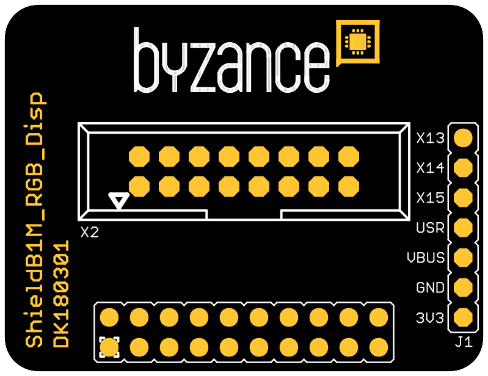
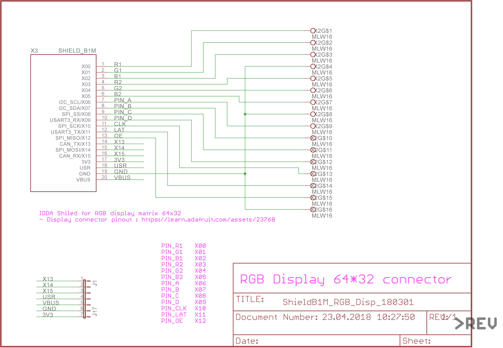

# RGB Displej shield

Jedná se o přizpůsobovací shield - poskytuje rozhraní k připojení RGB maticového displeje. K displeji je vždy dále nutné připojit externí napájení \(dle konkrétního typu displeje\). Základním principem fungování těchto registrů jsou posuvné registry s konstantním proudem. Podporováno je až 32 řádků \(4 bitová adresová sběrnice\), počet sloupců explicitně není omezen a je závislý na výkonu procesoru. Kompatibilní displeje jsou například [https://www.adafruit.com/product/2279](https://www.adafruit.com/product/2279) nebo [https://www.ebay.com/itm/1x-RGB-P5-HD-led-screen-display-module-64x32-led-display-module-dot-matrix-5mm/252445600901?hash=item3ac6ee2c85:g:QeYAAOSwTEJZ9r8v](https://www.ebay.com/itm/1x-RGB-P5-HD-led-screen-display-module-64x32-led-display-module-dot-matrix-5mm/252445600901?hash=item3ac6ee2c85:g:QeYAAOSwTEJZ9r8v) .

 



## Hardware

### Zapojení X konektoru

| **X01** | **X03** | **X05** | **X07** | **X09** | **X11** | **X13** | **X15** | **USR** | **VBUS** |
| --- | --- | --- | --- |
| ​G1 | ​R2 | B2​ | ​PIN\_B | ​PIN\_D | ​LAT | ​ | ​ |  |  |
| **X00** | **X02** | **X04** | **X06** | **X08** | **X10** | **X12** | **X14** | **3V3** | **GND** |
| R1 | ​B1 | ​G2 | PIN\_A | ​PIN\_C | CLK​ | OE​ |  | 3.3 V | GND |

* R1, G1, B1 - ovládání červené, zelené a modré v horní polovině displeje
* R2, G2, B2 - ovládání červené, zelené a modré v dolní polovině displeje
* PIN\_\* - volba řádku \(16 možností; vybírají se vždy dva najednou v horní a dolní polovině =&gt; max. 32 řádků\)
* CLK - hodinový signál pro vnitřní posuvné registry
* LAT - propsání hodnot na výstup posuvných registrů
* OE - aktivace výstupu

### Konfigurace a zapojení

Displej je kompatibilní s originálním zapojením a není nutná žádná dodatečná konfigurace.

## Schéma



## Software

```cpp
#include "byzance.h"
#include "RGB_matrix.h"


#define  PIN_R1   X00
#define  PIN_G1   X01
#define  PIN_B1   X02
#define  PIN_R2   X03
#define  PIN_G2   X04
#define  PIN_B2   X05
#define  PIN_A    X06
#define  PIN_B    X07
#define  PIN_C    X08
#define  PIN_D    X09
#define  PIN_CLK  X10
#define  PIN_LAT  X11
#define  PIN_OE   X12


void bin_busy(bool busy);

void init(){

    //Inicializece statické třídy displeje
    RGB_matrix::Init(PIN_R1,PIN_R2,PIN_G1 ,PIN_G2,PIN_B1,PIN_B2,PIN_CLK,PIN_LAT,PIN_OE,PIN_A,PIN_B,PIN_C,PIN_D);

    /* Is very handy to attach this callback to RGB_Matrix ticker, when you need to
    update program from cloud. Inner ticker of the RGB_Matrix class could block the update process at the background
    */
    Byzance::attach_bin_busy(&bin_busy);

    // Změní barvu kurzoru
    RGB_matrix::set_color(RGB_MATRIX_COLOR::RED);
    RGB_matrix::set_background(RGB_MATRIX_COLOR::NONE);
}

void loop(){

    // Change cursor color
    RGB_matrix::set_color(RGB_MATRIX_COLOR::YELLOW);

    char *str = "Hello world";

    // Write "Hello world" on the first line
    RGB_matrix::put_line(str, 1);

    // Change cursor color
    RGB_matrix::set_color(RGB_MATRIX_COLOR::BLUE);

    // Put char on the coordinates (50,20)
    RGB_matrix::put_char(50,20,'!');

    Thread::wait(300);
}

```

