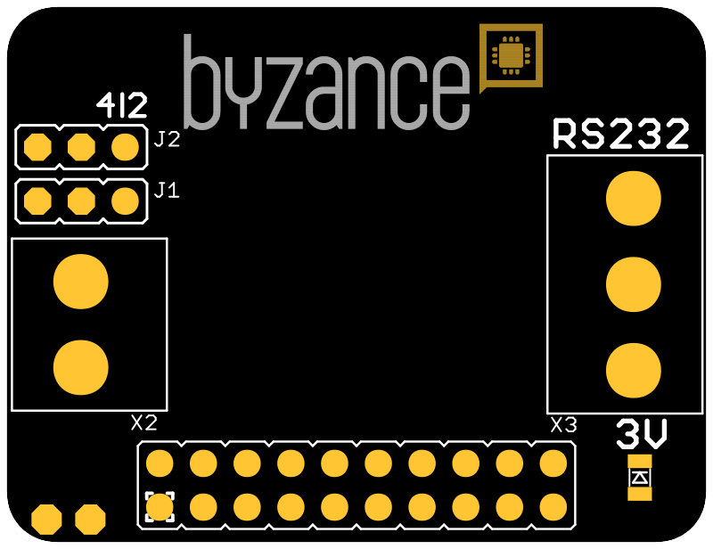
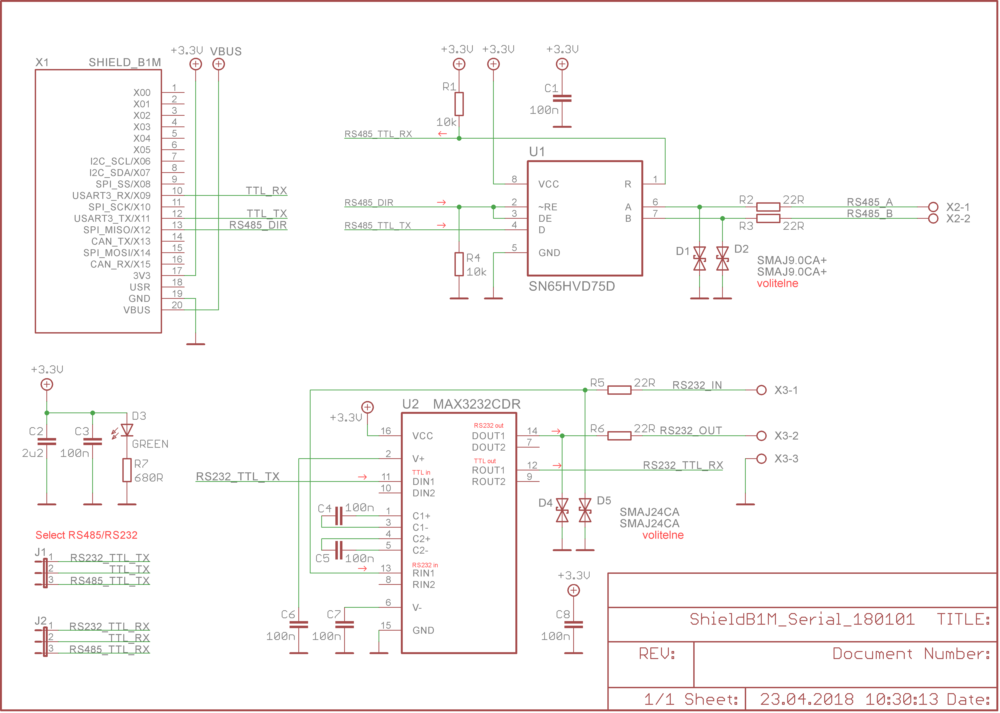

# Serial shield

Shield slouží jako převodník mezi sběrnicemi UART - RS-232 \(plně duplexní\) nebo UART - RS-485 \(poloduplexní\).



## Hardware

### Zapojení X konektoru

| **X01** | **X03** | **X05** | **X07** | **X09** | **X11** | **X13** | **X15** | **USR** | **VBUS** |
| :---: | :---: | :---: | :---: | :---: | :---: | :---: | :---: | :---: | :--- |
|  |  |  |  | TTL\_RX | TTL\_TX |  |  |  |  |
| **X00** | **X02** | **X04** | **X06** | **X08** | **X10** | **X12** | **X14** | **3V3** | **GND** |
|  |  |  |  |  |  | DIR |  |  |  |

* _TTL\_RX_ - slouží pro příjem na sběrnici RS-232 i RS-485
* _TTL\_RX_ - slouží pro vysílání na sběrnici RS-232 i RS-485
* _DIR_ - volba směru na sběrnici RS-485

### Konfigurace a zapojení

Jsou k dispozici dvě jumperové propojky:

* _J1_ - volba RX pinu \(vlevo RS-485, vpravo RS-232\)
* _J2_ - volba TX pinu \(vlevo RS-485, vpravo RS-232\)
* _X2_ - konektor pro připojení na sběrnici RS-485
* X3 - konektor pro připojení na sběrnici RS-232

## Schema



## Software

### Příklad prgramu pro RS-485

```cpp
#include "byzance.h"

Serial    pc(X11, X09); // tx, rx
DigitalOut dir(X12);
DigitalOut ledRed(LED_RED);

int i = 0;

void init(){
    pc.baud(115200);
    pc.printf("Hello world from serial test\n");

}

void loop(){
    ledRed = !ledRed;
    dir=1;
    pc.printf("serial test = %d\n", i);
    dir=0;
    i++;
    Thread::wait(500);
}
```

