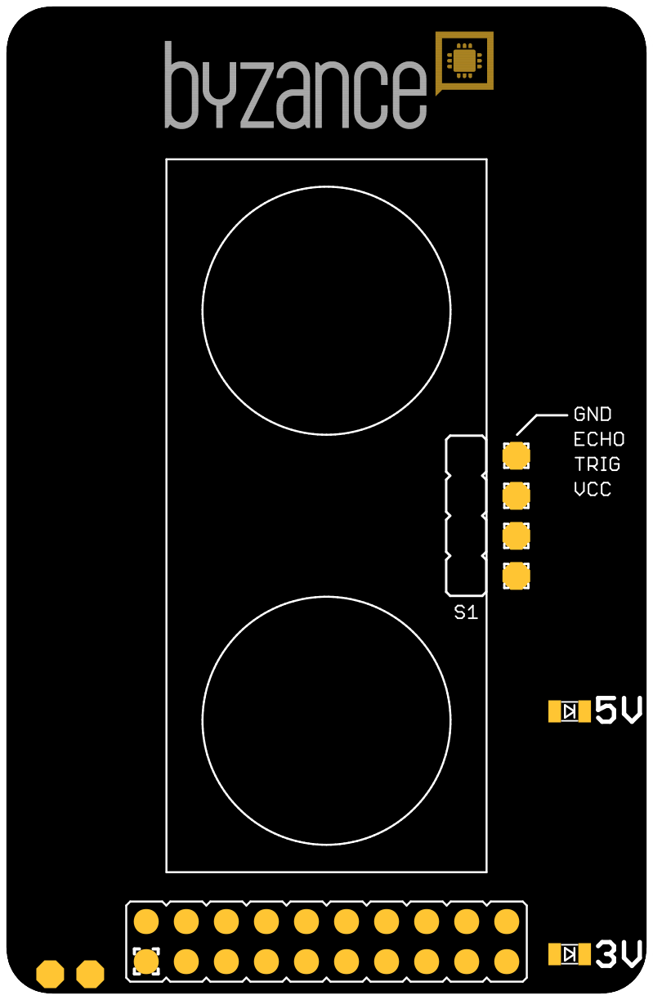
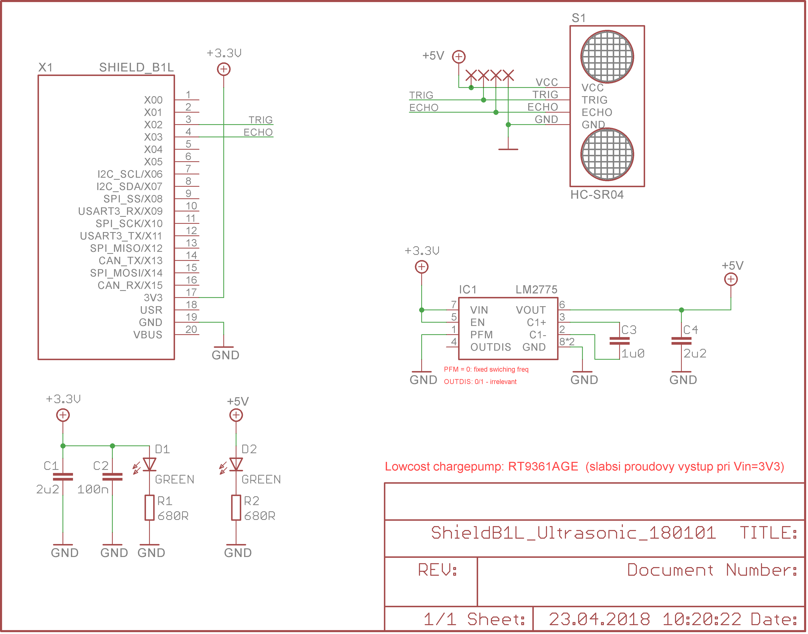

# Ultrasonic shield

Shield slouží k **měření vzdálenosti** pomocí odrazu akustického signálu od měřeného objektu. Shield využívá známý ultrazvukový senzor HYSRF04 od čehož se odvíjí i vlastnosti měřiče. Rozsah detekce sje udáván v rozmezí 2 až 400 cm, v praxi je zejména spodní hranice posunutá výše \(cca 20 cm\). Závisí od softwarevé implementace řídicího programu. Detekční úhel je měnší než 15 stupňů.  




## Hardware

### Zapojení X konektoru

| **X01** | **X03** | **X05** | **X07** | **X09** | **X11** | **X13** | **X15** | **USR** | **VBUS** |
| :---: | :---: | :---: | :---: | :---: | :---: | :---: | :---: | :---: | :--- |
|  | ECHO |  |  |  |  |  |  |  |  |
| **X00** | **X02** | **X04** | **X06** | **X08** | **X10** | **X12** | **X14** | **3V3** | **GND** |
|  | TRIG |  |  |  |  |  |  | 3.3 V | GND |

* _ECHO_ - pin pro potvrzení spuštění měření a detekci jejího dokončení
* _TRIG_ - pin pro spuštění měření
* _5V_ - detekce 5 V napájení ze step-up regulátoru
* 3_V_ - detekce 3.3 V napájení pro step-up regulátor

## Schema



## Software

```cpp
#include "byzance.h"

/*
* Test_ultrazvuk
* napajeni MUSI byt +5V0, na +3V3 to nefunguje
*/

// seriovka
Serial pc(SERIAL_TX, SERIAL_RX);

// ultrazvuk TRIG na X06
DigitalOut trig(X02);

// ultrazvuk ECHO na X04 (jsou tam pripadne i timery T3CH3, T1CH2N)
DigitalIn echo(X03);

// timer
Timer timer;

DigitalOut ledRed(X00);
DigitalOut ledGrn(X01);

// vzdalenost v cm
int distance_cm;

bool measuring = 0;

int getDistance(void);


void loop() {

distance_cm = getDistance();

if(distance_cm > 400 || distance_cm < 1){
pc.printf("Out of range\n");
} else {
pc.printf("Distance = %d cm\n", distance_cm);
}

Thread::wait(1000);
}


/**
* Vysle 10us pulz na TRIG a meri sirku pulzu vracenou na ECHO
* @param none
* @return prepocitana vzdalenost v cm
*
*/
int getDistance(void){

// 10 microsecond pulse
trig = 1;
wait_us(10);
trig = 0;

// reset timer
timer.reset();

while(!echo){
// waiting too long for rising edge
if(timer.read_ms()>100) return 0;
}

// reset timer
timer.reset();

while(echo){
// waiting too long for falling edge
if(timer.read_ms()>100) return 0;
}
//timer.stop();

return timer.read_us()/58; // prepocet na vzdalenost v cm
}
```

