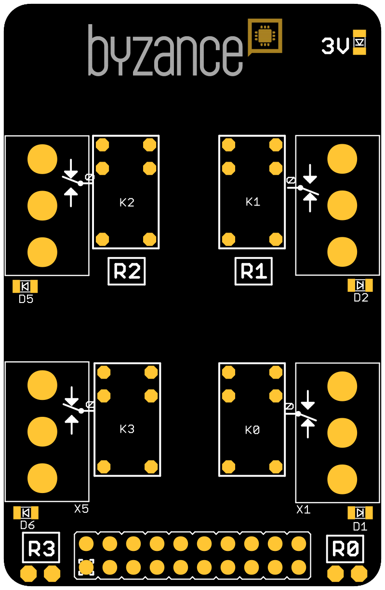
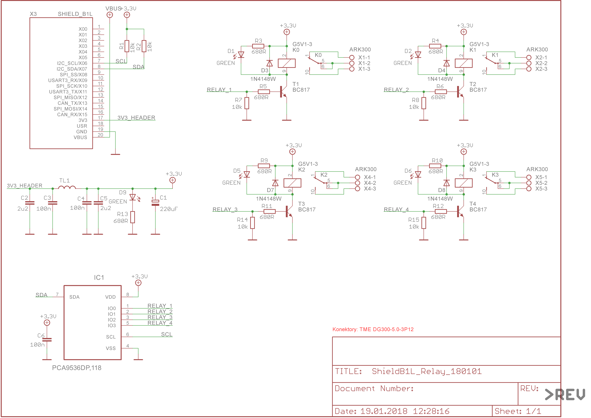

# Relay shield

Relé shield nese **čtyři **nízkonapěťová relé **Omron **řady **G5V1**. Na shieldu je použít I2C expandé pro zapínání jednotlivých relé z důvodu ušetření výstupy na X konektoru. Každé rele indikuje svoje sepnutí rozsvícením příslušné LED diody. Relé jsou označena R0 až R3 a značení odpovídá registrům v I2C expanderu, tzn. bit 0 na výstupu expanderu je rele R0.

### 

### Vlastnosti relé:

* Contact form SPDT
* Rated load 0.50 A at 125 VAC, 1 A 24 VDC
* Max. operating voltage 125 VAC, 60 VDC
* Carry current 2 A
* Max. operating current 1 A

_**TODO: tabulka se zapojením X konektoru**_

### Schema:

