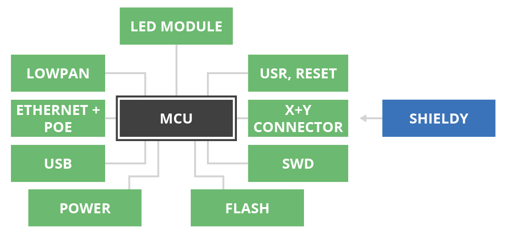

# Základní jednotky

Základní jednotka je zařízení, které slouží jako hlavní součást chytrého zařízení. Většinou je označováno jako IODA.

## Mikrokontrolér

Mikrokontrolér je založen na architektuře ARM a vykonává uživatelský program. Obsahuje interní paměť flash, interní paměť RAM, vstupy a výstupy, sběrnice a připojují se k němu všechny ostatní periferie.

## USB

USB slouží k připojení IODA do počítače. Může implementovat funkce virtuální sériové linky či jiné třídy USB.

## Blokové schéma

