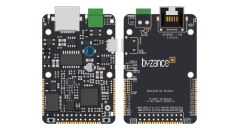

# Základní jednotky

## Přehled

Základní jednotka je zařízení, které slouží jako hlavní součást chytrého zařízení. Většinou je označováno jako IODA.

Základní jednotka je samostatně fungující plnohodnotý kus hardware, který je schopný připojení do cloudu a autonomní funkce. Základní jednotky mají programovatelné vstupy a výstupy, nejrůznější sběrnice a rozhraní a po napojení jednotek na cloud slouží jednotky jako IoT prvky. V závislosti na na konkrétním typu jednotky se liší druh připojení do cloudu \(ethernet, GSM,  6LoWPAN\). 

## Blokové schéma

Všechny základní jednotky technicky vycházejí ze stejné myšlenky a proto se dá mluvit o společném blokovém schématu pro všechny základní jednotky. Každé zařízení obsahuje řídicí mikrokontrolér, napájecí obvody, komunikační sběrnice, vstupně výstupní piny atp. Konkrétní realizace a typy elektronických komponent však závisí na typu základní jednotky. Na uvedeném obrázku jsou patrné všechny základní bloky jednotek.

\#TODO  [HW-1068](https://youtrack.byzance.cz/youtrack/issue/HW-1068)

### Napájecí obvody

Každý elektronický systém vyžaduje ke své funkci **napájení **a proto i základní jednotky mají blok starající se o napájení. Zdrojem napájení mohou být obecně nejrůznější adaptéry, energie z USB portu, baterie nebo napájené dodávané po ethernetovém kabelu \(PoE\).

Každá jednotka má své **specifické možnosti napájení** a detailní popis napájení je popsán v příslušné kapitole u každé základní jednotky. Možnosti se liší nejen v  množství i typech napájecích vstupů, ale i v mezních rozsazích provozních napětí.

### Mikrokontrolér

Mikrokontrolér založený na ARM architektuře je mozkem celého zařízení, vykonává uživatelský program a řídí celé zařízení. Obsahuje interní paměť FLASH pro program, interní paměť RAM pro data, vstupy a výstupy, sběrnice a připojují se k němu všechny ostatní periferie.

**Část periferií **mikrokontroléru je vyhrazena na obsluhu dalších obvodů na desce základní jednotky \(externí FLASH paměť, vodiče obvodů ethernetu atp.\), další část je dostupná uživateli na konektorech X a Y a část nemusí být ani z mikrokontroléru vyvedena. Podrobnější popis lze nalézt v popisu každé základní jednotky.

## Typy základních jednotek

ddd

## 

