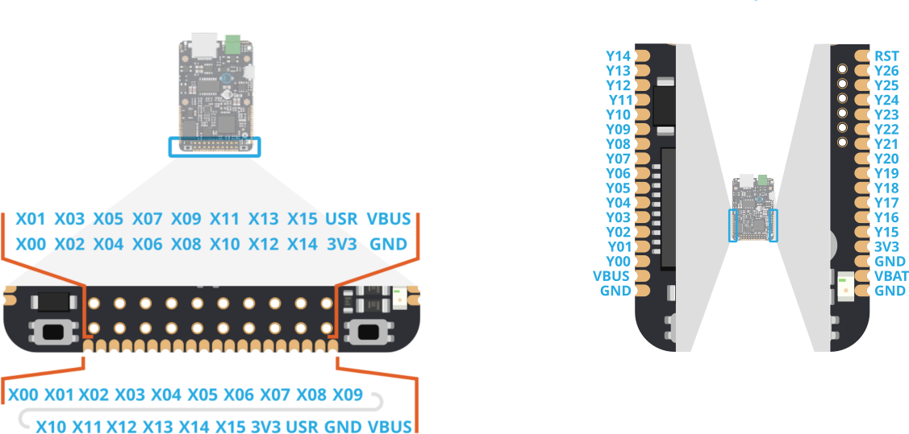

# Základní jednotky

## Přehled

Základní jednotka je samostatně fungující plnohodnotý kus hardware, který je schopný připojení do cloudu a autonomní funkce. Základní jednotky mají programovatelné vstupy a výstupy, nejrůznější sběrnice a rozhraní a po napojení jednotek na cloud slouží jednotky jako IoT prvky. V závislosti na na konkrétním typu jednotky se liší druh [připojení do cloudu](../../konektivita/) \(ethernet, GSM,  6LoWPAN\). 

Základní jednotka slouží jako řídicí komponenta chytrého zařízení. Většinou je označována názvem IODA a podle typu jednotky se k názvu přidávají další znaky \(např. [IODAG3E ](iodag3e/)nebo [IODAG3L](iodag3l.md)\). 

## Blokové schéma

Všechny základní jednotky technicky vycházejí ze stejné myšlenky a proto se dá mluvit o společném blokovém schématu pro všechny základní jednotky. Každé zařízení obsahuje řídicí mikrokontrolér, napájecí obvody, komunikační sběrnice, vstupně výstupní piny atp. Konkrétní realizace a typy elektronických komponent však závisí na typu základní jednotky. Na uvedeném obrázku jsou patrné všechny základní bloky jednotek. V podkapitolách níže jsou jednotlivé body rozebrány podrobněji.

\#TODO  [HW-1068](https://youtrack.byzance.cz/youtrack/issue/HW-1068)

### Napájecí obvody

Každý elektronický systém vyžaduje ke své funkci **napájení** a proto i základní jednotky mají blok starající se o napájení. Zdrojem napájení mohou být obecně nejrůznější adaptéry, energie z USB portu, baterie nebo napájené dodávané po ethernetovém kabelu \(PoE\).

Každá jednotka má své **specifické možnosti napájení** a detailní popis napájení je popsán v příslušné kapitole u každé základní jednotky. Možnosti se liší nejen v  množství i typech napájecích vstupů, ale i v mezních rozsazích provozních napětí.

### Mikrokontrolér

Mikrokontrolér založený na ARM architektuře je mozkem celého zařízení, vykonává uživatelský program a řídí celé zařízení. Obsahuje interní paměť FLASH pro program, interní paměť RAM pro data, vstupy a výstupy, sběrnice a připojují se k němu všechny ostatní periferie.

**Část periferií** mikrokontroléru je vyhrazena na obsluhu dalších obvodů na desce základní jednotky \(externí FLASH paměť, vodiče obvodů ethernetu atp.\), další část je dostupná uživateli na **konektorech X** a **Y** a část nemusí být ani z mikrokontroléru vyvedena. Podrobnější popis vývodů lze nalézt v popisu každé základní jednotky nebo níže v části [Vstupy a výstupy](./#vstupy-a-vystupy).

### Tlačítka, LED

Každá základní jednotka je zpravidla osazena několika **tlačítky** a signalizačními **LED** diodami. Jejich účelem je usnadnit ovládaní jednotek a jednoduše vizualizovat vnitřní stavy zařízení. Fyzické umístění tlačítek a LED diod může být odlišné pro jednotlivé základní jednotky.

Všechny jednotky mají v základu _User_  a _Reset_ tlačítko. Tlačítko _Reset_ slouží k hardwarovému restartu mikrokontroléru jednotky a hodí se zejména při vývoji. Po jeho stisku základní jednotka přeruší veškeré operace a řídicí program mikrokontroléru se začne vykonávat znovu od začátku. Tlačítko _User_ se hodí pro napojení na libovolnou v programu definovanou funkcionalitu \(vykonání něčeho po stisku tlačítka\). Během startu základních jednotek slouží _User_ tlačítko pro vstup do [Bootloaderu](../../architektura-fw/bootloader/).

### Vstupy a výstupy

Jak již bylo naznačeno v části o [mikrokontroléru](./#mikrokontroler), základní jednotky disponují množinou vstupů a výstupů. Obecně můžeme mluvit o **signálových** vstupech/výstupech a o **napájecích** vývodech. **Signálové** vstupy a výstupy jsou typicky vyvedeny přímo z mikrokontroléru a zahrnují nejrůznější sběrnice \(UART, I2C, SPI, ...\), AD či DA převodníky, PWM výstupy, obecné GPIO \(General-purpose input/output\) atp. Na tyto piny uživatel připojuje další aplikačně specifické obvody \(akční členy, senzory, jiné jednotky, atp.\). **Napájecí** vývody umožňují vyvést interní napájecí větvě i mimo základní jednotku \(3V3, VBUS\) případně skrze ně základní jednotku napájet. 

#### **X konektor** a **Y konektor**

Fyzicky jsou výstupy rozděleny do dvou skupin, tzn. na **X konektor** a **Y konektor**. Základní jednotky podporující připojení [shieldů ](../rozsirujici-moduly/)musí mít integrovaný tzv. **X konektor** \(např. [IODAG3E](iodag3e/)\). Jde o standardní 20 pinový header s roztečí 2.54mm a rozložením 2x10 pinů \(samice\). Do tohoto headeru se připojují všechny shieldy. Kromě toho jsou vývody dostupné na hranách základních jednotek ve frézovaných prokovech. Rozteč prokovů je standardních 1.27mm.

Oproti tomu **Y konektor** není fyzicky vyveden na žádný konektor, ale vývody jsou dostupné pouze na hranách základních jednotek ve frézovaných prokovech. Vývody slouží pro další rozšíření vstupů a výstupů.

Popis jednotlivých výstupů je závislý na typu základní jednotky - různé základní jednotky se mohou mírně odlišovat v dostupných pinech/funkcích \(tzn. pin X05 může být hardwarově připojen na různý pin mikrokontroléru na různých základních jednotkách\). Ukázka konkrétního zapojení vývodů pro jednotku IODAG3E [zde](iodag3e/rozhrani-a-periferie.md#gpio-a-sbernice).

### SWD

Rozhraním SWD \(Serial Wire Debug\) je vybavena každá základní jednotka a hodí se při vývoji na zařízení. Přes SWD rozhraní je možné do základních jednotek nahrávat zkompilovaný firmware nebo debugovat běžící program. Více informací o možnostech programování je v článku \#TODO článek o programování.

### Konektivita do cloudu

Pro připojení základní jednotky do cloudu se používají různé technologie \(ethernet, GSM,  6LoWPAN\) a každá z nich vyžaduje další specifické hardwarové komponenty. Z tohoto důvodu je v blokovém schématu uvedena komponenta Konektivita do internetu \(\#TODO přejmenovat na ang. výraz\) a její implementace se odvíjí od typu jednotky.

## Typy základních jednotek

V současné době disponujeme dvěma typy základních jednotek a to typem [IODAG3E](iodag3e/) s ethernetovým připojením a volitelnou GSM a/nebo 6LoWPAN konektivitou a nízkopříkonovým typem [IODAG3L ](iodag3l.md)výhradně s 6LoWPAN připojením. 

## 

