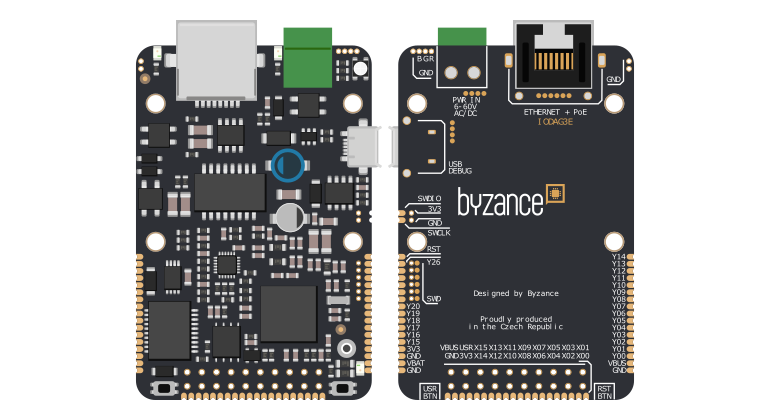

# IODAG3E

## Přehled

IODAG3E je základní jednotka vybavená vestavěným ethernetovým rozhraním pro připojení do [Cloudu](../../../../cloud/cloud.md). Volitelně nabízí [GSM ](../../../konektivita/gsm.md)a/nebo [6LowPAN](https://docu.byzance.cz/~/edit/primary/hardware-a-programovani/konektivita/6lowpan)​ konektivitu. Jednotka disponuje bohatými možnostmi napájení \(aktivní/pasivní PoE, USB, AC/DC vstup\), velkým množstvím vstupně výstupních signálů na [X a Y konektorech](../../rozsirujici-moduly/#x-konektor-a-y-konektor) a výkonným mikrokontrolérem ARM Cortex M4. Jednotka se hodí pro řízení uživatelského zařízení a je možné ji vestavět do nového či existujícího systému. Alternativně lze na základě dokumentace navrhnout vlastní zařízení, která bude již jednotku IODAG3 mít přímo integrovanou v sobě.

## Hlavní funkcionality

* mikrokontrolér STM32F437IIH6 \([Datasheet](http://www.st.com/content/ccc/resource/technical/document/datasheet/fd/8c/0a/19/13/8f/41/99/DM00077036.pdf/files/DM00077036.pdf/jcr:content/translations/en.DM00077036.pdf)\)
  * 2 MB FLASH
  * 256 kB SRAM \(včetně 64 kB CCM + 4kB zálohované SRAM\)
  * 180 MHz 
* vestavěný ethernet
  * navíc volitelně GSM a/nebo 6LoWPAN 
* napájení 4 až 60 V AC/DC
  * čtyři napájecí vstupy
  * integrované PoE
* 43 vstupně výstupních pinů
* externí FLASH pamět 64Mb
* RGB stavová LED dioda
* dvě tlačítka \(_reset_ a _user_ tlačítko\) 
* opensource návrh

## Další funkcionality

* online programování v C/C++ z webové aplikace Byzance
* vzdálená aktualizace uživatelského programu
* vestavěný webový server
* konektor na uchycení 6LoWPAN modulu [WEXP ](../../ostatni/wexp/)pro bezdrátovou komunikaci
* low power management
* hardwarová akcelerace CRC, šifrování
* hardwarový watchdog
* automatické zálohování uživatelského programu a jeho obnova při selhání
* možnost vestavění na vlastní PCB

## Periferie

* Ethernet
* Lowpan
* GPIO Header \(41 pinů\) 
* A/D, D/A převodníky
* SPI 
* CAN
* UART
* I2C
* SAI
* USB 2.0

## Možnosti napájení

Zařízení disponuje efektivním spínaným zdrojem s širokým rozsahem vstupního napětí.

Lze napájet přes:

* MicroUSB 
* Externí zdroj 6-60V AC/DC
* POE \(aktivní/pasivní\)
* Napájení z baterie

## Tlačítka

* Tlačítko pro RESET
* Tlačítko USER

## Led signalizace

* RGB LED modul

## Rozměry a hmotnost

* Rozměry desky včetně konektorů : 42,5 x 65,5 mm
* Výška včetně konektorů: 11.5 mm
* Hmotnost: 60g

