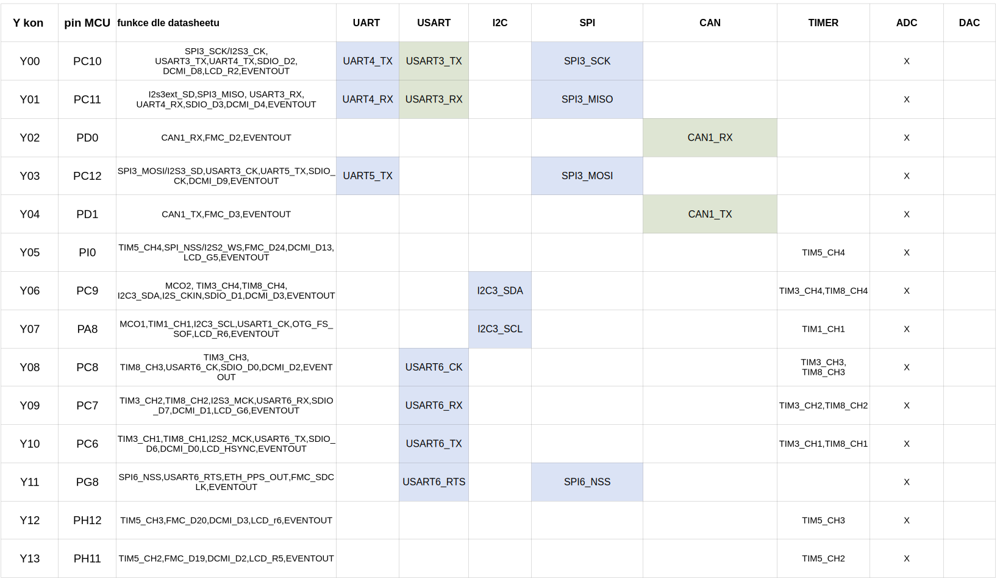

# Konektor X a Y

Každá [základní jednotka ](../)může mít piny [X a Y konektoru](../../rozsirujici-moduly/#x-konektor-a-y-konektor) zapojeny na mikrokontrolér odlišně. Tato stránka obsahuje podrobný a na typu jednotky závislý popis zapojení pinů [konektorů X a Y. ](../../rozsirujici-moduly/#x-konektor-a-y-konektor) Jednotka [IODAG3E](./) disponuje vývody periferií jako např. UART, I2C, SPI, CAN, TIM, ADC, DAC a přesné zapojení je v tabulce níže.

Všechny tabulky jsou také ke stační ve formátu [PDF](https://blobscdn.gitbook.com/v0/b/gitbook-28427.appspot.com/o/assets%2F-L9jHroT0UirGp5ehgdL%2F-LChC6yh2bOuYNFUpYFa%2F-LChCB41XZXKV35C4DoU%2F2187003581.pdf?alt=media&token=62931b0b-b06f-4b39-b721-cce66c6c8ca2).

