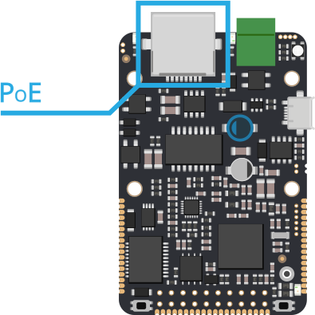
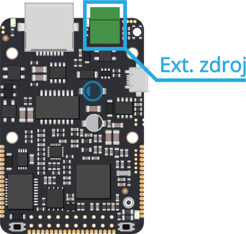

# Napájení

## Přehled

Základní jednotka [IODAG3E ](./)disponuje hned několika možnostmi napájení pro nasazení v nejrůznějších aplikacích. Zařízení IODAG3E disponuje **třemi** standardními **napájecími vstupy** \(USB, PoE a napájení z externího zdroje\) a čtvrtým méně standardním vstupem s širokým rozsahem akceptovaného napájecího napětí. Všechny tři standardní  varianty mohou být bezpečně použity současně a lze je zapínat nezávisle na sobě. **Čtvrtou** možností je použití signálu _**VBUS**_, který je vyveden na [X a Y konektoru](../../rozsirujici-moduly/#x-konektor-a-y-konektor) jednotky. Jeho použití **není** pro běžného uživatele **bezpečné** a není doporučené ho používat. Všechny možnosti jsou dále detailněji rozebrány.

## USB

Prvním napájecím vstupem je standardní mikro USB AB konektor na těle jednotky. Kromě napájení slouží konektor pro datovou komunikaci po USB. 

### Technické parametry USB vstupu

* doporučené vstupní napětí: 5.0V \(+-10% dle specifikací USB\)
* doporučený proud vstupem: 0.5A
* vstup je vybaven přepěťovou ochranou, max. vstupní napětí: 6.0V

## PoE

Napájení PoE \(Power Over Ethernet\) je napájením po datovém síťovém kabelu, bez nutnosti přivést napájecí napětí k přístroji dalším samostatným kabelem. Obecně se rozlišuje tzv. **aktivní** a **pasivní PoE** a toto zařízení je kompatibilní s oběma standardy. ****

### Aktivní PoE

Aktivní PoE existuje ve více standardech a jedním z nich je i standard IEEE 802.3af se kterým je IODAG3E kompatibilní. Přesněji řečeno IODAG3E v revizi 170725 je kompatibilní se standardem IODAG3E IEEE  802.3af PoE Mode A. Z tohoto důvodu se pro napájení hodí aktivní switch se zmíněným standardem a nebo standardem IEEE  802.3at. Switch standardu IEEE  802.3af PoE Mode B použít v dané revizi nelze. 

IODAG3E je Class 0 zařízení, tudíž přes PoE může odebírat max. 12.95W energie a akceptuje napětí od 37 do 57V.

### Pasivní PoE

Zařízení akceptuje také **Pasivním PoE**, což v praxi znamená, že zařízení je možné napájet 6-60V na nevyužitých párech 100Mbit LAN kabelu. Jde o piny číslo 4, 5 a 7, 8 na běžném RJ45 konektoru. 

### Technické vlastností PoE napájení

* rozsah vstupního napětí: **6 - 60V AC/DC**
* doporučený maximální proud vstupem: **0.5A**
* vstup je vybaven přepěťovou ochranou dimenzovanou na **60V**

## Externí zdroj

Další metodou napájení je zapojení externího zdroje do zeleného konektoru na čelní straně desky vedle ethernetového kabelu. Výhodou je široký rozsah napájecího napětí a jeho nezávislost na polaritě.

### Technické vlastností vstupu externího napájení

* rozsah vstupního napětí: **6 - 60V AC/DC**
* doporučený maximální proud vstupem: **0.5A**
* vstup je vybaven přepěťovou ochranou dimenzovanou na **60V**

## VBUS

Čtvrtá a nestandardní možnosti napájení je signál VBUS. Jde o signál na [konektoru X a Y](../../rozsirujici-moduly/#x-konektor-a-y-konektor), jehož **použití pro napájení jednotky není** pro běžného uživatele **bezpečné** a a může vést ke zničení desky či připojeného zdroje. Na pin **VBUS** je možné aplikovat napětí přímo na **nechráněný** vstup spínaného zdroje a dosáhnout tak spuštění desky již od napětí typ. 4.0V. Současně s tímto vstupem nesmí být použit žádný z předchozích napájecích vstupů.

Smyslem je umožnit běh desky z externího 5V zdroje \(typicky při vestavbě do existujícího 5V systému\). Tato věc je technicky možná, nicméně není doporučována. Běžně **VBUS** slouží jako výstup pro napájení externích zařízení pomocí IODAG3E.

### Technické vlastností napájení signálem VBUS

* rozsah vstupního napětí: 4.0 - 60V DC \(maximální limit, doporučeno spíše 57V\)
* doporučený maximální proud vstupem: 1.2A \(dáno šířkou spoje, 0.6mm/18um\)
* pro použití nutno vodivě spojit pájecí propojku SJ1 \(vedle tlačítka RST\)

  

####  

  

