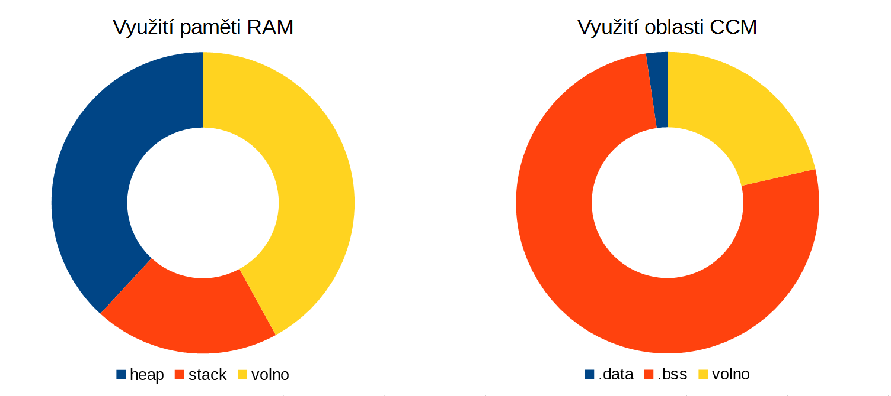

# Paměti

## Přehled

Jednotka IODAG3E obsahuje několik druhů pamětí, kde každý typ má svůj účel a svá specifika. Jedná se o volatilní paměť RAM a nevolatilní paměť FLASH integrovanou v pouzdře mikrokontroléru a o větší externí FLASH paměť.

* RAM
  * 256 kB SRAM \(včetně 64 kB CCM\)
  * 4 kB zálohované SRAM \(zálohováno [_VBAT_ ](pripojeni-zdroje-k-vbat.md)zdrojem\) 
  * součást mikrokontroléru sloužící pro data běžícího firmware
* FLASH
  * 2 MB v mikrokontroléru
  * rozděleno na stránky o různých velikostech
  * slouží pro firmware a bootloader jednotky
* externí FLASH
  * velikost 64 Mb
  * připojena přes SPI rozhraní k mikrokontroléru
  * slouží pro uložení konfigurace, záložního firmware a jako uživatelský prostor

## RAM

Paměť RAM \(Random Access Memory\) je nevolatilní paměť sloužící pro data běžícího firmware. Pro správné pochopení je vhodné nejdříve přečíst si obecný článek o [nevolatilní paměti RAM](../../../knowledge-base/pamet-ram.md). Níže uvedený přehled obecné informace doplňuje a zpřesňuje pro konkrétní jednotku IODAG3E.

### Rozdělení

IODAG3E mí k dispozici výše uvedených 256 kB paměti. Paměť je rozdělena na více oblastí a při použití minimálního projektu jsou orientačně zaplněny podle následující tabulky. Přesné hodnoty závisí na verzi projektu i knihoven a může se měnit.

| oblast | .bss | .data | heap | stack |
| :--- | :--- | :--- | :--- | :--- |
| umístění | CCM | CCM | RAM | RAM |
| velikost | 1500 B | 48 kB | 48 kB | 26 kB |

### Zaplněnost

Na grafu níže je pro daný projekt uvedeno využití paměti pro obě oblasti. Z grafu je patrné, že téměř polovina paměti RAM je dostupná pro uživatelskou aplikaci. Opět platí, že jde o orientační hodnoty.



## FLASH v mikrokontroléru

### Rozdělení sektorů

Většina mikrokontrolérů Cortex M4 má banky paměti rozdělené do menších částí, tzv. sektory. Platí to i pro mikrokontrolér použitý v jednotce IODAG3E a sektory jsou rozděleny podle tabulky níže. V případě použitého mikrokontroléru je paměť složena z více paměťových bank \(dvě banky po 1 MB\), struktura rozdělení sektorů se u druhé banky opakuje.

| **Blok paměti** | **Velikost bloku** | **Počáteční adresa** |
| :--- | :--- | :--- |
| Sektor 0 až 3 | 16 kB | 0x08000000 |
| Sektor 4 | 64 kB | 0x08010000 |
| Sektor 5 až 11 | 128 kB | 0x08020000 |
| Sektor 12 až 15 | 16 kB | 0x08100000 |
| Sektor 16 | 64 kB | 0x08110000 |
| Sektor 17 až 23 | 128 kB | 0x08120000 |
| System memory | 30 kB | 0x1FFF0000 |
| OTP | 528 B | 0x1FFF7800 |
| Option bytes 1 | 16 B | 0x1FFFC000 |
| Option bytes 2 | 16 B | 0x1FFEC000 |

### Důsledky existence sektorů

Vzhledem k rozdělení paměti a existenci bootloaderu a hlavního programu je FLASH paměť logicky rozdělena na dvě části.

* bootloader 64 kB - od adresy 0x08000000 po 0x0800FFFF, sektory 0 až  3
* firmware 1984 kB - od adresy 0x8010000 po 0x80200000,  - sektory 4 až 23

Adresy 0x08000000 a 0x08010000 je tedy třeba znát při [ručním nahrávání](../../../programovani-hw/offline-programovani/) bootloaderu nebo firmware \(např přes [ST-LINK](../../../programovani-hw/offline-programovani/upload-kodu-z-gui.md)\).

### Přímá uživatelská práce s interní FLASH

Přímá uživatelská práce s interní FLASH pamětí mikrokontroléru se nedoporučuje, protože může dojít k poškození firmware nebo bootloaderu. Výše uvedené skutečnosti je třeba reflektovat \(především při mazání, kde se může stát, že je třeba smazat jenom několik bytů dat, ale technologie FLASH smaže celou stránku společně i s jinými daty\).

Pro ukládání uživatelských dat je určena externí FLASH paměť.

### OTP a statní části FLASH paměti

V tabulce výše jsou patrné také další čísti paměti kromě sektorů pro uložení firmware. Jejich význam a použití se lze dočíst v [referenčních manuálech ](http://www.st.com/content/ccc/resource/technical/document/reference_manual/3d/6d/5a/66/b4/99/40/d4/DM00031020.pdf/files/DM00031020.pdf/jcr:content/translations/en.DM00031020.pdf)výrobce mikrokontroléru.

Za zmíňku stojí OTP \(one-time programmable memory\) část, kde je např. uložena MAC adresa jednotky a kód revize zařízení. K tomu jsou rezervovány první 2 bloky OTP.

```text
Blok 0 -> adresa od 0x1FFF7800 - [6 bytů MAC adresa][10 bytů rezervováno]
Blok 1 -> adresa od 0x1FFF7810 - [4 byty Revision][12 bytů rezervováno  ]
```

OTP paměť v zařízení IODAG3E má velikost 528 B, dostupných programově je 512 B.

```text
OTP_BLOCKS * OTP_BYTES_IN_BLOCK
```

```text
16 * 32 = 512 B
```

## Externí FLASH

Na PCB jednotky IODAG3E je umístěna také externí SPI FLASH paměť o kapacitě 64 Mb. Částečně je využívání pro potřeby Byzance knihoven \(OTA update, konfigurace, ...\) a z části je plně dostupná pro uživatele. Uživatelsky dostupná část je velká 2 MB a pracuje se s ní výhradně přes API \#TODO link na API.

| **Fyzický rozsah adres uživatelské části paměti** |
| :--- |
| 0x08400000 až  0x085FFFFF \(2 MB\) |

