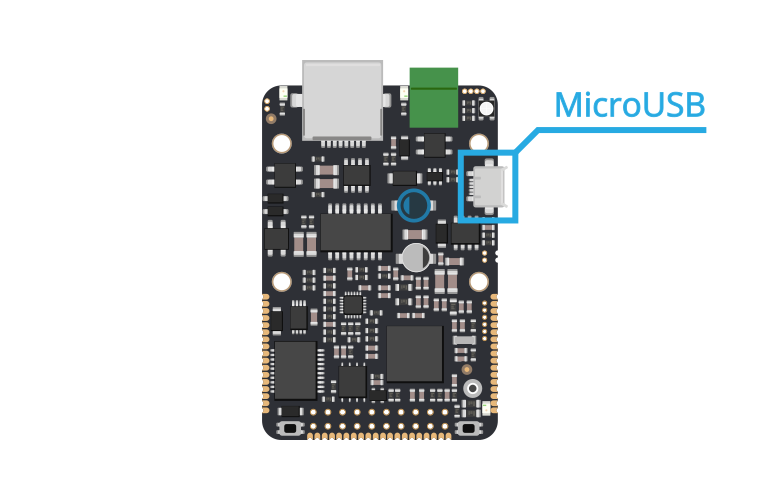
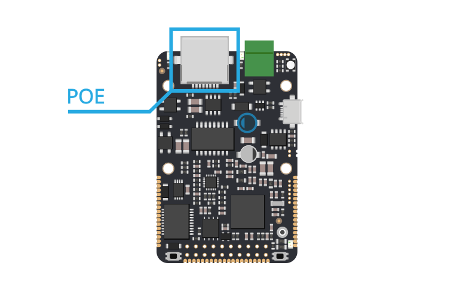
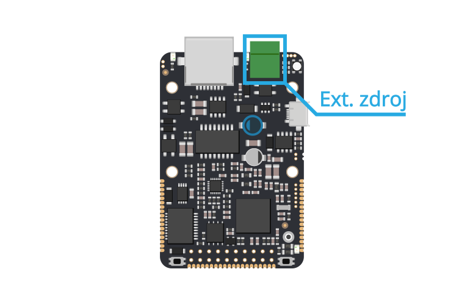
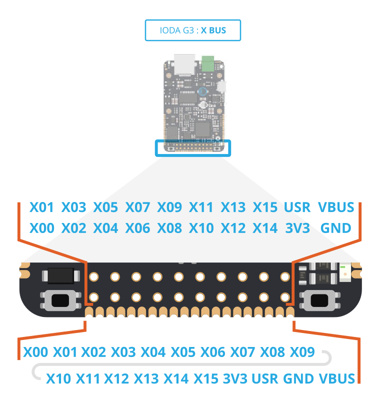
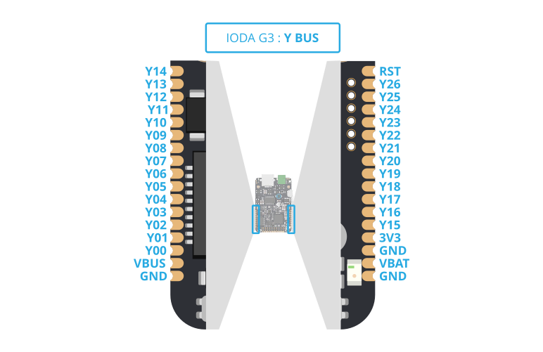

# Rozhraní a periférie

## Blokové schéma {#block-diagram}

TO DO

## Metody napájení

Zařízení IODAG3E disponuje **třemi **standartními **napájecími vstupy** \(USB, PoE a napájení z externího zdroje\) s širokém rozsahem akceptovaného napájecího napětí. Všechny tři výše uvedené varianty mohou být bezpečně použity současně a lze je zapínat nezávisle na sobě.

Čtvrtou možností je použití signálu _**VBUS**_, který je vyveden na X a Y liště desky. Jeho použití **není **pro běžného uživatele **bezpečné **a není doporučené ho používat. Všechny možnosti jsou dále detailněji rozebrány.

**Příkon ** zařízení se v zásvislost na stavu, činnosti a zvoleném vstupu pohybuje od 0.6W do 0.9W \(Měřeno bez rozšiřujících desek a dalších připojených komponent\). Příkon je dále také ovlivněn amplitudou napájecího napětí. Všechny uváděné proudy jsou bezpečné proudy pro dlouhodobější provoz s ohledem na výkonové ztráty v systému \(zahřívání komponent\). Překročení **horní** hranice uvedených napětí může vést k **poškození **zařízení. Naopak **podpětí** a **nedostatečně dimenzovaný **vstup zdroje energie může zpusobit **nepředvídatelné chování **a nestabilitu.

### USB

Zařízení se spustí neprodleně po připojení microUSB kabelu.

Technické parametry USB vstupu:

* Doporučené vstupní napětí: 5.0V \(+-10% dle specifikací USB\)
* Doporučený proud vstupem: 0.5A
* Vstup je vybaven přepěťovou ochranou: max. vstupní napětí je 6.0V

### PoE \(Power over Ethernet\)

Napájení po datovém síťovém kabelu, bez nutnosti přivést napájecí napětí k přístroji dalším samostatným kabelem. Rozlišuje se tzv. **aktivní **a **pasivní PoE**.

#### Aktivní PoE

* Tato metoda je **Kompatibilní** se standartem **802.3af** \(802.3at Type 1, jedná se tedy o tzn. **aktivní** PoE\). Tento standart povoluje napětí od 37 do 57V, nicméně zařízení IODAG3E umožňuje napájení přes PoE už od nižšího napětí \(Pasivní PoE\).
* IODA je _**Class 0**_ zařízení, tudíž přes PoE může odebírat max. 12.95W energie.

#### Pasivní PoE

* Zařízení akceptuje také **Pasivním PoE**, což znamená, že zařízení je možné napájet 6-60V na nevyužitých párech 100Mbit LAN kabelu.

K PoE se přistupuje podobným způsobem jako Mikrotic u zařízení \([http://www.wifihw.cz/img.asp?attid=22184](http://www.wifihw.cz/img.asp?attid=22184)\), kde se kombinují vlastnosti aktivního PoE s výhodami pasivního PoE pro dosažení maximální flexibility a jednoduchosti použití.

Technické vlastností PoE napájení:

* Rozsah vstupního napětí **6 - 60V AC/DC**
* Doporučený maximální proud vstupem: **0.5A**
* Vstup je vybaven přepěťovou ochranou dimenzovanou lehce nad **60V**

### Externí zdroj

Další metodou napájení je zapojení externího zdroje do zeleného konektoru na čelní straně desky vedle ethernetového kabelu. Výhodou je široký rozsah napájecího napětí a jeho nezávislost na polaritě.

Technické vlastností vstupu externího napájení:

* Rozsah vstupního napětí **6 - 60V AC/DC**
* Doporučený maximální proud vstupem: **0.5A**
* Vstup je vybaven přepěťovou ochranou dimenzovanou mírně nad **60V**

### VBUS

Jde o signál na liště X/Y, jehož **použití není** pro běžného uživatele **bezpečné **a a může vést ke zničení desky či připojeného zdroje. Na pin **VBUS** je možné aplikovat napětí přímo na **nechráněný** vstup spínanného zdroje a dosáhnout tak spuštění desky již od napětí typ. 4.0V.

Smyslem je umožnit běh desky z externího 5V zdroje \(typicky při vestavbě do existujícího 5V systému\). Tato věc je technicky možná, nicméně se silně **nedoporučuje** \(Spíše jen pro interní info\). Běžně **VBUS** slouží jako výstup pro napájení externích zařízení pomocí IODAG3E.

Technické vlastností napájení signálem VBUS:

* Rozsah vstupního napětí 4.0 - 60V DC \(horní limit maximální, doporučeno spíše 57V\)
* Doporučený maximální proud vstupem: 1.2A \(dáno šířkou spoje, 0.6mm/18um\)
* Pro použití nutno vodivě spojit pájecí propojku SJ1 \(vedle tlačítka RST\)

## GPIO a sběrnice

Zařízení IODA dispouje sběrnicí GPIO s celkem 54 piny. Na GPIO lze definovat digitální i analogové vstupy a výstupy a další komunikační rozhraní

### Pinout

Sběrnice GPIO je rozdělena na dvě části a to **X-Konektor** a **Y-Konektor**

#### X-Konektor

#### Y-Konektor

### Analogové vstupy

Na GPIO lze definovat 8 analogových vstupů a to na následujících pinech :

| Pin |
| :--- |
| X00 |
| X01 |
| X04 |
| Y19 |
| Y22 |
| Y23 |
| Y24 |
| Y25 |

### Analogové výstupy

Jako analogové výstupy lze použít následující dva piny:

| Funkce | Pin |
| :--- | :--- |
| DAC\_OUT1 | Y23 |
| DAC\_OUT2 | Y24 |

### I2C

Zařízení IODA má na GPIO sběrnici k dispozici dvě sběrnice I2C. Obě sběrnice nabízejí možnost využití alternativního zapojení na jiné dvojici pinů.

| **Funkce ** | **Pin** | **Alternativní pin** |
| :--- | :--- | :--- |
| I2C1 SCL | X06 | X15 |
| I2C1 SDA | X07 | X13 |
| I2C3 SCL | Y07 | Y21 |
| I2C3 SDA | Y06 | Y20 |

### UART/USART

IODA umožňuje komunikovat po několika sériových linkách. Na jeho sběrnici GPIO lze definovat až 4x komunikační rozhraní typu **UART** a jedno komunikační rozhraní **USART**

| **Funkce** | **Pin** |
| :--- | :--- |
| UART1\_TX | X06 |
| UART1\_RX | X07 |
| UART3\_TX | X11 |
| UART3\_RX | X09 |
| UART4\_TX | Y00 |
| UART4\_RX | Y01 |
| UART5\_TX | Y03 |
| UART5\_RX | Y18 |
| USART6\_TX | Y10 |
| USART6\_RX | Y09 |
| USART6\_RTS | Y11 |
| USART6\_CTS | Y15 |

### SPI

GPIO obsahuje možnost definovat až** 3 komunikační rozhraní SPI najednou**.

| Funkce | Pin |
| :--- | :--- |
| SPI1\_MISO | X12 |
| SPI1\_MOSI | X14 |
| SPI1\_SCK | X10 |
| SPI1\_NSS | X08 |
| SPI3\_MISO | Y01 |
| SPI3\_MOSI | Y03 |
| SPI3\_SCK | Y00 |
| SPI3\_NSS | Y23 |
| SPI6\_MISO | Y17 |
| SPI6\_MOSI | Y16 |
| SPI6\_SCK | Y15 |
| SPI6\_NSS | Y11 |

### CAN

Dále je možné definovat dvě sběrnice typu CAN na pinech:

| Funkce | Pin |
| :--- | :--- |
| CAN1\_TX | X13 |
| CAN1\_RX | X15 |
| CAN2\_TX | X06 |
| CAN2\_RX | X14 |

### Timers \(PWM\)

IODA má na své GPIO sběrnici dále k dispozici sadu timerů, které se primárně používají k vytváření PWM signálů. Procesor má k dispozici několik různých Timerů, které mají různé kanály.

| Funkce | Pin |
| :--- | :--- |
| TIM1\_CH3,TIM3\_CH4,TIM8\_CH3 | X00 |
| TIM1\_CH2,TIM3\_CH3,TIM8\_CH2 | X01 |
| TIM1\_CH1 | X02 |
| TIM2\_CH4,TIM5\_CH4,TIM9\_CH2 | X04 |
| TIM1\_BKIN,TIM3\_CH1,TIM8\_BKIN | X05 |
| TIM4\_CH1 | X06 |
| TIM4\_CH4, TIM11\_CH1 | X13 |
| TIM3\_CH2 | X14 |
| TIM4\_CH3,TIM10\_CH1 | X15 |
| TIM5\_CH4 | Y05 |
| TIM3\_CH4,TIM8\_CH4 | Y06 |
| TIM1\_CH1 | Y07 |
| TIM3\_CH3, TIM8\_CH3 | Y08 |
| TIM3\_CH2,TIM8\_CH2 | Y09 |
| TIM3\_CH1,TIM8\_CH1 | Y10 |
| TIM5\_CH3 | Y12 |
| TIM5\_CH2 | Y13 |
| TIM5\_CH1 | Y14 |
| TIM2\_CH1/TIM2\_ETR,TIM8\_CH1N | Y25 |
| TIM2\_CH3 | Y26 |

## Ethernet

Budič LAN8720 \([Datasheet](http://ww1.microchip.com/downloads/en/DeviceDoc/8720a.pdf)\)

* Podpora PoE
* Rychlost do 100Mbit

## WEXP module \(Lowpan\)

 \#TODO \(Dopsat specifikace modulu WEXP + něco například k anténám\)

