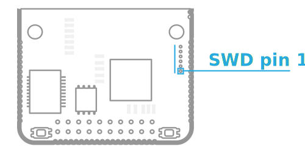

# Rozhraní a periférie

[IODAG3E ](./)disponuje mnoha vstupy a výstupy vyvedenými na svém těle buď v podobě [X a Y konektorů](../../rozsirujici-moduly/#x-konektor-a-y-konektor) a nebo jako další konektory přímo na PCB. Mezi tyto rozhraní patří plnohodnotný mikro USB port, volitelný konektor externího napájení, volitelný [SWD](../../../programovani-hw/offline-programovani/) konektor, konektor pro připojení [WEXP ](../../ostatni/wexp/)modulu a zapuštěný konektor ethernetu.

## Ethernet

Zařízení používá budič LAN8720 \([Datasheet](http://ww1.microchip.com/downloads/en/DeviceDoc/8720a.pdf)\) jako PHY \(physical layer\) rozhraní a spolu s mikrokontrolérem zajišťují 10/100 Mbit/s konektivitu jednotky po ethernetu. Ethernet je základní rozhraní pro připojení do cloudu a je na jednotce vždy přítomné. Kromě datové komunikace lze jednotku přes ethernetový port i napájet \([PoE napájení](napajeni.md#poe)\).

* rychlost do 10/100 Mbit/s
* podpora [PoE](napajeni.md#poe)

## USB

IODAG3E disponuje plnohodnotným mikro USB vstupem včetně datových vodičů. Použitý mikrokontrolér disponuje FS i HS USB periferií schopnou pracovat v režimech device, host i OTG. IODAG3E má však implementovánu podporu pouze USB FS a je zpravidla využíván jako device zařízení třídy CDC \(Communications Device Class\) .

USB lze využít i pro napájení, kde další podrobnosti popsány v [článku o napájení](napajeni.md#usb).

## GPIO a sběrnice

Zařízení IODA disponuje celkem 54 piny vstupně výstupními piny na [X a Y konektoru](../../rozsirujici-moduly/#x-konektor-a-y-konektor) \([namapování pinů](konektor-x-a-y.md)\) a to včetně [napájecích ](napajeni.md)pinů. Na pinech lze definovat digitální i analogové vstupy a výstupy, další komunikační sběrnice a nebo používat napájecí vývody pro napájení jednotky či jako výstup napájení pro externí zařízení.

Vlastnosti vstupů a výstupů se odvíjí od použitého [mikrokontroléru](http://www.st.com/content/ccc/resource/technical/document/datasheet/fd/8c/0a/19/13/8f/41/99/DM00077036.pdf/files/DM00077036.pdf/jcr:content/translations/en.DM00077036.pdf) a jejich napojení je patrné z [tabulek s přiřazenými vývody](konektor-x-a-y.md). Lze se tak například dozvědět, jaká jednotka SPI sběrnice na daných pinech funguje a kde ne. 

### Analogové vstupy

Na GPIO lze definovat 8 analogových vstupů a to na pinech uvedených v tabulce. Negativní referenci představuje potenciál _GND_ a kladnou referenci větev _3V3_. AD převodník [mikrokontroléru](http://www.st.com/content/ccc/resource/technical/document/datasheet/fd/8c/0a/19/13/8f/41/99/DM00077036.pdf/files/DM00077036.pdf/jcr:content/translations/en.DM00077036.pdf) tedy dokáže měřit napětí od 0.0 do 3.3 V. Rozlišení AD převodníku je 12 bitů a může být obsluhován DMA přenosy.

| Pin |
| :--- |
| X00 |
| X01 |
| X04 |
| Y19 |
| Y22 |
| Y23 |
| Y24 |
| Y25 |

### Analogové výstupy

Analogové výstupy obsluhuje DA převodník \(Digital-to-analog converter\) se dvěma nezávislými výstupy a rozlišením až 12 bitů. Jeho pozitivní reference je na větvi _3V3_ a negativní na signálu _GND_.

| Funkce | Pin |
| :--- | :--- |
| DAC\_OUT1 | Y23 |
| DAC\_OUT2 | Y25 |

### I2C

Zařízení IODA má mezi výstupy k dispozici také dvě sběrnice I2C. Obě sběrnice nabízejí možnost využití alternativního zapojení na jiné dvojici pinů.

| **Funkce**  | **Pin** | **Alternativní pin** |
| :--- | :--- | :--- |
| I2C1 SCL | X06 | X15 |
| I2C1 SDA | X07 | X13 |
| I2C3 SCL | Y07 | Y21 |
| I2C3 SDA | Y06 | Y20 |

### UART/USART

IODA umožňuje komunikovat po několika sériových linkách. Na jeho sběrnici GPIO lze definovat až 4x komunikační rozhraní typu **UART** a jedno komunikační rozhraní **USART**

| **Funkce** | **Pin** |
| :--- | :--- |
| UART1\_TX | X06 |
| UART1\_RX | X07 |
| UART3\_TX | X11 |
| UART3\_RX | X09 |
| UART4\__TX_   | Y00 |
| UART4\_RX | Y01 |
| UART5\_TX | Y03 |
| UART5\_RX | Y18 |
| USART6\_TX | Y10 |
| USART6\_RX | Y09 |
| USART6\_RTS | Y11 |
| USART6\_CTS | Y15 |

### SPI

GPIO obsahuje možnost definovat až **3 komunikační rozhraní SPI najednou**.

| Funkce | Pin |
| :--- | :--- |
| SPI1\_MISO | X12 |
| SPI1\_MOSI | X14 |
| SPI1\_SCK | X10 |
| SPI1\_NSS | X08 |
| SPI3\_MISO | Y01 |
| SPI3\_MOSI | Y03 |
| SPI3\_SCK | Y00 |
| SPI3\_NSS | Y23 |
| SPI6\_MISO | Y17 |
| SPI6\_MOSI | Y16 |
| SPI6\_SCK | Y15 |
| SPI6\_NSS | Y11 |

### CAN

Dále je možné definovat dvě sběrnice typu CAN na pinech:

| Funkce | Pin |
| :--- | :--- |
| CAN1\_TX | X13 |
| CAN1\_RX | X15 |
| CAN2\_TX | X06 |
| CAN2\_RX | X14 |

### Timers \(PWM\)

Mikrokontrolér jednotky má k dispozici sadu také skupinu timerů, které se primárně používají k vytváření PWM signálů. Procesor má k dispozici několik různých Timerů, které mají různé kanály.

| Funkce | Pin |
| :--- | :--- |
| TIM1\_CH3,TIM3\_CH4,TIM8\_CH3 | X00 |
| TIM1\_CH2,TIM3\_CH3,TIM8\_CH2 | X01 |
| TIM1\_CH1 | X02 |
| TIM2\_CH4,TIM5\_CH4,TIM9\_CH2 | X04 |
| TIM1\_BKIN,TIM3\_CH1,TIM8\_BKIN | X05 |
| TIM4\_CH1 | X06 |
| TIM4\_CH4, TIM11\_CH1 | X13 |
| TIM3\_CH2 | X14 |
| TIM4\_CH3,TIM10\_CH1 | X15 |
| TIM5\_CH4 | Y05 |
| TIM3\_CH4,TIM8\_CH4 | Y06 |
| TIM1\_CH1 | Y07 |
| TIM3\_CH3, TIM8\_CH3 | Y08 |
| TIM3\_CH2,TIM8\_CH2 | Y09 |
| TIM3\_CH1,TIM8\_CH1 | Y10 |
| TIM5\_CH3 | Y12 |
| TIM5\_CH2 | Y13 |
| TIM5\_CH1 | Y14 |
| TIM2\_CH1/TIM2\_ETR,TIM8\_CH1N | Y25 |
| TIM2\_CH3 | Y26 |

## SWD

SWD \(Serial Wire Debug\) konektor slouží k ručnímu naprogramování a ladění mikrokontroléru zařízení. Pro jeho využití je potřeba nezbytný hardware a počítač s patřičným softwarem. Informace o tomto druhu programování hardware je v článku o [offline programování](../../../programovani-hw/offline-programovani/) \(pomocí [ZPP ](../../../programovani-hw/offline-programovani/upload-kodu-pomoci-zpp.md)či [ST-linku](../../../programovani-hw/offline-programovani/upload-kodu-z-gui.md)\).

