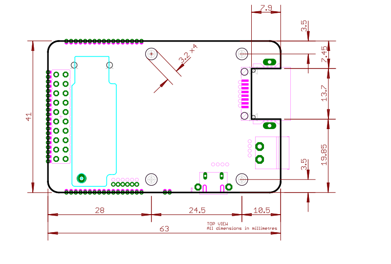
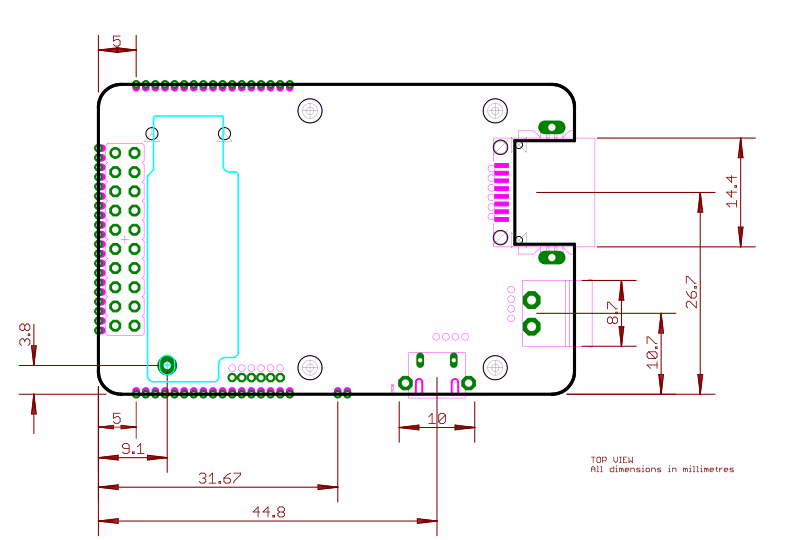

# Technické specifikace

## Přehled

Stránka se zabývá mechanickým popisem desky [IODAG3E](./), uvádí důležité rozměry a blíže specifikuje provozní podmínky desky.

## Absolute maximum ratings

| Parametr |  Min | Typ | Max |
| --- | --- | --- | --- |
| Napájecí napětí \[A\] | 4.0 |  | 60.0 |  
| Napájecí proud \[V\] |  |  | 1.2 |  
| Provozní rozsah \[°C\] | -40 |  | -85 |  
| Skladovací rozsah \[°C\] | -40 |  | -85 |  
| ESD \(human body model\) \[V\] |  |  | 2000 | 

Jednotka [IODAG3E](./) je postavena z běžně dostupných komerčních komponent přičemž každá komponenta má výrobcem daný rozsah provozních teplot. Většina komponenta pracuje v průmyslovém rozsahu -40°C až +85°C. Použitý ethernetový budič LAN8720A-CP pracuje až od teploty 0°C nicméně lze použít i variantu LAN8720Ai-CP s rozšířeným rozsahem -40°C až +85°C. Všechny ostatní komponenty plně splňují průmyslový rozsah -40°C až +85°C.

## Doporučené operační podmínky

| Parametr | Min | Typ | Max |
| --- | --- | --- | --- |
| Napájecí napětí \[V\] | 5.0 |  | 57.0 |  
| Napájecí proud \[A\] |  | 0.5 | 1.0 |  |
| Příkon v činnosti \[mW\] |  | 650 | 800 | 
| Příkon ve spánku \[mW\] |  | 100 |  |  
| Příkon v hlubokém spánku \[mW\] |  |  |  |  
| Proud pro RTC obvod \[uV\] |  | 1 | 3 |  

Jednotka [IODAG3E ](./)je navržena pro přímé použití ve vnitřních a suchých prostorech bez kondenzující vlhkosti a přímých povětrnostních vlivů. Pro venkovní montáž, montáž do vlhkých a jinak náročných prostředí je vhodné jednotku uzavřít do krytu s odpovídajícím krytím \([IPxx](https://en.wikipedia.org/wiki/IP_Code)\).

## Rozměry a váha

Rozměry a hmotnost osazeného PCB je uvedena v horní tabulce. Jde o rozměr bez přesahu bočních konektorů \(USB, ethernet\).

| Délka \(mm\) | Šířka \(mm\) | Výška \(mm\) | Váha \(g\) |
| --- | --- |
| 63.0 | 41.0 | 11.5 | 30 |

Spodní tabula uvádí rozsah včetně přesahujících konektorů \(USB, ethernet\).

| Délka \(mm\) | Šířka \(mm\) | Výška \(mm\) | Váha \(g\) |
| --- | --- |
| 65.5 | 42.5 | 11.5 | 30 |

