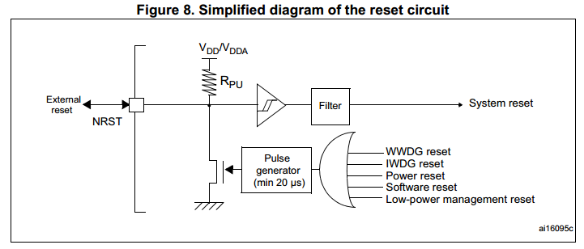

# Watchdog

Watchdog \(IWDG\) je interní periferie mikrokontroléru, která se zapíná a konfiguruje v bootloaderu před startem uživatelského programu.

Watchdog se jednou zapne a již není možno jej v rámci běhu programu vypnout. Vnitřní implementace odpovídá čítači, kterému se pravidelně nastaví hodnota na určitý čas a čítač se postupně automaticky dekrementuje. Než čítač doteče do nuly, je nutné jej opět restartovat do výchozí hodnoty. Pokud není watchdog softwarově resetovaný, resetuje automaticky celý mikrokontrolér. To může být způsobeno například zamrznutím firmware. O automatické resetování se stará Byzance knihovna.

## Nastavení

Vlastnosti watchdogu se dají konfigurovat z command režimu bootloaderu. K tomu slouží položky

* wdenable - 0 \(vypnuto\) a 1 \(zapnuto - výchozí\)
* wdtime - defaultní hodnota wdtime je 30 \(v sekundách\). Při nastavení na 0 se watchdog nezapíná, i když je wdwnable zapnuto.

## Schéma

