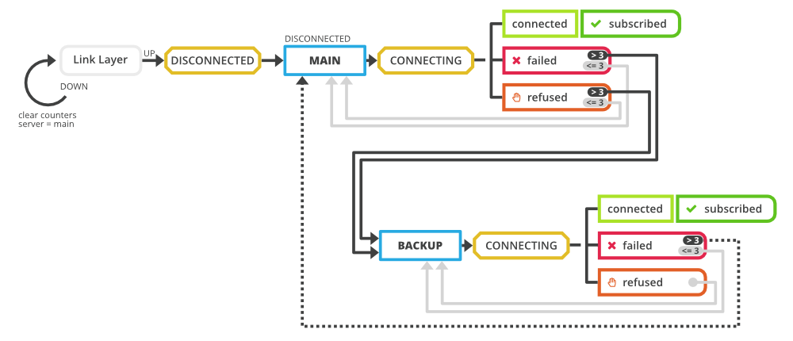

# Přepínání mezi servery

Každé zařízení Byzance obsahuje mechanismus pro připojování k serverům, který umí přepínat mezi hlavním a záložním hostujícím serverem.  Tento mechanismus slouží jako ochrana před možným výpadkem  či nedostupnosti serveru.

1\) Čeká se, až linková s fyzickou vrstvou připojí.   
  
2\) Po připojení linkové vrstvy se klient inicializuje do stavu DISCONNECTED, je mu nastaven main server a započne připojování.  
3\) Po určité době je pokus o připojení vyhodnocen do tří možných stavů - CONNECTED, FAILED, REFUSED  
4\) Pokud nastal stav CONNECTED, znamená to, že main server existuje a komunikuje. V té chvíli provede client subscribe k MQTT brookeru.  
5\) Nastane-li stav FAILED nebo REFUSED, proběhnou ještě 2 další pokusy o připojení  \(celkem tedy 3\); jinak se pokračuje dále do bodu 6.  
  
6\) Opakuje se podobná situace, jako v bodu 2 - stav DISCONNECTED, nastavení tentokráte backup serveru, dočasný stav CONNECTING.  
7\) Pokus o připojení na backup server je vyhodnocen - CONNECTED, FAILED, REFUSED  
8\)  Pokud nastal stav CONNECTED, znamená to, že backup server existuje a komunikuje. V té chvíli provede client subscribe k MQTT brookeru.  
9\)  Nastane-li stav FAILED, proběhnou celkem 3 pokusy a pak se přepíná zpátky na main server  
10\) Výjimkou je stav REFUSED i na backup serveru. Na main se již nepřepíná připojení na backup se zkouší do nekonečna i nadále.  

