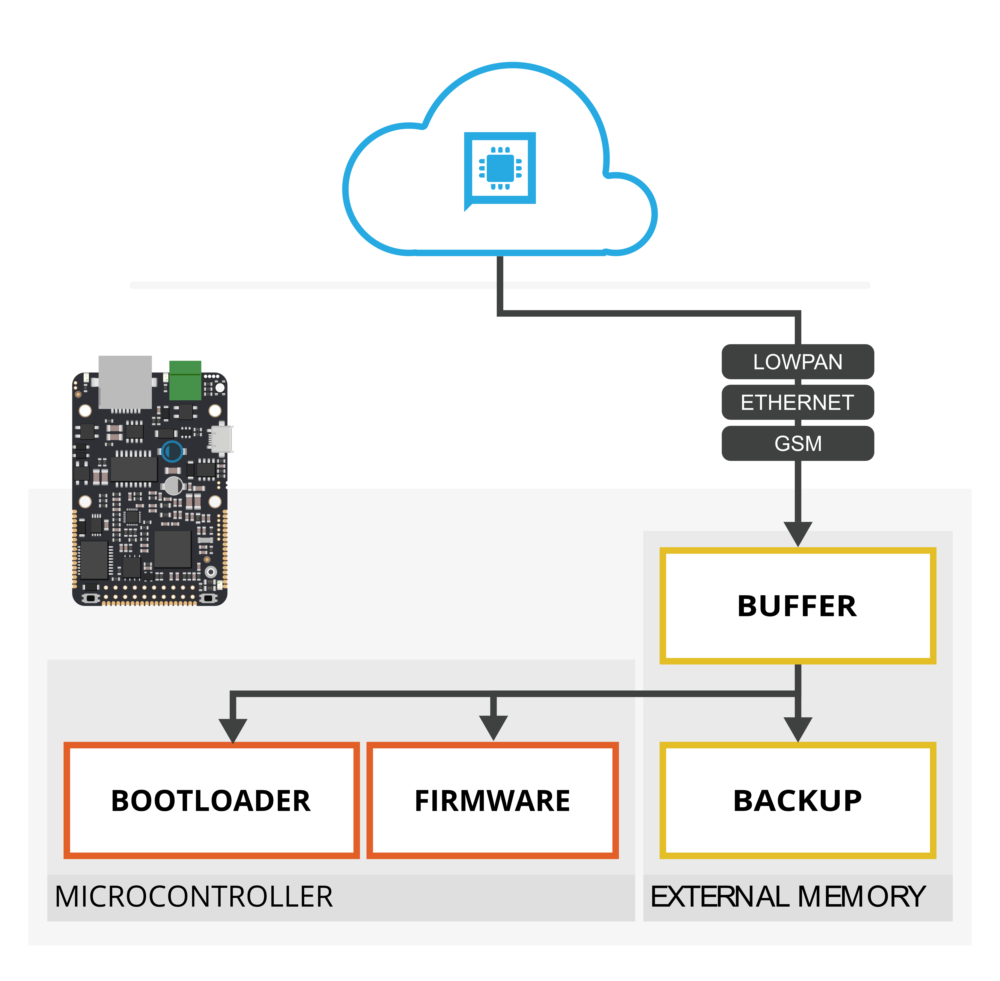

# Aktualizace FW

Každé zařízení IODAG3E umožňuje vytvářet vlastní hlavní i záložní firmware, kterými je možno vzdáleně aktualizovat zařízení. Podporována je i vzdálená aktualizace [bootloaderu](../../sprava-a-diagnostika/bootloader/).

Postup nahrávání je vždy stejný. Nová aktualizace se nahrává do sekce Buffer a teprve poté se rozhoduje, kam bude aktualizace zkopírována. Celý proces mezi Portálem a zařízením IODAG3E se tedy pro jednotlivé komponenty neliší a je možno jej postupně popsat následujícími kroky:

* Zařízení potřebuje sekci Buffer před příjmem nejprve smazat - tento krok se nazývá **prepare**. 
* Nahrátí samotné binárky do IODA - proces [**upload**](aktualizace-fw.md#proces-upload) _\*\*_\(podrobněji popsán dále\). Binárka se v této chvíli uloží do sekce ''buffer''.
* Aktualizace jedné z příslušných komponent aktualizací uloženou v sekci ''buffer''. Krok se nazývá [**update**](aktualizace-fw.md#proces-update) _\*\*_\(podrobněji popsán dále\).

## Proces upload

V rámci procesu upload probíhá nahrávání binárky z Cloudu do sekce ''buffer'' zařízení. Tento postup je odolný proti výpadku internetového připojení - pokud dojde k poškození přenášených dat či k výpadku, data v sekci ''buffer'' budou automaticky označena za neplatná a není je možné potom nasadit jako jednu z hlavních komponent. Tím je zamezeno poškození firmware při aktualizaci.

## Proces update

Až je binárka nahraná v Iodovi, ještě je stále třeba ji z externí paměti překopírovat na požadované místo, což může být jedna z komponent - hlavní či záložní firmware, nebo bootloader.

### Komponenta firmware

Pokud je aktualizována komponenta firmware, automaticky se v průběhu vykonávání normálního programu zapne interní signalizátor ''flashflag''. Tento signalizátor je po restartu detekován [bootloaderem](../../sprava-a-diagnostika/bootloader/). Na základě toho se poté v bootloaderu spustí proces aktualizace. může provést zálohu aktuálního firmware \(je-li aktivována funkce [autobackup](autobackup.md)\). Nakonec dojde přeflashování hlavního programu z externí paměti ''buffer'' do interní ''firmware''.

### Komponenta backup nebo bootloader

Pokud má být aktualizován záložní program nebo bootloader, kopírování z ''buffer'' do ''backup'' nebo ''bootloader'' se provede v **hlavním firmware** bez nutnosti restartu zařízení.

