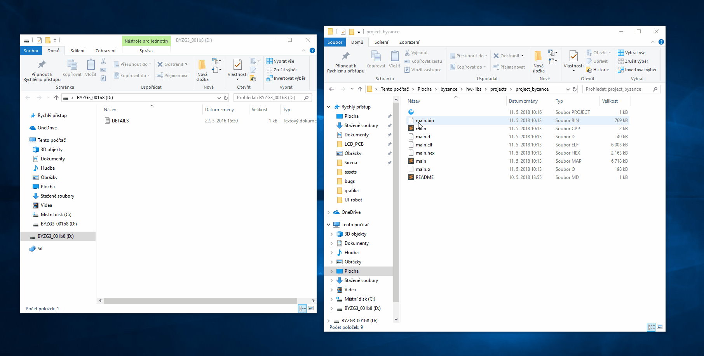
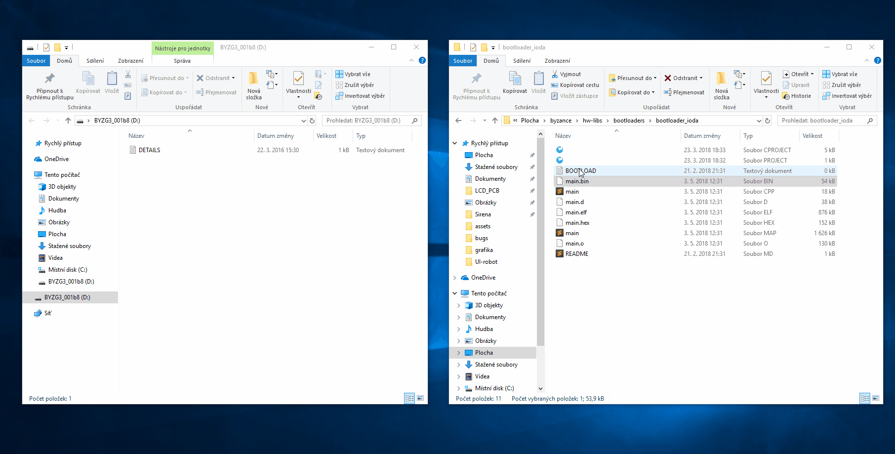
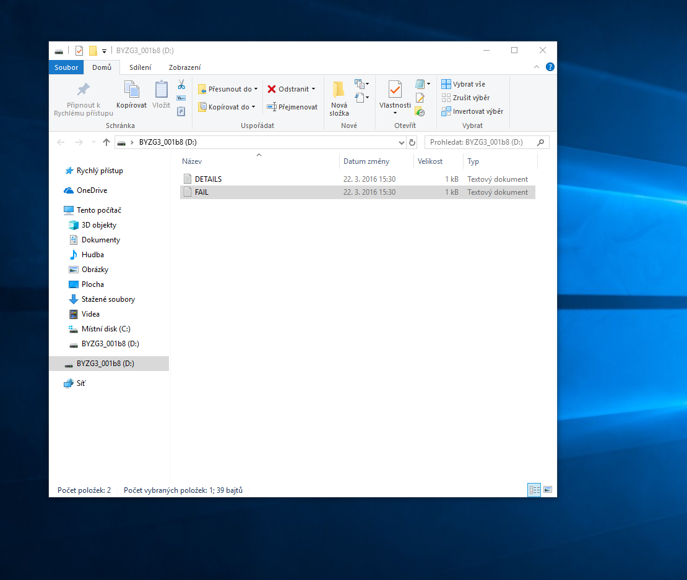

# Upload kódu Drag&drop

Upload kódu pomocí drag and drop je operace, kdy se zařízení připojí jako virtuální [mass storage zařízení](https://en.wikipedia.org/wiki/Mass_storage) \(flash disk\) a poté umožňuje pouhým přetažení souboru s firmware aktualizovat kód zařízení. 

Funkcionalita drag&drop je podmíněna přítomností programátoru a debuggeru, založeného na technologii [DAPlink](https://github.com/ARMmbed/DAPLink). DAPlink může být připojen buď externě jako v případě desky [ZPP](../../hardware/ostatni/zppg3/), či může být součástí zařízení, například [DKG3](../../hardware/ostatni/devkitg3/).

## Upload hlavního programu

V případě, že je k dispozici již zkompilovaný kód v binární podobě \(**main.bin**\), připojí se zařízení s DAPlink  do PC a poté se zajistí napájení. Správnou inicializaci by měl DAPlink signalizovat krátkým zablikáním.

 \#TODO \(Gif připojení ZPP podle ticketu HW-1054\) 

Po inicializaci se v PC objeví nový virtuální disk pojmenovaný  **BYZG3\_&lt;pripona&gt;**. Na tento disk stačí pouze pomocí drag&drop přetáhnout zkompilovaný binární kód a DAPlink automaticky nahraje program do zařízení.

## Upload nové verze bootloaderu  

Pokud je třeba do zařízení nahrát novou verzi [bootloaderu](../../architektura-fw/bootloader/), postup nahrávání se nepatrně liší. Bootloader se nachází v jiné části paměti zařízení. Proto je potřeba před uploadem binárky s novým bootloaderem nejprve potřeba nahrát pomocí drag&drop prázdný textový soubor pojmenovaný **BOOTLOAD.txt.** Tím se DAPlink přeprogramuje na programování bootloaderu, díky čemuž je automaticky nahrán binární kód do správné části paměti. Po dokončení operace proběhne restart programovaného zařízení a DAPlink se sám přepne zpět do módu programování firmware.

## Chybová hlášení

V případě, že se během uploadu programu vyskytne chyba a programování není dokončeno, objeví se na virtuálním disku soubor **FAIL.txt**, ve kterém se vyskytuje chybová hláška. 

## MSD příkazy

Jedná se o příkazy, kterými lze ovládat programátor. Pro jejich vyvolání je nutné nahrát na disk soubor s příslušným názvem. Existují dva módy příkazů:

* automation-allowed on - v tomto módu programátor přijímá příkazy přímo - tj. pokud je příkaz nahrán
* automation-allowed off- pokud je programátor v tomto módu, příkazy přijímá pouze, pokud je při nahrávání příkazu stisknuto tlačítko RST \(výchozí mód\)

Podrobnosti viz.: [MSD Commands](https://github.com/mbedmicro/DAPLink/blob/master/docs/MSD_COMMANDS.md).

#### Action Commands

* _start\_bl.act_ - restartuje programátor do bootloader \(tj. jako CRP DISABLED flash disk\)
* _start\_if.act_ - flashdisk se odpojí a znovu připojí
* _erase.act_ - vymaže programovou paměť IODy \(bootloader i firmware\)

#### Configuration Commands

* _auto\_rst.cfg_ - zapne mód auto reset \(po dokončení programování cílového procesoru je procesor restartován; ve výchozím nastavení zapnut; ukládání do NVM\)
* _hard\_rst.cfg_ - vypne mód auto reset  \(ukládání do NVM\)
* _auto\_on.cfg_ - přepnutí do módu automation-allowed on \(ukládání do NVM\)
* _auto\_off.cfg_ - přepnutí do módu automation-allowed off \(ukládání do NVM\)

## Upload firmware programátoru 

Pokud je potřeba přehrát firmware programátoru, je zapotřebí:

1. odpojit DAPlink z USB a veškerého napájení
2. stisknout tlačítko RST a současně připojit USB kabel
3. programátor se přihlásí jako flash disk _CRP DISABLED_
4. smazat soubor _firmware.bin_ z flashdisku
5. nahrát na flash disk soubor \#todo nahrát soubor

