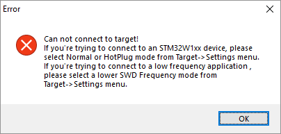
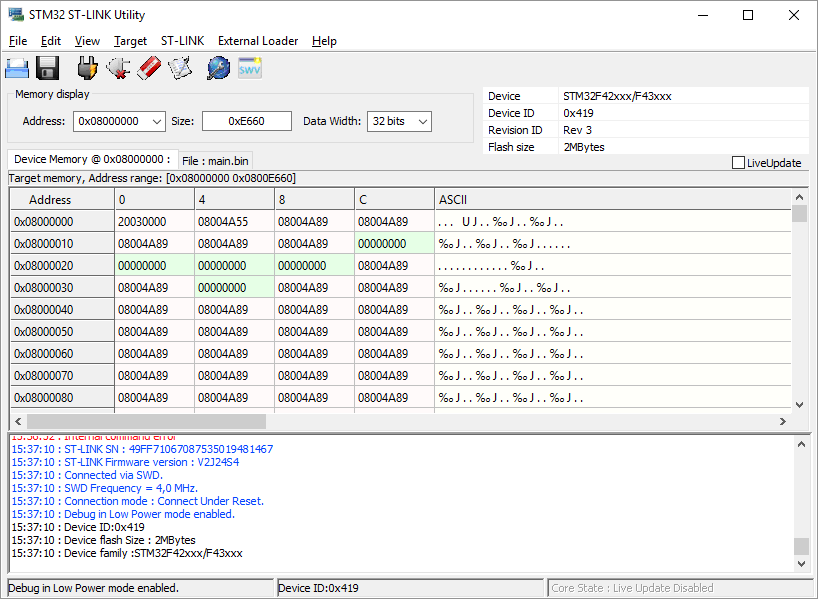
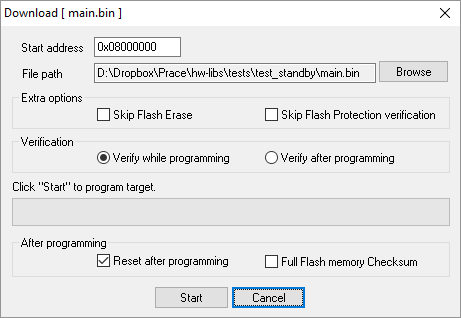

# Upload kódu z GUI

## Ruční programování zařízení

Programování je možné přes Byzance portál přes ethernet \(online\), ale někdy je tento postup nežádoucí. V případě vývoje, nebo tzv. ''bricknutí'' je třeba použít programátor - jak na bootloader, tak na hlavní firmware. K tomu je na desce připraveno rozhraní SWD.

Toto rozhraní je třeba napojit do programátoru, který je zapojený v počítači. K tomu je možné využít například programátor [ST-LINK](http://www.st.com/en/development-tools/st-link-v2.html) a utilitu [ST-LINK UTILITY](http://www.st.com/content/st_com/en/products/embedded-software/development-tool-software/stsw-link004.html). Místo programátoru ST-LINK může posloužit i například libovolná deska STM32, která programátor obsahuje \(tyto desky bývají velmi levné a dostupné\).

## Utilita ST-LINK

Utilita se po kliknutí na ikonu ''blesk'' \(třetí zleva v menu\) zkomunikuje s programátorem, skrz který zjistí verzi připojeného mikrokontroléru. Pokud toto neproběhne správně, není programátor připojen v PC, není v PC nainstalován příslušný driver, nebo je rozpojeno SWD rozhraní mezi programovaným zařízením a programátorem. Někdy k chybě dochází samovolně a třeba odpojit a zapojit všechny konektory, popřípadě zkontrolovat zapojení SWD, kvůli případném prohození pinů \(nebo otočení konektoru\).

V případě, že je vše v pořádku, programátor se po kliknutí na ikonu ''blesk'' spojí se zařízením a identifikuje jeho mikrokontrolér. V informační konzoli dole se zobrazí identifikátory mikrokontroléru a v tabulce uprostřed se automaticky vypíše začátek FLASH pamětí s vektory přerušení \(které nejsou pro účely programování důležité.

Programování může začít kliknutím na modrou složku ''open file'' vlevo nahoře. V průzkumníku souborů je potom nutné vybrat \*.bin soubor zvoleného firmware či bootloaderu. Vypálení do mikrokontroléru následuje stiskem tlačítka ''program - verify'' \(6. ikona zleva\). Zde je nutné zkontrolovat adresu a režim vypalování. Adresy je možné zjistit v článku \[\[memory:internal\|interní paměť mikrokontroléru\]\]. V zásadě platí, že bootloader se vypaluje na adresu ''0x08000000'' a firmware na adresu ''0x08010000'', adresy je ale nutno překontrolovat podle zvoleného targetu. Správné zadání adresy je velmi kritické, protože v případě překlepu se přepíše špatná část mikrokontroléru a může dojít k tzv. ''bricknutí''. Je důležité si neplést kolonku ''Memory display'' \(zakroužkováno červeně\), která pouze slouží k zobrazení části paměti, ale nikoliv k programování. Programovací adresa ''Start address'' je zakroužkována modře. Upload se spustí kliknutím na tlačítko ''Start''.

