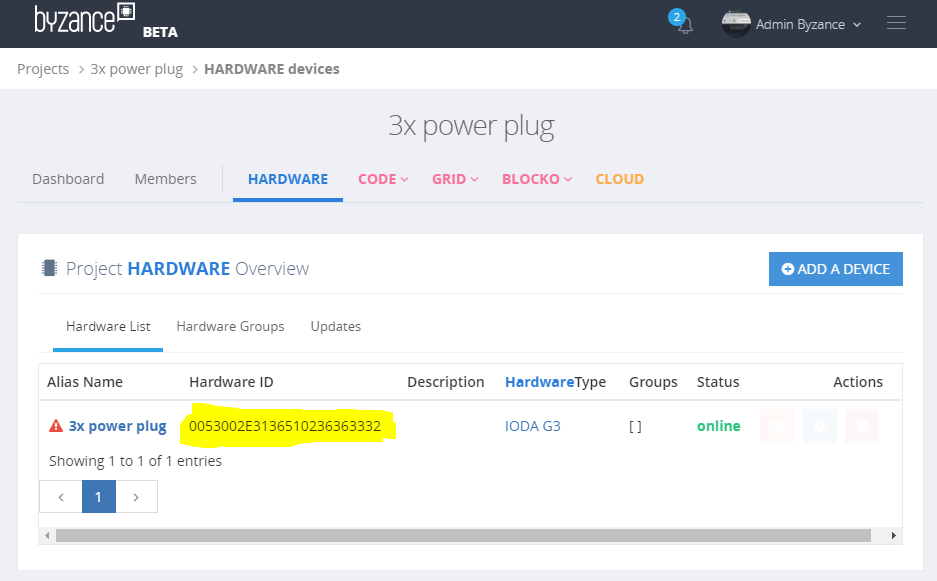
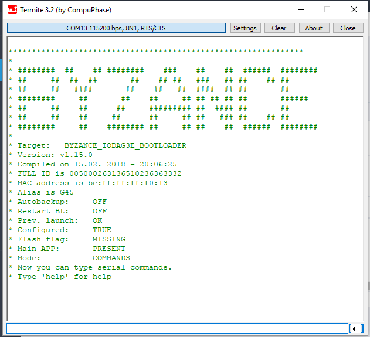
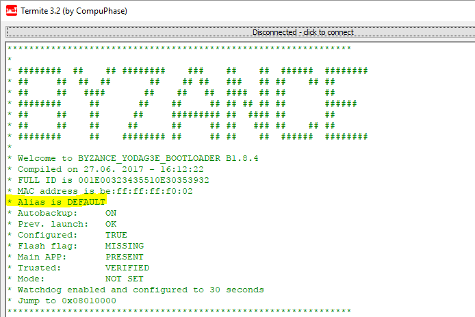
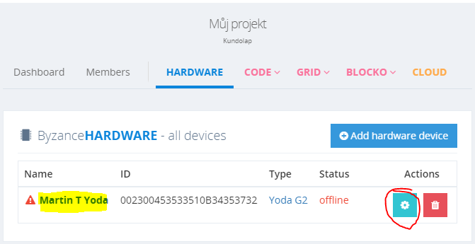
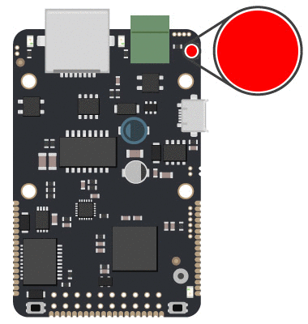

# Identifikace zařízení

Pokud je součástí rozsáhlejšího projektu více zařízení, je nezbytné se mezi nimi správně orientovat. Existuje několik způsobů a identifikátorů, které orientaci napomáhají.

## FULL ID

Všechna zařízení IODA mají v mikrokontroléru STM32 z výroby naprogramovaný **jedinečný identifikátor** , který se vyskytuje na specifické adrese v [OTP paměti ](identifikace-zarizeni.md)\(liší se podle rodiny mikrokontroléru\) a lze ho pouze číst. Toto číslo je Byzance interně označováno jako **Full ID**.


Full ID je pro člověka obtížně zapamatovatelné a slouží především k strojovému zpracovávání. Je pro každé zařízení unikátní.


Jedná se o 96 bitů dlouhé číslo reprezentované **24 hexadecimálními ASCII znaky**. Full ID se zapisuje **velkými písmeny a bez oddělujícíh znaků**. Např. ''0123456789AB0123456789AB''.

Lze to teoreticky přirovnat například k MAC adrese - ta je 48 bitů dlouhá a zapisuje se jako šestice dvojciferných hexadecimálních čísel oddělených pomlčkami nebo dvojtečkami \(např. ''01-23-45-67-89-AB'' nebo ''01:23:45:67:89:AB''\).

### Jak zjistit Full ID

Existuje několik způsobů, jak zjistit Full ID. Pokud je zařízení nové a nikdy nebylo použito, Full ID lze zjistit společně s kódem pro přidání do uživatelského účtu z nálepky na zařízení, nebo na jeho obalu.

Pokud je zařízení připojeno k internetu a je přidáno v nějakém projektu, Full ID je možné zjistit online v sekci Projects -&gt; \(název projektu\) -&gt; Hardware



Bez využití internetu je Full ID možno zjistit z bootloaderu výpisem přes sériovou linku nebo USB.



Pomocí veřejné metody třídy Byzance ''Byzance::get\_full\_id\(\)'' výpisem přes sériovou linku nebo USB.

```cpp
#include "byzance.h"

Serial    pc(SERIAL_TX, SERIAL_RX); // tx, rx

void init(){
    pc.baud(115200);
}

void loop(){
    pc.printf("full_id=%s\n", Byzance::get_full_id());
    Thread::wait(500);
}
```

## Alias

Alias slouží společně s Full ID k identifikaci zařízení. Název může být například "kuchyn-svetlo".


Alias slouží k identifikaci člověkem.


Narozdíl od Full ID, které je vždy unikátní z výroby a strojově dobře čitelné, Alias je nastavovaný uživatelsky pro lepší identifikaci člověkem. Při více zařízeních by měl být identifikátor Alias dostatečně popisný, nemusí však být nutně unikátní. Například při použití v osvětlení by měl Alias nést názvy typu "SVETLO-KUCHYN", "SVETLO-OBYVAK" a podobně. S identifikátorem Alias je možné pracovat několika způsoby.

Omezení při nastavování Alias jsou popsána v příslušné kapitole.



Alias je možné zjistit při startu zařízení vyčtením při startu [bootloaderu](bootloader/).



Je možné jej zjistit či nastavit v [command režimu bootloaderu](bootloader/command-mod.md). V případě nastavení z bootloaderu není garantována funkčnost, protože zařízení při startu zařízení žádá o nastavení Aliasu a v případě, že je název s Tyrionem kolizní, za správnou variantu je považovana varianta Tyrionu.

Alias je možné také zjistit v rámci uživatelského kódu dotazem pomocí [Byzance API](../programovani-hw/byzance-api/) funkcí ''Byzance::get\_alias\(\);''.

Jednoduchý kód může vypadat například takto:

```cpp
#include "byzance.h"

Serial    pc(SERIAL_TX, SERIAL_RX); // tx, rx

void init(){
    pc.baud(115200);
}

void loop(){
    pc.printf("alias=%s\n", Byzance::get_alias());
    Thread::wait(500);
}
```

Jediná správná možnost editace aliasu je pomocí Byzance Code \(Becki\). V sekci hardware uživatele je možné Alias jak zjistit, tak změnit.



## Blink

\#todo napsat pokec



## Revize

Revize \(revision\) je jeden z dalších identifikátorů každého zařízení.


Revize slouží k odlišení různých vlastností stejného zařízení, které by při provozu neměly hrát roli.


Rozdíly revizí stejného zařízení můžou být například

* jiná výrobní série
* jiný výrobce PCB či dodavatel
* jiná výrobní technologie 
* implementační drobnost \(jiná použitá součástka\)

Revision je interně interpretováno jako 32 bitové číslo, které se interpretuje HEX ASCII. Může tedy nabývat hodnoty ''0x00000000'' až ''0xFFFFFFFF''. Je nastaveno v [OTP paměti](identifikace-zarizeni.md) při výrobě a proto už nelze změnit.

Revizi je možno zjistit jednou z možností popsaných v sekci konfigurace zařízení.



