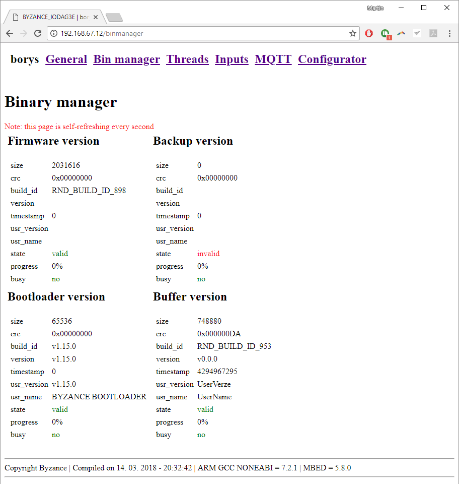

# Správce firmware

Správce firmware nabízí podrobný přehled o jednotlivých firmwarových komponentách a umožňuje monitorovat proces aktualizace či zálohy. Podrobnější informace o aktualizaci je možno naleznout v příslušném článku.



