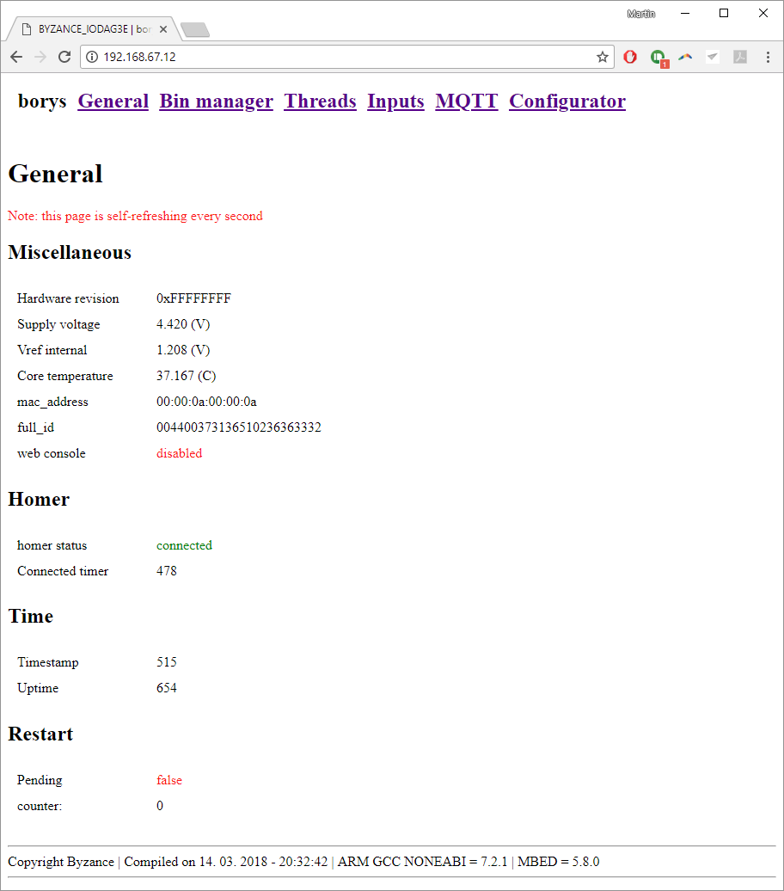

# Základní přehled

Webové rozhraní nabízí přehled informací o daném zařízení. Mezi tyto informace se řadí

* [Alias](../identifikace-zarizeni.md#alias)
* Revize
* [Napájecí napětí](../monitoring-parametru.md#napajeci-napeti)
* [Vnitřní refereční napětí jádra](../monitoring-parametru.md#referencni-napeti)
* [Teplota jádra](../monitoring-parametru.md#teplota-jadra)
* MAC adresa
* [FULL ID identifikátor](../identifikace-zarizeni.md#full-id)
* Stav [webové konzole](../webova-konzole.md)

Další informace jsou

* [Stav připojení k serverům](../monitoring-parametru.md#cas-pripojeni-k-serverum)
* [Čas, jak dlouho je zařízení připojeno k serverům](../monitoring-parametru.md#cas-pripojeni-k-serverum)
* [Aktuální čas z RTC](../../tutorialy/datum-a-cas-rtc.md)
* [Čas od startu zařízení](../monitoring-parametru.md#cas-behu-zarizeni)
* [Přehled o plánovaném restartu](../../programovani-hw/byzance-api/odlozeny-restart.md)

Některé z těchto možností jsou dostupné taktéž pomocí Byzance API. Více informací je popsáno v příslušné sekci.



