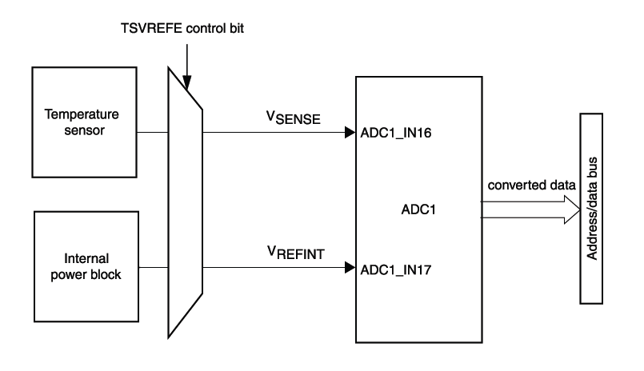

# Provozní informace

## Čas běhu zařízení

Čas běhu zařízení, neboli "uptime" je čítač, který je implementovaný v každém zařízení Byzance. Vyjadřuje počet sekund uplynulých od zapnutí zařízení. Slouží především k monitoringu stability kódu a zlepšení všeobecného přehledu o zařízení. Čítač se inkrementuje automaticky. Jeho maximální hodnota může být 2^32 - 1, tedy zhruba 136 let. Poté čítač přeteče znova na nulu.

Pokud je zařízení přepnuto do [bootloaderu](../architektura-fw/bootloader/), ''uptime'' se neinkrementuje.

Hodnotu uptime je možno zjistit

* Ve [webovém rozhraní](../funkcionality/webove-rozhrani/)
* Pomocí uživatelského kódu a [Byzance API](../programovani-hw/byzance-hardware-api.md)

## Čas připojení k serverům

Je-li zařízení připojeno k internetu, je možno zjistit, jak dlouho od startu je připojeno k serverům. Tato položka je pojmenována "connected time". Čítač je podobně jako "uptime" implementován jako 32 bitové číslo, které se automaticky inkrementuje každou sekundu. Jeho maximální hodnota může být 2^32 - 1, tedy zhruba 136 let. Poté čítač přeteče znova na nulu.

Při každém odpojení od serverů se čítač přestane inkrementovat a resetuje se do nuly.

Hodnotu "connected time" je možno zjistit

* ve [webovém rozhraní](../funkcionality/webove-rozhrani/)
* pomocí uživatelského kódu a [Byzance API](../programovani-hw/byzance-hardware-api.md).

## Napájecí napětí

Každé zařízení IODA je možno napájet mnoha způsoby - záleží na konkrétním použití. Jednotlivé napájecí větve se však vždy přes usměrňovače sbíhají do jednoho bodu - v případě IODAG3E je to větev VBUS. 

Sem je napojen dělič, jehož výstup PWR\_MEAS je připojen do mikrokontroléru a vzorkován ADC převodníkem. Aktuální napětí ve voltech je možno získat

* ve [webovém rozhraní](../funkcionality/webove-rozhrani/)
* pomocí uživatelského kódu a [Byzance API](../programovani-hw/byzance-hardware-api.md).

Napájecí napětí je však pouze orientační. Na základě zvolené větve napájení je třeba pro zjištění skutečné hodnoty k naměřené hodnotě přičíst úbytky na usměrňovací kaskádě - zhruba 0,7 voltu při průchodu každou diodou.

## Teplota jádra

| Symbol | Rozsah | Přesnost |
| --- | --- |
| Vsense | -40°C až 125°C | 1,5°C |

Teplotu jádra je možno získat

* ve [webovém rozhraní](../funkcionality/webove-rozhrani/)
* pomocí uživatelského kódu a [Byzance API](../programovani-hw/byzance-hardware-api.md).

## Referenční napětí

| Symbol | Podmínky | Min | Typ | Max | Jednotka |
| --- | --- |
| Vrefint | -40°C - 105°C | 1.18 | 1.21 | 1.24 | Volty |

Hodnotu referenčního napětí je možno získat 

* ve [webovém rozhraní](../funkcionality/webove-rozhrani/)
* pomocí uživatelského kódu a [Byzance API](../programovani-hw/byzance-hardware-api.md).

## 

