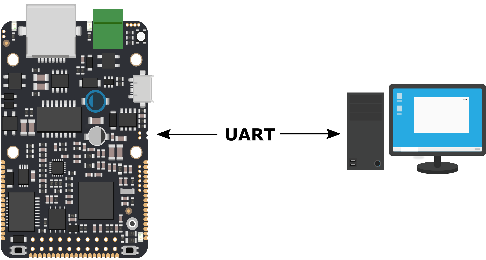

# Komunikace po sériové lince \(UART\) s PC

  
V řadě aplikací je potřebné zavést komunikační kanál mezi zařízením, které programujeme a PC. To je potřeba primárně za účelem debugování a logování nebo také v případě obsluhy zařízení v [command režimu](../../architektura-fw/bootloader/command-mod.md). Pro tyto účely se využívá sériová linka, kterou lze velmi jednoduše nakonfigurovat. 

## Konfigurace PC

Abychom mohli v PC zobrazovat zprávy přijaté po sériové lince, je nutné nakonfigurovat libovolný sériový terminál. Více informací o instalaci terminálu lze získat v sekci [Konfigurace sériové linky v PC](konfigurace-seriove-linky-v-pc.md)



##  Programování sériové linky

Na straně zařízení se sériová komunikace obsluhuje přímo v programu a je možné ji inicializovat dvěma způsoby. Buď můžeme využít třídy [Serial](programovani-seriove-linky.md#komunikace-pomoci-serial), nebo sériovou linku emulovat přes [microUSB](programovani-seriove-linky.md#komunikace-pomoci-usb). Všechny potřebné informace se nacházejí v článku [Programování sériové linky](programovani-seriove-linky.md).



